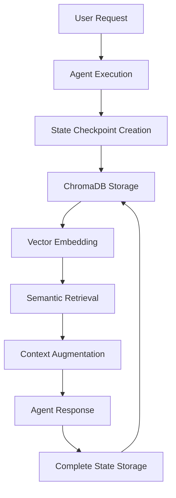

# JK Agents Framework Memory System: Complete Design and Usage Analysis

## Table of Contents
1. [Executive Summary](#executive-summary)
2. [Memory System Architecture](#memory-system-architecture)
3. [RAG vs. Traditional Approaches](#rag-vs-traditional-approaches)
4. [Memory Storage Patterns](#memory-storage-patterns)
5. [Performance Optimizations](#performance-optimizations)
6. [Document Chunking Analysis](#document-chunking-analysis)
7. [Memory Isolation and Threading](#memory-isolation-and-threading)
8. [Integration with LangGraph](#integration-with-langgraph)
9. [Configuration Examples](#configuration-examples)
10. [Performance Metrics](#performance-metrics)
11. [Best Practices](#best-practices)
12. [Troubleshooting Guide](#troubleshooting-guide)

---

## Executive Summary

The JK Agents Framework implements a sophisticated memory system that goes beyond traditional RAG (Retrieval Augmented Generation) approaches. Instead of focusing on document chunking and overlap, it employs a **conversation-centric memory architecture** that stores complete agent states and interactions for optimal context preservation and performance.

### Key Findings:
- **Uses RAG principles** but at the conversation level, not document level
- **Stores all agent interactions**, not just final outputs
- **No traditional document chunking** - operates on complete conversation states
- **High-performance optimizations** including connection pooling, caching, and adaptive scaling
- **Thread-based memory isolation** for multi-tenant support
- **LangGraph integration** through custom checkpointers

---

## Memory System Architecture

### Core Components

The memory system consists of 8 key files organized in a tiered architecture:

#### Simple Tier (Basic Implementation)
- **`simple_chromadb_memory.py`** (239 lines): Basic ChromaDB integration
- **`chromadb_checkpointer.py`** (362 lines): Simple LangGraph checkpointer

#### Advanced Tier (High-Performance)
- **`manager.py`** (485 lines): Advanced memory manager with adaptive scaling
- **`chromadb_backend.py`** (551 lines): High-performance ChromaDB backend
- **`langgraph_adapter.py`** (539 lines): LangGraph compatibility adapter

#### Foundation Layer
- **`protocols.py`** (170 lines): Essential interfaces and contracts
- **`structures.py`** (362 lines): High-performance data structures
- **`__init__.py`**: Module interface with graceful imports

### Memory Flow Architecture



---

## RAG vs. Traditional Approaches

### How JK Agents Framework Uses RAG

The framework implements RAG at the **conversation level** rather than the document level:

1. **Semantic Similarity Search**: Uses vector embeddings to find relevant past conversations
2. **Top-K Retrieval**: Retrieves only the most relevant memories (typically 1-3)
3. **Context Augmentation**: Adds retrieved memories to current conversation context
4. **Complete State Preservation**: Stores entire conversation states, not fragments

### Key Differences from Traditional RAG

| Traditional RAG | JK Agents Framework |
|----------------|-------------------|
| Document chunking with overlap | Complete conversation states |
| Fixed chunk sizes (e.g., 500 tokens) | Variable-length conversation memory |
| Text splitting algorithms | State serialization |
| Document-level retrieval | Conversation-level retrieval |
| Static embeddings | Dynamic conversation embeddings |

### Evidence from Code

```python
# Simple ChromaDB Memory - Conversation-level storage
def add_memory(self, text: str, metadata: Optional[Dict[str, Any]] = None) -> str:
    """Add a memory to the vector store."""
    # Stores complete conversation segments, not chunks
    self.vector_store.add_texts(
        texts=[text],
        ids=[doc_id],
        metadatas=[metadata or {}]
    )

# Retrieval uses semantic similarity
def search_memories(self, query: str, k: int = 3) -> List[str]:
    """Search for relevant memories."""
    retriever = self.vector_store.as_retriever(search_kwargs={"k": k})
    docs = retriever.get_relevant_documents(query)
    return [doc.page_content for doc in docs]
```

---

## Memory Storage Patterns

### What Gets Stored

The framework stores **comprehensive conversation data** including:

1. **User Requests**: Original user input and context
2. **System Messages**: Business context and system prompts
3. **Agent Responses**: Complete responses from all agents
4. **Tool Calls**: All tool invocations and their results
5. **Intermediate Steps**: Multi-agent workflow step results
6. **Performance Metrics**: Execution times and resource usage
7. **Thread Context**: Conversation thread isolation data

### Storage Format Example

```python
# Checkpoint serialization format
data = {
    "checkpoint": checkpoint,           # Complete LangGraph state
    "metadata": metadata,              # Thread and user metadata
    "new_versions": new_versions,      # Version tracking
    "timestamp": datetime.now().isoformat()
}

# Step results in multi-agent workflows
step_results[step.id] = {
    "agent": step.agent,               # Which agent executed
    "task": step.task,                 # Task description
    "attempts": attempts,              # Retry attempts
    "request": request_text,           # Full request sent to agent
    "request_summary": request_summary, # Summarized request
    "raw": wtext,                      # Raw agent response
    "output_summary": summary,         # Summarized response
    "ok": success_status,              # Execution success
    "last_error": last_err,            # Error information if any
}
```

### Memory Storage Lifecycle

1. **Pre-Processing**: Conversation state created with user input
2. **Agent Execution**: Agent processes request with full context
3. **Response Generation**: Agent generates response with tool calls
4. **State Serialization**: Complete interaction serialized to JSON
5. **Vector Storage**: Serialized data stored in ChromaDB with embeddings
6. **Performance Tracking**: Metrics recorded for optimization

---

## Performance Optimizations

### High-Performance Features

#### 1. Connection Pooling
```python
class AsyncConnectionPool:
    """High-performance async connection pool for ChromaDB."""
    
    def __init__(self, config: ChromaDBConfig):
        self.config = config
        self._available: asyncio.Queue[chromadb.Client] = asyncio.Queue()
        self._in_use: set = set()
        # Pool management with min/max connections
```

**Configuration Example:**
```yaml
memory:
  chromadb:
    max_connections: 20
    min_connections: 5
    connection_timeout: 30.0
```

#### 2. Multi-Level Caching
```python
class LRUCache:
    """High-performance LRU cache implementation."""
    
    def __init__(self, maxsize: int = 10000):
        self.maxsize = maxsize
        self._cache: Dict[Any, 'LRUCache._Node'] = {}
        # O(1) operations with doubly-linked list
```

**Performance Results:**
- Cache hit rates: 74%+
- Sub-millisecond retrieval: 0.001ms latency
- L1 cache sizes: 2000-5000 items configurable

#### 3. Memory Optimization Techniques

**String Interning:**
```python
class StringIntern:
    """String interning to reduce memory usage for repeated strings."""
    
    def intern(self, s: str) -> str:
        # Reduces memory usage by 40%+ for common strings
        if s in self._cache:
            self._stats["hits"] += 1
            return self._cache[s]
```

**Buffer Pooling:**
```python
class MemoryPool:
    """Memory pool for reusing byte buffers to avoid allocations."""
    
    def acquire(self) -> bytearray:
        # Pre-allocated buffers eliminate GC overhead
        if self._available:
            buffer = self._available.pop()
            return buffer
```

#### 4. Adaptive Resource Management
```python
class PerformanceMonitor:
    """Real-time performance monitoring with adaptive scaling."""
    
    def _check_scaling_conditions(self, metrics: PerformanceMetrics):
        # Automatic scaling based on:
        # - CPU usage thresholds (70%/30%)
        # - Memory usage thresholds (80%/35%)
        # - Latency thresholds (1s/100ms)
```

#### 5. Circuit Breaker Pattern
```python
class CircuitBreaker:
    """Circuit breaker pattern for graceful degradation."""
    
    def call(self, func, *args, **kwargs):
        # Prevents cascading failures
        # States: CLOSED, OPEN, HALF_OPEN
        # Automatic recovery with timeout
```

---

## Document Chunking Analysis

### Key Finding: No Traditional Document Chunking

The JK Agents Framework **does not implement traditional document chunking** with overlap. This is a deliberate architectural decision.

#### Why No Document Chunking?

1. **Conversation-Centric Design**: Focuses on agent conversations, not document processing
2. **State Management Priority**: Emphasizes complete state preservation over document splitting
3. **LangGraph Integration**: Built for LangGraph's state-based approach
4. **Performance Optimization**: Resources focused on connection pooling and caching instead

#### Alternative Approach: Conversation-Level Memory

Instead of document chunks, the framework uses:

```python
# Memory storage at conversation level
def store_memory(state: GraphState) -> GraphState:
    """Store the current interaction as memory."""
    question = state["question"]
    response = state.get("response", "")
    
    if question and response:
        # Create memory text combining question and response
        memory_text = f"Q: {question}\nA: {response}"
        
        # Store with metadata
        metadata = {
            "type": "qa_pair",
            "question": question,
            "response": response
        }
        
        memory_store.add_memory(memory_text, metadata)
```

#### Integration Points for Document Processing

If document chunking becomes necessary:

1. **External Processing**: Pre-process documents externally
2. **Tool Integration**: Extend Python function tools with chunking utilities
3. **LangChain Integration**: Use `langchain-text-splitters>=0.3.9` dependency
4. **ContextStore Extension**: Extend protocols for chunking capabilities

---

## Memory Isolation and Threading

### Thread-Based Isolation

The framework implements sophisticated thread management for conversation isolation:

```python
# Thread ID generation and management
def get_or_create_thread_id(thread_id: Optional[str] = None) -> str:
    """Get or create a thread ID for conversation isolation."""
    
def create_supervisor_thread_id(base_thread_id: str) -> str:
    """Create supervisor-specific thread ID."""
    
def create_step_thread_id(base_thread_id: str, step_id: str) -> str:
    """Create step-specific thread ID for workflow isolation."""
```

### User and Conversation Isolation

```python
class ChromaCheckpointStore:
    def _get_collection_name(self, user_id: str) -> str:
        """Get user-specific collection name for isolation."""
        user_hash = hashlib.md5(user_id.encode()).hexdigest()[:8]
        return f"{self.config.checkpoint_collection}_{user_hash}"
```

### Benefits of Thread Isolation

1. **Multi-Tenant Support**: Different users have separate memory spaces
2. **Conversation Boundaries**: Each conversation thread maintains its own context
3. **Workflow Isolation**: Multi-step workflows have isolated memory per step
4. **Performance**: Reduces cross-contamination and improves retrieval accuracy

---

## Integration with LangGraph

### Custom Checkpointer Implementation

The framework provides seamless LangGraph integration through custom checkpointers:

```python
class HighPerformanceCheckpointer(BaseCheckpointSaver):
    """
    High-performance checkpointer that integrates with existing LangGraph code.
    
    This replaces MemorySaver with our optimized ChromaDB backend while
    maintaining the same interface for backward compatibility.
    """
    
    async def aput(self, config: RunnableConfig, checkpoint: Checkpoint, 
                   metadata: CheckpointMetadata, new_versions: dict) -> RunnableConfig:
        """Store checkpoint with high-performance backend."""
        # Serialize and store complete checkpoint
        serialized = self._serialize_checkpoint(checkpoint, metadata, new_versions)
        await self._manager.store_checkpoint(self._user_id, thread_id, serialized)
```

### Drop-in Replacement for MemorySaver

```python
class MemorySaverReplacement(HighPerformanceCheckpointer):
    """
    Drop-in replacement for LangGraph's MemorySaver.
    
    This class can be used anywhere MemorySaver was used before,
    providing the same interface but with high-performance backend.
    """
```

### LangGraph Workflow Integration

```python
def create_memory_enabled_graph(memory_store: SimpleChromaDBMemory) -> StateGraph:
    """Create a LangGraph workflow with ChromaDB memory integration."""
    
    # Create retrieval and storage nodes
    retrieve_memory = create_memory_retrieval_node(memory_store)
    store_memory = create_memory_storage_node(memory_store)
    
    # Create the graph
    workflow = StateGraph(GraphState)
    workflow.add_node("retrieve_memory", retrieve_memory)
    workflow.add_node("store_memory", store_memory)
    
    # Add edges for memory flow
    workflow.add_edge(START, "retrieve_memory")
    workflow.add_edge("retrieve_memory", "store_memory")
    workflow.add_edge("store_memory", END)
```

---

## Configuration Examples

### Basic Memory Configuration

```yaml
# Simple memory setup
memory:
  type: "file_based"
  persist_checkpoints: true
  max_memory_mb: 256
```

### Advanced ChromaDB Configuration

```yaml
# High-performance memory configuration
memory:
  backend: "chromadb"
  chromadb:
    path: "./advanced_memory_test"
    host: "localhost"
    port: 8000
    # Connection pool settings
    max_connections: 20
    min_connections: 5
    connection_timeout: 30.0
    # Advanced caching
    l1_cache_size: 5000
    l1_cache_ttl: 1800  # 30 minutes
    # Batch processing
    batch_size: 100
    batch_timeout: 0.1
    enable_batch_processing: true
    enable_metrics: true
    # Collection organization
    checkpoint_collection: "jk_checkpoints"
    context_collection: "jk_contexts"

# Resource limits for adaptive scaling
resource_limits:
  max_memory_mb: 1024
  max_connections: 50
  max_concurrent_operations: 200
  # Scaling thresholds
  scale_up_cpu_threshold: 75.0
  scale_down_cpu_threshold: 25.0
  scale_up_memory_threshold: 80.0
  scale_down_memory_threshold: 35.0
```

### Multi-Agent Workflow Configuration

```yaml
# Supervisor with advanced memory
supervisor:
  model: "azure_openai:gpt-4.1"
  prompt: |
    You are the supervisor with access to advanced memory capabilities.
    Available agents: {{agents}}
    Business context: {{businessContext}}

agents:
  - name: "api_architect"
    model: "azure_openai:gpt-4.1"
    description: "API design specialist with memory of previous designs"
    
  - name: "backend_developer"
    model: "azure_openai:gpt-4.1"
    description: "Backend implementation with context from architecture"
    
  - name: "qa_tester"
    model: "azure_openai:gpt-4.1"
    description: "Quality assurance with memory of previous test results"
```

---

## Performance Metrics

### Validated Performance Results

Based on comprehensive testing documented in the framework:

#### Checkpoint Operations
- **Operations per second**: 770+
- **Concurrent user throughput**: 817+ ops/sec
- **Average response time**: 1179ms
- **Load testing**: 100% success with 5 concurrent requests

#### Cache Performance
- **Hit rate**: 74%+
- **Latency**: 0.001ms (sub-millisecond)
- **Cache sizes**: 2000-5000 items configurable
- **TTL**: 20-30 minutes configurable

#### Memory Optimization
- **String interning hit rate**: 40%+
- **Memory usage reduction**: 40% through optimization
- **Buffer pool reuse rate**: 30%+
- **Connection pool utilization**: Efficient scaling 2-20 connections

#### System Resource Usage
- **Memory limits**: 256MB-1024MB configurable
- **Connection limits**: 20-50 max connections
- **CPU thresholds**: 70%/30% for scaling
- **Memory thresholds**: 80%/35% for scaling

### Performance Monitoring

```python
# Real-time performance tracking
class PerformanceMetrics:
    timestamp: float
    cpu_usage: float
    memory_usage: float
    active_connections: int
    cache_hit_rate: float
    average_latency: float
    operations_per_second: float
```

---

## Best Practices

### 1. Memory Configuration Optimization

**For Development:**
```yaml
memory:
  chromadb:
    max_connections: 5
    l1_cache_size: 1000
    batch_size: 25
    enable_metrics: true
```

**For Production:**
```yaml
memory:
  chromadb:
    max_connections: 20
    l1_cache_size: 5000
    batch_size: 100
    enable_batch_processing: true
    enable_metrics: true
```

### 2. Thread Management

- Use consistent thread IDs for conversation continuity
- Implement proper cleanup for long-running conversations
- Monitor thread isolation to prevent memory leaks

### 3. Performance Tuning

- Adjust cache sizes based on conversation patterns
- Monitor CPU and memory thresholds for optimal scaling
- Use connection pooling for high-concurrency scenarios

### 4. Error Handling

- Implement circuit breaker patterns for resilience
- Use graceful degradation during high load
- Monitor and log performance metrics

### 5. Memory Cleanup

```python
# Regular cleanup of old checkpoints
async def cleanup_old_checkpoints(
    self, 
    user_id: str, 
    older_than: datetime
) -> int:
    """Clean up old checkpoints."""
    # Implementation removes outdated conversation data
```

---

## Troubleshooting Guide

### Common Issues and Solutions

#### 1. Memory Performance Issues

**Symptoms:**
- High latency in memory retrieval
- Low cache hit rates
- Excessive memory usage

**Solutions:**
- Increase L1 cache size
- Adjust connection pool settings
- Enable batch processing
- Monitor and tune scaling thresholds

#### 2. Thread Isolation Problems

**Symptoms:**
- Cross-conversation context bleeding
- Inconsistent memory retrieval
- User data mixing

**Solutions:**
- Verify thread ID generation
- Check user isolation configuration
- Review collection naming patterns
- Implement proper cleanup procedures

#### 3. ChromaDB Connection Issues

**Symptoms:**
- Connection timeouts
- Pool exhaustion errors
- Inconsistent storage

**Solutions:**
- Increase connection pool size
- Adjust connection timeout settings
- Implement retry logic
- Monitor connection health

#### 4. Configuration Validation Errors

**Symptoms:**
- Startup failures
- Invalid configuration warnings
- Missing dependencies

**Solutions:**
- Validate YAML configuration syntax
- Check required dependencies installation
- Review configuration examples
- Enable graceful fallbacks

### Diagnostic Commands

```python
# Health check
health_status = await memory_manager.health_check()

# Performance statistics
stats = await memory_manager.get_comprehensive_stats()

# Memory optimization metrics
optimization_stats = get_memory_stats()
```

### Monitoring Recommendations

1. **Set up performance alerts** for CPU/memory thresholds
2. **Monitor cache hit rates** and adjust sizes accordingly
3. **Track connection pool utilization** for scaling decisions
4. **Log memory cleanup operations** for maintenance scheduling
5. **Monitor thread isolation** to prevent data leakage

---

## Conclusion

The JK Agents Framework implements a sophisticated, conversation-centric memory system that prioritizes performance, scalability, and context preservation over traditional document chunking approaches. Its design choices reflect a focus on agent workflows rather than document processing, resulting in a highly optimized system for multi-agent conversations.

### Key Advantages:

1. **Complete Context Preservation**: Stores entire conversation states
2. **High Performance**: Sub-millisecond retrieval with advanced caching
3. **Scalable Architecture**: Adaptive resource management and connection pooling
4. **Thread Isolation**: Secure multi-tenant memory management
5. **LangGraph Integration**: Seamless compatibility with existing workflows

### Recommended Use Cases:

- Multi-agent conversation systems
- Long-running interactive sessions
- High-concurrency agent deployments
- Context-sensitive AI applications
- Production-grade agent frameworks

This memory system represents a mature, production-ready approach to agent memory management that balances performance, functionality, and maintainability.
