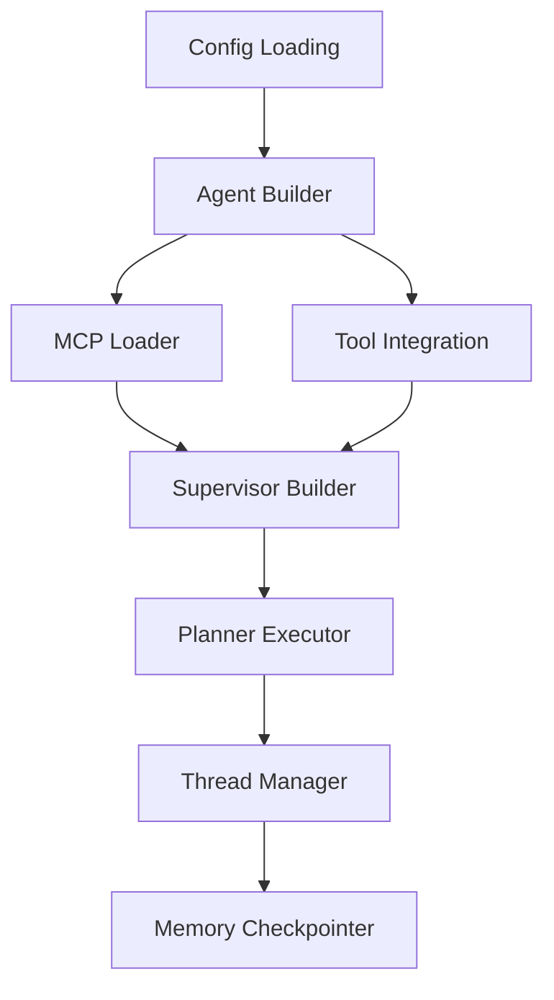

# Core Application Modules Documentation

## Overview

The `app/` directory contains the core modules that power the jk-agents-framework. These modules handle agent construction, supervisor orchestration, tool integration, and execution management.

## Module Details

### `app/config.py` - Configuration Management

Defines the configuration models using Pydantic for type validation and structure:

- **`MCPServerConfig`**: Configuration for Model Context Protocol servers
  - Supports stdio, HTTP, and SSE transports
  - Validates transport-specific requirements (command for stdio, URL for HTTP)
  - Handles environment variables and headers

- **`AgentConfig`**: Individual agent configuration
  - Agent name, description, and model specification
  - Prompt content (direct or from file)
  - MCP servers, HTTP tools, and Python function tools integration
  - Validation ensures either prompt or prompt_file is provided

- **`SupervisorConfig`**: Supervisor agent configuration
  - Similar to AgentConfig but specialized for the planning supervisor
  - Handles the orchestration logic prompt templates

- **`AppConfig`**: Root application configuration
  - Model mappings for different providers
  - Business context shared across agents
  - Persistence configuration (memory/checkpointer)
  - Agent and supervisor definitions
  - Temperature settings

### `app/agent_builder.py` - Agent Construction

Core module responsible for building React agents with tools and memory:

**Key Functions:**
- **`create_model_instance(model_id, temperature)`**: 
  - Creates model instances for different providers
  - Handles Google Gemini models with custom initialization
  - Parses temperature from model ID strings
  - Falls back to provider strings for OpenAI/Azure/Anthropic

- **`build_react_agent(agent_cfg, ...)`**:
  - Main agent construction function
  - Loads and integrates MCP tools, HTTP tools, and Python function tools
  - Applies Gemini schema filtering for compatibility
  - Sets up memory checkpointing and logging
  - Renders prompts with placeholder replacement

**Tool Integration:**
- MCP servers via `mcp_loader`
- HTTP tools for API endpoints
- Python function tools for custom logic
- Tool combination and validation

### `app/supervisor_builder.py` - Supervisor Construction

Builds the supervisor agent responsible for task planning and orchestration:

**Key Functions:**
- **`build_supervisor_compiled(supervisor_cfg, ...)`**:
  - Creates the supervisor React agent
  - Renders planning prompts with agent listings
  - Handles placeholder replacement with enhanced context
  - Uses global checkpointer for memory persistence
  - Logs the compiled planning prompt for debugging

**Features:**
- Agent listing generation for prompt context
- Enhanced placeholder system integration
- Fallback rendering for prompt template errors
- Model instance creation for multi-provider support

### `app/mcp_loader.py` - Model Context Protocol Integration

Handles loading and managing MCP tools and servers:

**Key Classes:**
- **`TimeoutTool`**: Wrapper for tools with timeout and retry logic
  - Implements timeout protection for tool execution
  - Supports retry attempts with failure handling
  - Preserves tool schemas and metadata
  - Handles structured arguments and error recovery

**Key Functions:**
- **`load_mcp_tools(servers_cfg, ...)`**:
  - Loads MCP servers based on configuration
  - Supports stdio, HTTP, and SSE transports
  - Creates MultiServerMCPClient for tool management
  - Wraps tools with timeout and retry logic

- **`build_http_tools(http_tools_cfg)`**:
  - Creates simple HTTP tools for API endpoints
  - Non-MCP tool integration for direct HTTP calls

**Transport Support:**
- **stdio**: Command-line MCP servers
- **HTTP/SSE**: Web-based MCP servers
- Configuration validation for each transport type

### `app/planner_executor.py` - Plan Execution

Orchestrates the execution of supervisor-generated plans:

**Key Classes:**
- **`PlanStep`**: Individual step in execution plan
  - ID, agent assignment, task description
  - Dependency tracking with depends_on
  - Verification prompts and timeouts
  - Retry configuration

- **`Plan`**: Complete execution plan
  - Goal description and step list
  - JSON serialization support

**Key Functions:**
- **`parse_plan_text(text)`**: Extracts JSON plans from supervisor responses
- **`topo_sort_steps(steps)`**: Dependency-based step ordering
- **`execute_plan(supervisor, agents_map, ...)`**: Main execution orchestrator

**Execution Features:**
- Topological sorting for dependency resolution
- Step-by-step execution with progress tracking
- Verification system for critical steps
- Retry logic with configurable attempts
- Thread management for conversation context
- Error handling and recovery mechanisms

### `app/thread_manager.py` - Thread and Memory Management

Manages conversation threads and memory persistence:

**Functions:**
- Thread ID generation and management
- Supervisor-specific thread creation
- Step-specific thread isolation
- Memory checkpointing integration

### `app/checkpointer_manager.py` - Memory Persistence

Handles memory checkpointing and persistence:

- Global checkpointer management
- Memory statistics and monitoring
- Thread-specific memory cleanup
- Full memory reset capabilities

### `app/mcp_loader.py` - Tool Integration Continued

**Additional Tool Types:**

**HTTP Tools:**
```python
http_tools:
  api_endpoint:
    url: "https://api.example.com/endpoint"
    method: "POST"
    headers:
      Authorization: "Bearer {{token}}"
```

**Python Function Tools:**
```python
python_tools:
  custom_functions:
    module_path: "tools.python_function_tools"
    function_name: "specific_function"  # Optional
    tool_names: ["tool1", "tool2"]     # Optional
```

### `app/template_utils.py` - Template Processing

Handles Jinja2 template rendering for prompts:

- Dynamic prompt generation
- Context injection (business context, user input)
- Placeholder replacement system
- Template error handling and fallbacks

### `app/placeholder_system/` - Advanced Placeholder Management

Enhanced placeholder replacement system:

- **`context.py`**: Placeholder context management
- **`providers.py`**: Data providers for placeholders
- **`registry.py`**: Placeholder registration and resolution
- **`exceptions.py`**: Custom exception handling

### `app/utils.py` - Utility Functions

Common utility functions used across modules:

- JSON block extraction from text
- Text processing and sanitization
- Error handling helpers
- Data transformation utilities

## Integration Flow



## Configuration Example

```yaml
models:
  default: "google:gemini-2.0-flash-exp"
  supervisor: "azure_openai:gpt-4o"

business_context: |
  Your business-specific context here

supervisor:
  name: "supervisor"
  prompt: |
    Planning prompt template with {{agents}} and {{business_context}}

agents:
  - name: "data_analyst"
    description: "Analyzes CSV data and generates insights"
    model: "google:gemini-2.0-flash-lite-001"
    prompt: |
      You are a data analysis expert...
    mcp_servers:
      python_runner:
        transport: "stdio"
        command: "deno"
        args: ["run", "-N", "jsr:@pydantic/mcp-run-python"]
    python_tools:
      analysis_tools:
        module_path: "tools.analysis"
        tool_names: ["data_processor", "chart_generator"]
```

## Key Design Patterns

### 1. Builder Pattern
- Agents and supervisors are constructed through builder functions
- Flexible configuration with sensible defaults
- Tool integration through composition

### 2. Strategy Pattern
- Different model providers handled through strategy pattern
- Transport-specific MCP server handling
- Tool type-specific loading strategies

### 3. Chain of Responsibility
- Prompt rendering with fallback mechanisms
- Error handling with multiple recovery strategies
- Tool execution with timeout and retry logic

### 4. Observer Pattern
- Logging integration throughout execution
- Memory checkpointing at key points
- Progress tracking and monitoring

## Performance Considerations

- **Async/Await**: All major operations are async for performance
- **Connection Pooling**: MCP clients manage connection pools
- **Memory Management**: Checkpointer handles memory efficiently
- **Tool Timeouts**: Prevents hanging operations
- **Resource Cleanup**: Proper cleanup of MCP connections and threads

## Error Handling

- **Graceful Degradation**: Tools fail gracefully with fallbacks
- **Retry Logic**: Configurable retry attempts for transient failures
- **Error Aggregation**: Multiple errors collected and reported
- **Context Preservation**: Error context maintained for debugging

## Extension Points

1. **Custom Tools**: Add new tool types through MCP or Python functions
2. **Model Providers**: Extend `create_model_instance` for new providers
3. **Transport Types**: Add new MCP transport mechanisms
4. **Placeholder Providers**: Extend placeholder system with new data sources
5. **Memory Backends**: Implement custom checkpointer implementations