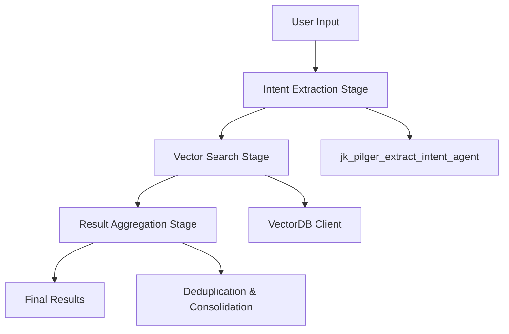

# Defect Analysis Pipeline

A comprehensive defect analysis pipeline using the pipefunc library for orchestrating intent extraction, vector search, and result aggregation stages.

## Overview

The Defect Analysis Pipeline processes user input describing equipment issues through three main stages:

1. **Intent Extraction**: Uses the `jk_pilger_extract_intent_agent` to extract structured intent data
2. **Vector Search**: Performs vector search using extracted intent data with top-n=10 results
3. **Result Aggregation**: Consolidates and deduplicates search results

## Architecture



## Installation

The pipeline is located in the `gemba_agents/defect_analysis/` folder and requires:

- pipefunc library for pipeline orchestration
- vectordb_wrapper for vector search operations
- Existing jk-agents infrastructure

## Quick Start

### Basic Usage

```python
from gemba_agents.defect_analysis import DefectAnalysisPipeline

# Create pipeline with default configuration
pipeline = DefectAnalysisPipeline()

# Run analysis
result = await pipeline.run(
    "The pump's loading/unloading piston is not operating smoothly"
)

print(f"Component: {result.intent_data.component}")
print(f"Issue: {result.intent_data.issue}")
print(f"Found {result.total_unique_results} defects")
```

### Synchronous Usage

```python
from gemba_agents.defect_analysis import analyze_defect_sync

result = analyze_defect_sync(
    "Motor bearing is overheating and making noise"
)
```

### Custom Configuration

```python
from gemba_agents.defect_analysis import DefectAnalysisPipeline, DefectAnalysisConfig

config = DefectAnalysisConfig(
    top_n=15,
    min_score=0.5,
    parallel_search=True,
    enable_logging=True
)

pipeline = DefectAnalysisPipeline(config)
result = await pipeline.run("Hydraulic system leak")
```

## Configuration Options

The `DefectAnalysisConfig` class provides comprehensive configuration:

```python
class DefectAnalysisConfig:
    # Intent extraction
    agent_name: str = "jk_pilger_extract_intent_agent"
    config_path: str = "config/jk-gemba.yaml"
    
    # Vector search
    top_n: int = 10
    min_score: float = 0.6
    vectordb_base_url: Optional[str] = None
    
    # Pipeline options
    enable_logging: bool = True
    enable_caching: bool = True
    parallel_search: bool = True
```

## Pipeline Stages

### Stage 1: Intent Extraction

**Function**: `extract_intent(user_input, config) -> IntentData`

- Loads the `jk_pilger_extract_intent_agent` from configuration
- Processes raw user input through the agent
- Returns structured intent data

**Expected Output Format**:
```json
{
  "interpreted_meaning": "The pump's loading/unloading piston is not operating smoothly; investigate the air compressor for a potential issue, such as insufficient air supply, or a problem with the air cylinder.",
  "component": "Pump",
  "sub_component": "Pump piston", 
  "related_component": "Air compressor",
  "issue": "Not operating smoothly"
}
```

### Stage 2: Vector Search

**Function**: `search_vectors(intent_data, config) -> VectorSearchResults`

- Constructs multiple search queries from intent data
- Performs vector searches with top-n=10 results
- Combines and deduplicates results
- Supports parallel search execution

**Search Query Construction**:
- Primary query from interpreted meaning
- Component + issue combinations
- Sub-component specific queries
- Related component queries

### Stage 3: Result Aggregation

**Function**: `aggregate_results(user_input, intent_data, search_results, config) -> AggregatedResults`

- Consolidates vector search results
- Removes duplicates based on defect codes
- Merges root causes and corrective actions
- Provides comprehensive final output

## Data Models

### IntentData
Structured intent information extracted from user input.

### VectorSearchResults
Combined results from multiple vector searches.

### AggregatedResults
Final consolidated output with deduplicated results.

### DefectResult
Individual defect information with score and metadata.

## Error Handling

The pipeline implements comprehensive error handling:

- **Agent Loading Failures**: Graceful fallback with error logging
- **Vector Search Failures**: Continues with partial results
- **JSON Parsing Errors**: Attempts multiple parsing strategies
- **Network Timeouts**: Configurable retry mechanisms

## Performance Features

- **Caching**: LRU cache for repeated queries
- **Parallel Execution**: Concurrent vector searches
- **Profiling**: Built-in performance monitoring
- **Memory Management**: Efficient result storage

## Examples

### Multi-language Support

```python
# English input
result1 = await pipeline.run("Motor bearing failure")

# Hindi input
result2 = await pipeline.run("पंप लोडिंग अनलोडिंग करने वाला पिस्टन बराबर से चल नहीं रहा है")

# Mixed language input
result3 = await pipeline.run("Hype jam ہو رہا ہے، ایچ ایس پی ون پہ")
```

### Batch Processing

```python
inputs = [
    "Motor bearing failure",
    "Hydraulic pump cavitation", 
    "Gear wear",
    "Valve leakage"
]

results = []
for input_text in inputs:
    result = await pipeline.run(input_text)
    results.append(result)
```

### Pipeline Visualization

```python
pipeline = DefectAnalysisPipeline()
pipeline.visualize()  # Shows pipeline graph
pipeline.print_profiling_stats()  # Performance statistics
```

## Testing

Run the example file to test the pipeline:

```bash
cd gemba_agents/defect_analysis
python example.py
```

## Cross-Platform Compatibility

The pipeline is designed to work on both Windows and macOS:

- Uses `pathlib` for path handling
- Async/await patterns for cross-platform compatibility
- Environment variable configuration
- Proper encoding handling

## Troubleshooting

### Common Issues

1. **Agent Not Found**: Verify `jk_pilger_extract_intent_agent` exists in config
2. **Vector Search Timeout**: Check VectorDB service availability
3. **JSON Parsing Errors**: Enable debug logging for response inspection
4. **Memory Issues**: Reduce `top_n` parameter or disable caching

### Debug Mode

```python
import logging
logging.basicConfig(level=logging.DEBUG)

config = DefectAnalysisConfig(enable_logging=True)
pipeline = DefectAnalysisPipeline(config)
```

## API Reference

See the individual module documentation for detailed API information:

- `gemba_agents.defect_analysis.pipeline.DefectAnalysisPipeline`
- `gemba_agents.defect_analysis.models.data_models`
- `gemba_agents.defect_analysis.stages`

## Contributing

When extending the pipeline:

1. Follow the existing error handling patterns
2. Add comprehensive logging
3. Update data models as needed
4. Include unit tests for new functionality
5. Update documentation
