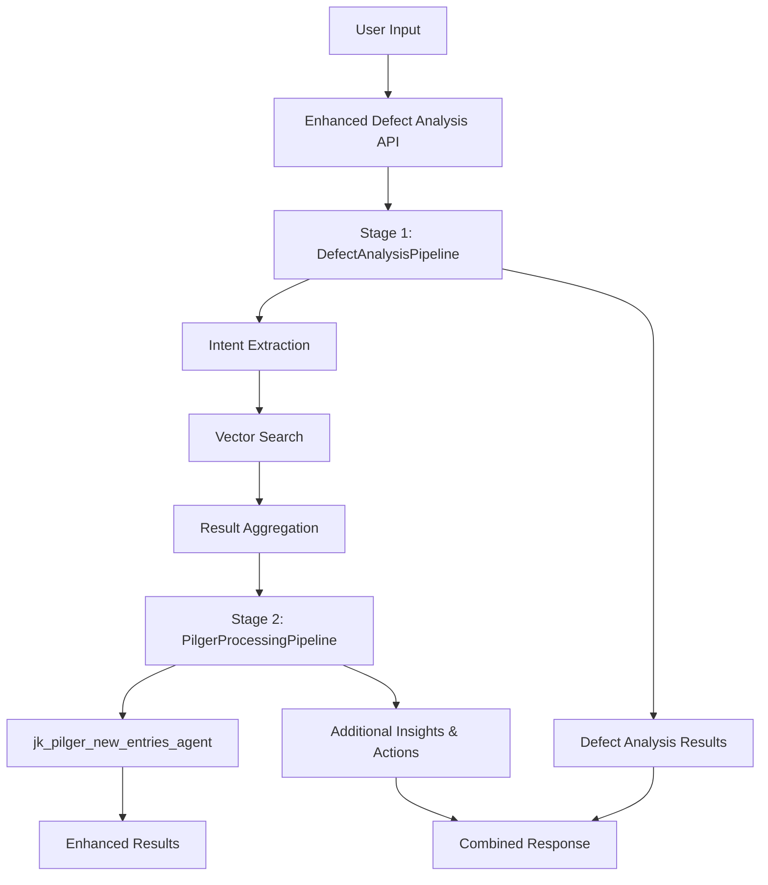

# Enhanced Defect Analysis API Documentation

## Overview

The Enhanced Defect Analysis API provides a comprehensive two-stage processing workflow that combines the DefectAnalysisPipeline and PilgerProcessingPipeline for advanced equipment defect analysis. This endpoint processes user input through both stages to provide enhanced insights and recommended actions.

## Architecture



## Endpoints

### 1. JSON Endpoint

**POST** `/defect-analysis-with-pilger`

Accepts JSON payload for enhanced defect analysis with both pipelines.

#### Request Body

```json
{
  "user_input": "The pump's loading/unloading piston is not operating smoothly",
  "top_n": 10,
  "min_score": 0.6,
  "enable_logging": true,
  "enable_caching": true,
  "parallel_search": true,
  "pilger_timeout_seconds": 120,
  "pilger_format": "structured",
  "skip_pilger_processing": false
}
```

#### Request Parameters

| Parameter | Type | Default | Description |
|-----------|------|---------|-------------|
| `user_input` | string | **required** | Equipment issue description (1-1000 chars) |
| `top_n` | integer | 10 | Number of top results from vector search (1-50) |
| `min_score` | float | 0.6 | Minimum similarity score (0.0-1.0) |
| `enable_logging` | boolean | true | Enable detailed logging |
| `enable_caching` | boolean | true | Enable caching for repeated queries |
| `parallel_search` | boolean | true | Enable parallel vector search |
| `pilger_timeout_seconds` | integer | 120 | Pilger processing timeout (30-300) |
| `pilger_format` | string | "structured" | Agent input format: "structured" or "text" |
| `skip_pilger_processing` | boolean | false | Skip Pilger stage, return only defect analysis |

#### Response Body

```json
{
  "success": true,
  "original_input": "The pump's loading/unloading piston is not operating smoothly",
  "defect_analysis": {
    "success": true,
    "intent_data": {
      "interpreted_meaning": "Pump piston operation issue",
      "component": "Pump",
      "sub_component": "Piston",
      "related_component": "Loading/Unloading System",
      "issue": "Not operating smoothly"
    },
    "total_unique_results": 3,
    "defects": [...],
    "root_causes": ["Worn piston seals", "Contaminated hydraulic fluid"],
    "corrective_actions": ["Replace seals", "Change fluid"],
    "processing_time_ms": 1250.5
  },
  "pilger_processing": {
    "success": true,
    "pilger_agent_response": {...},
    "processed_insights": ["Additional insight 1", "Additional insight 2"],
    "recommended_actions": ["Enhanced action 1", "Enhanced action 2"],
    "confidence_score": 0.85,
    "processing_time_ms": 2100.3,
    "agent_execution_time_ms": 1800.1,
    "error_message": null
  },
  "total_insights": ["Additional insight 1", "Additional insight 2"],
  "total_recommended_actions": [
    "Replace seals", "Change fluid", "Enhanced action 1", "Enhanced action 2"
  ],
  "processing_stages": {
    "defect_analysis": {
      "success": true,
      "processing_time_ms": 1250.5,
      "results_count": 3
    },
    "pilger_processing": {
      "success": true,
      "processing_time_ms": 2100.3,
      "agent_execution_time_ms": 1800.1,
      "skipped": false,
      "insights_count": 2,
      "actions_count": 2
    }
  },
  "total_processing_time_ms": 3500.8,
  "error": null,
  "warnings": [],
  "metadata": {
    "pipeline_version": "2.0.0",
    "processing_stages": ["defect_analysis", "pilger_processing"],
    "defect_analysis_config": {...},
    "pilger_processing_config": {...},
    "caching_enabled": true,
    "logging_enabled": true,
    "warnings_count": 0
  }
}
```

### 2. Form Endpoint

**POST** `/defect-analysis-with-pilger/form`

Accepts form data for enhanced defect analysis (useful for HTML forms and testing).

#### Form Parameters

Same parameters as JSON endpoint but submitted as form data.

#### Example cURL Request

```bash
curl -X POST "http://localhost:8000/defect-analysis-with-pilger/form" \
  -H "Content-Type: application/x-www-form-urlencoded" \
  -d "user_input=Motor bearing overheating" \
  -d "top_n=5" \
  -d "min_score=0.7" \
  -d "enable_logging=true" \
  -d "pilger_timeout_seconds=180" \
  -d "pilger_format=text"
```

## Response Structure

### Success Response

The response contains comprehensive results from both processing stages:

#### Core Fields
- `success`: Overall success status
- `original_input`: Original user input
- `total_processing_time_ms`: Total time for both stages

#### Stage Results
- `defect_analysis`: Complete results from DefectAnalysisPipeline
- `pilger_processing`: Results from PilgerProcessingPipeline (null if skipped/failed)

#### Combined Results
- `total_insights`: All insights from both stages
- `total_recommended_actions`: All actions from both stages

#### Processing Metadata
- `processing_stages`: Detailed status and timing for each stage
- `warnings`: Non-fatal issues during processing
- `metadata`: Configuration and pipeline information

### Error Response

```json
{
  "success": false,
  "original_input": "user input",
  "defect_analysis": {
    "success": false,
    "intent_data": {},
    "total_unique_results": 0,
    "defects": [],
    "root_causes": [],
    "corrective_actions": [],
    "processing_time_ms": 0.0
  },
  "pilger_processing": null,
  "total_insights": [],
  "total_recommended_actions": [],
  "processing_stages": {
    "defect_analysis": {"success": false, "processing_time_ms": 0.0},
    "pilger_processing": {"success": false, "processing_time_ms": 0.0, "skipped": true}
  },
  "total_processing_time_ms": 150.2,
  "error": "Error message describing what went wrong",
  "warnings": [],
  "metadata": {
    "pipeline_version": "2.0.0",
    "error_occurred": true,
    "processing_stages": ["defect_analysis", "pilger_processing"]
  }
}
```

## Usage Examples

### Python Client Example

```python
import requests
import json

# Enhanced defect analysis request
url = "http://localhost:8000/defect-analysis-with-pilger"
payload = {
    "user_input": "Hydraulic pump cavitation detected",
    "top_n": 8,
    "min_score": 0.7,
    "pilger_timeout_seconds": 180,
    "pilger_format": "structured"
}

response = requests.post(url, json=payload)
result = response.json()

if result["success"]:
    print(f"Defect Analysis: {result['defect_analysis']['total_unique_results']} results")
    print(f"Pilger Processing: {len(result['pilger_processing']['processed_insights'])} insights")
    print(f"Total Actions: {len(result['total_recommended_actions'])}")
else:
    print(f"Error: {result['error']}")
```

### JavaScript/Node.js Example

```javascript
const axios = require('axios');

async function analyzeDefect(userInput) {
  try {
    const response = await axios.post('http://localhost:8000/defect-analysis-with-pilger', {
      user_input: userInput,
      top_n: 10,
      min_score: 0.6,
      pilger_format: 'text',
      enable_logging: true
    });

    const result = response.data;
    
    if (result.success) {
      console.log(`Analysis completed in ${result.total_processing_time_ms}ms`);
      console.log(`Defects found: ${result.defect_analysis.total_unique_results}`);
      console.log(`Total insights: ${result.total_insights.length}`);
      console.log(`Total actions: ${result.total_recommended_actions.length}`);
    } else {
      console.error(`Analysis failed: ${result.error}`);
    }
  } catch (error) {
    console.error('Request failed:', error.message);
  }
}

analyzeDefect("Gear wear in transmission system");
```

## Configuration Options

### Defect Analysis Configuration
- **top_n**: Controls result count from vector search
- **min_score**: Sets similarity threshold for results
- **parallel_search**: Enables concurrent vector searches
- **enable_caching**: Caches results for repeated queries

### Pilger Processing Configuration
- **pilger_timeout_seconds**: Maximum time for agent processing
- **pilger_format**: Input format for agent ("structured" or "text")
- **skip_pilger_processing**: Bypass Pilger stage entirely

### System Configuration
- **enable_logging**: Detailed logging for debugging
- **enable_caching**: System-wide caching for performance

## Error Handling

The API implements comprehensive error handling:

### HTTP Status Codes
- **200**: Success (check `success` field in response)
- **400**: Bad Request (validation errors)
- **422**: Unprocessable Entity (Pydantic validation errors)
- **500**: Internal Server Error

### Graceful Degradation
- If DefectAnalysisPipeline fails, entire request fails
- If PilgerProcessingPipeline fails, defect analysis results are still returned
- Warnings are included for non-fatal issues
- Processing continues even if individual stages have issues

### Error Response Fields
- `success`: Always false for errors
- `error`: Main error message
- `warnings`: List of non-fatal issues
- `processing_stages`: Status of each stage
- `metadata.error_occurred`: Flag indicating error state

## Performance Considerations

### Processing Times
- **DefectAnalysisPipeline**: Typically 500-2000ms
- **PilgerProcessingPipeline**: Typically 1000-5000ms (depends on agent response time)
- **Total**: Usually 1500-7000ms for complete analysis

### Optimization Tips
- Enable caching for repeated queries
- Use parallel_search for faster vector searches
- Adjust pilger_timeout_seconds based on requirements
- Skip Pilger processing if only basic analysis is needed

### Rate Limiting
- No built-in rate limiting (implement at reverse proxy level)
- Consider agent processing capacity for concurrent requests
- Monitor total processing times for performance tuning

## Integration Patterns

### Sequential Processing Workflow
```python
# Complete two-stage analysis
result = await enhanced_defect_analysis_endpoint(request)

# Access stage-specific results
defect_results = result.defect_analysis
pilger_results = result.pilger_processing

# Use combined results
all_actions = result.total_recommended_actions
all_insights = result.total_insights
```

### Conditional Processing
```python
# Skip Pilger for basic analysis
basic_request = EnhancedDefectAnalysisRequest(
    user_input=user_input,
    skip_pilger_processing=True
)

# Or use different configurations based on context
if complex_analysis_needed:
    request.pilger_timeout_seconds = 300
    request.pilger_format = "structured"
else:
    request.pilger_timeout_seconds = 60
    request.pilger_format = "text"
```

## Monitoring and Debugging

### Logging
- Enable `enable_logging=true` for detailed logs
- Check processing stage timings in response
- Monitor warnings for potential issues

### Metrics to Track
- `total_processing_time_ms`: Overall performance
- `processing_stages.*.processing_time_ms`: Stage-specific performance
- `warnings`: Non-fatal issues
- Success rates for each stage

### Troubleshooting
- Check agent configuration if Pilger processing fails
- Verify vector database connectivity for defect analysis
- Monitor timeout settings for long-running requests
- Review logs for detailed error information
