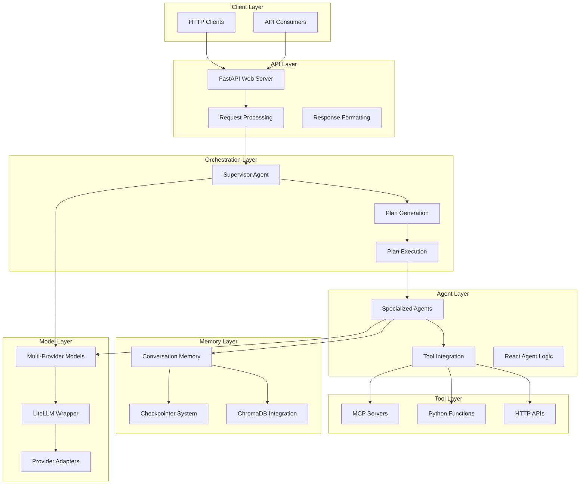
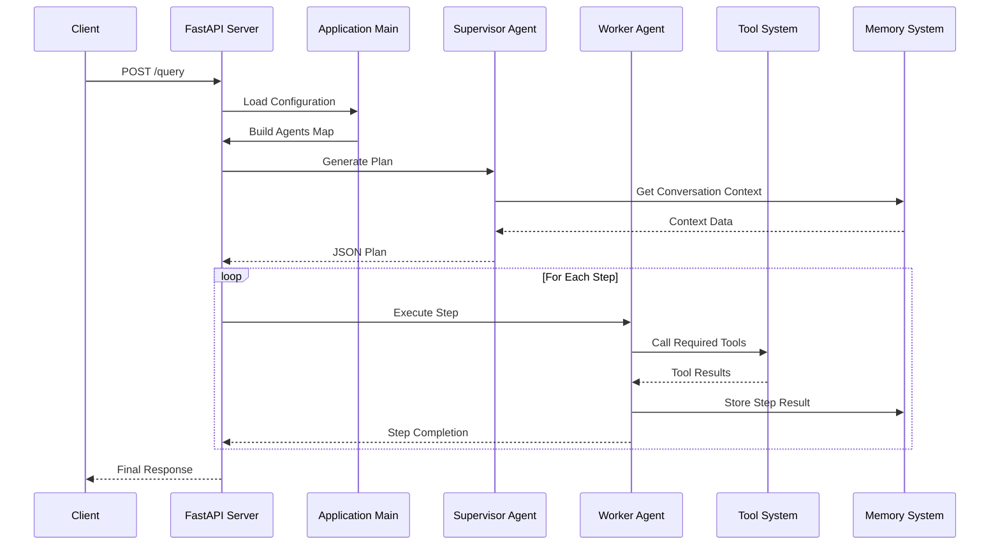
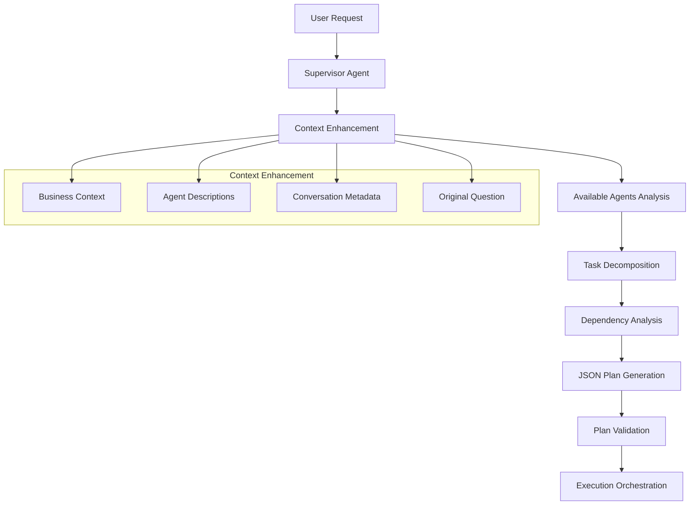
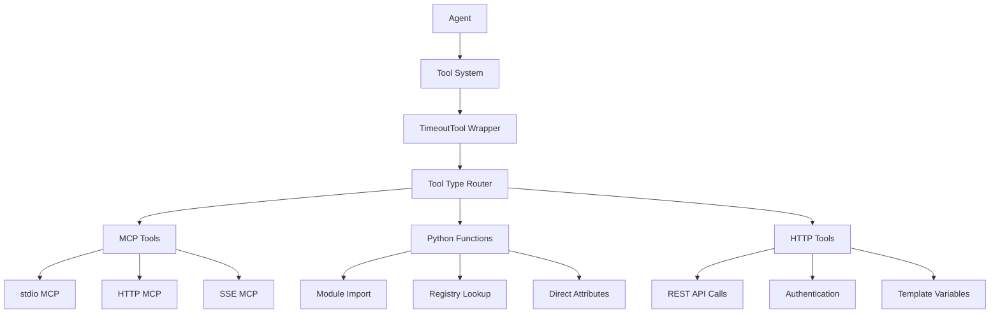
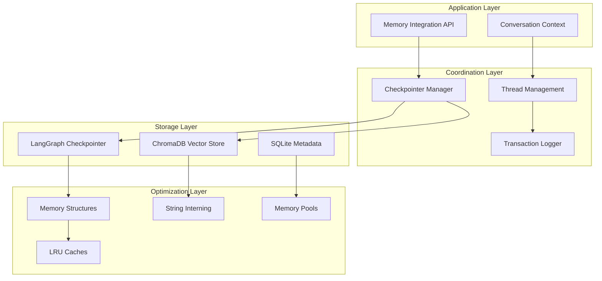
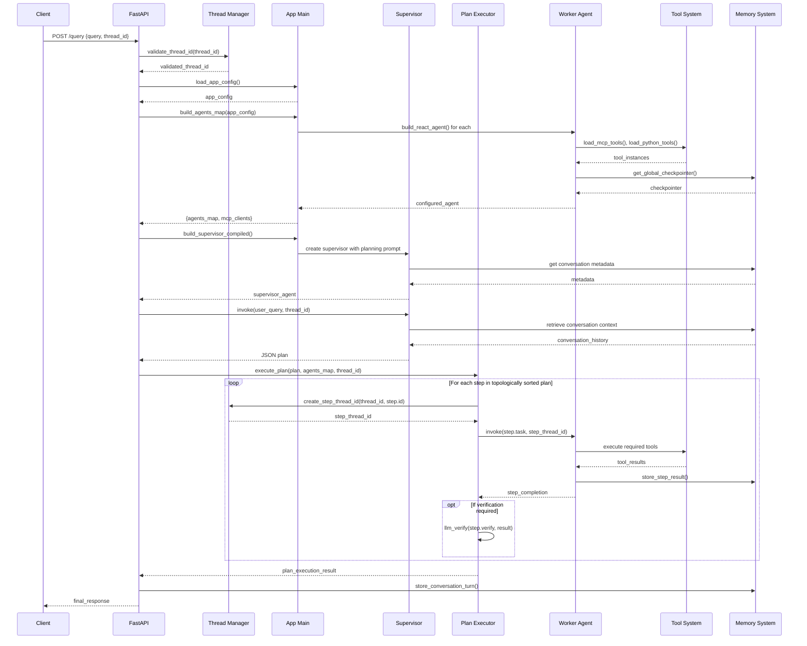
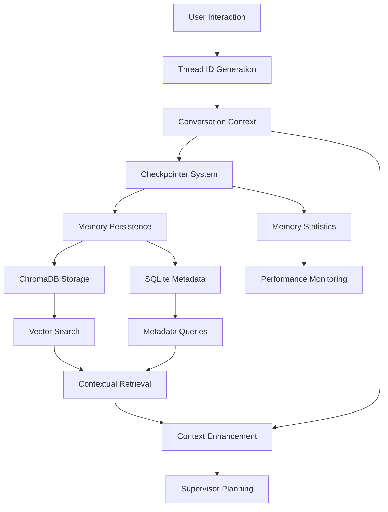
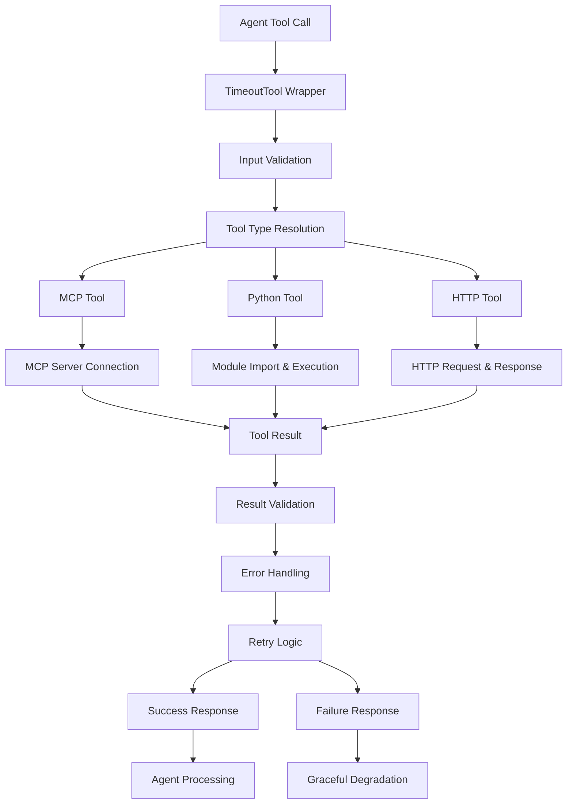

# JK-Agents Framework - Integrated Design Document

*Generated on: 2025-09-29*

## Executive Summary

The **JK-Agents Framework** is a sophisticated, production-ready multi-agent AI orchestration platform that implements a supervisor-based architecture for intelligent task decomposition and execution. Built on Python/FastAPI with extensive LangChain integration, the framework provides a robust foundation for building complex AI-powered applications with multi-provider LLM support, advanced memory management, and extensible tool integration.

---

## 🎯 Design Philosophy

### Core Principles

1. **Supervisor-Orchestrated Architecture**: Central planning agent coordinates specialized worker agents
2. **Multi-Provider Flexibility**: Seamless integration with multiple LLM providers (OpenAI, Azure, Google, Anthropic)
3. **Memory-Aware Operations**: Persistent conversation context with optimized memory management
4. **Tool Extensibility**: Pluggable tool system via Model Context Protocol (MCP) and Python functions
5. **Production Readiness**: Enterprise-grade error handling, monitoring, and scalability features
6. **Developer Experience**: Type-safe configuration, comprehensive testing, and extensive documentation

### Architectural Goals

- **Scalability**: Handle concurrent conversations and complex multi-step workflows
- **Reliability**: Graceful error handling with retry logic and fallback mechanisms
- **Maintainability**: Modular design with clear separation of concerns
- **Extensibility**: Easy integration of new models, tools, and capabilities
- **Performance**: Optimized memory usage and execution efficiency

---

## 🏗️ System Architecture

### High-Level Architecture



### Component Interaction Model



---

## 🔧 Core Design Components

### 1. Configuration Management System

**Design Pattern**: Pydantic-based type-safe configuration with validation

#### Configuration Hierarchy
```yaml
AppConfig
├── models: Dict[str, str]              # Model mappings
├── business_context: str               # Shared context
├── supervisor: SupervisorConfig        # Planning agent config
├── agents: List[AgentConfig]          # Worker agents
├── temperature: float                  # Default temperature
└── persistence: PersistenceConfig     # Memory settings

AgentConfig
├── name: str                          # Agent identifier
├── model: str                         # Model specification
├── prompt: str | prompt_file: str     # Agent instructions
├── agent_type: "react" | "normal"     # Agent architecture type
├── mcp_servers: Dict[str, MCPConfig]  # Tool integrations
├── python_tools: Dict[str, PyConfig]  # Python functions
└── parallel_tool_calls: bool          # Concurrency setting
```

#### Configuration Loading Process
1. **File Loading**: YAML parsing with UTF-8 encoding support
2. **Environment Integration**: Automatic `.env` loading and variable substitution
3. **Model Format Normalization**: Consistent provider format handling
4. **Provider Detection**: Auto-detection of Azure OpenAI vs OpenAI configurations
5. **Validation**: Pydantic model validation with detailed error reporting
6. **Template Expansion**: `file:` prefix support for external prompt files

### 2. Multi-Provider Model System

**Design Pattern**: Strategy pattern with provider-specific adapters

#### Model Format Specification
```python
# Provider formats supported:
"google:gemini-2.0-flash-exp:0.5"     # Google with temperature
"azure_openai:gpt-4o"                 # Azure OpenAI deployment
"openai:gpt-4o-mini"                  # OpenAI API or LM Studio
"anthropic:claude-sonnet-4"           # Anthropic Claude
"openai/gpt-4o"                       # LiteLLM format
"gemini/gemini-1.5-pro"              # LiteLLM Gemini format
```

#### Provider Selection Logic
```python
def create_model_instance(model_id: str) -> ModelInstance:
    # 1. Enhanced LiteLLM wrapper (priority)
    if HAS_ENHANCED_LITELLM and is_litellm_model(model_id):
        return create_litellm_model(model_id)
    
    # 2. Legacy LiteLLM provider
    if is_legacy_litellm_format(model_id):
        return create_legacy_litellm(model_id)
    
    # 3. Provider-specific implementations
    if model_id.startswith("google:"):
        return create_gemini_model(model_id)
    
    # 4. Model string passthrough for LangGraph
    return model_id
```

#### Provider-Specific Optimizations
- **Google Gemini**: Schema filtering for tool compatibility, multimodal support
- **Azure OpenAI**: Enterprise authentication, deployment mapping  
- **Enhanced LiteLLM**: Multi-provider abstraction, automatic fallbacks
- **OpenAI**: Direct API integration or LM Studio compatibility

### 3. Supervisor-Based Planning System

**Design Pattern**: Command pattern with intelligent task decomposition

#### Planning Workflow


#### Plan Structure
```json
{
  "goal": "High-level user objective description",
  "plan": [
    {
      "id": "s1",
      "agent": "data_analyzer",
      "task": "Analyze the uploaded CSV file for patterns",
      "depends_on": [],
      "verify": "Was the CSV file successfully analyzed?",
      "timeout_seconds": 120,
      "retry": 1
    },
    {
      "id": "s2", 
      "agent": "report_generator",
      "task": "Create a summary report based on analysis results",
      "depends_on": ["s1"],
      "verify": "Is the report complete and well-formatted?"
    }
  ]
}
```

#### Context Enhancement Features
- **Agent Listing**: Dynamic agent descriptions for planning context
- **Business Context**: Template-rendered business-specific information
- **Conversation Metadata**: Memory size, turn count, summarization recommendations
- **Placeholder System**: Advanced template rendering with custom providers

### 4. Plan Execution Engine

**Design Pattern**: Pipeline pattern with dependency resolution

#### Execution Process
```python
async def execute_plan(plan: Plan, agents_map: Dict, thread_id: str):
    # 1. Dependency Resolution
    sorted_steps = topo_sort_steps(plan.plan)  # Kahn's algorithm
    
    # 2. Sequential Execution with Context
    for step in sorted_steps:
        step_thread_id = create_step_thread_id(thread_id, step.id)
        agent = agents_map[step.agent]
        
        # 3. Execute with memory isolation
        result = await agent.invoke(
            {"messages": [HumanMessage(content=step.task)]},
            config={"configurable": {"thread_id": step_thread_id}}
        )
        
        # 4. Verification (optional)
        if step.verify:
            verification = await llm_verify(step.verify, result)
            if not verification.success:
                await retry_step(step, result)
        
        # 5. Progress tracking and error handling
        track_step_completion(step, result)
```

#### Safety and Reliability Features
- **Dependency Validation**: Ensures all step dependencies exist
- **Circular Dependency Detection**: Prevents infinite loops in plan execution
- **Thread Isolation**: Each step gets unique conversation context
- **Verification System**: Optional LLM-based step completion verification
- **Retry Logic**: Configurable retry attempts with exponential backoff
- **Error Aggregation**: Comprehensive error collection and reporting

### 5. Tool Integration Architecture

**Design Pattern**: Adapter pattern with timeout and retry protection

#### Tool Integration Hierarchy


#### TimeoutTool Wrapper Features
```python
class TimeoutTool(BaseTool):
    def __init__(self, inner: BaseTool, timeout: float = 15.0, retries: int = 0):
        # Features:
        # - Configurable execution timeouts
        # - Automatic retry with exponential backoff
        # - Schema preservation from wrapped tool
        # - Structured argument handling
        # - Empty value filtering
        # - Error categorization and reporting
```

**Error Classification System**:
- Parameter conflicts → Immediate failure with clear message
- Authentication issues → Retry with exponential backoff
- Permission problems → Immediate failure with context
- Connectivity issues → Retry with timeout adjustment
- Generic errors → Standard retry logic with full logging

#### MCP Server Management
```yaml
# Configuration example
mcp_servers:
  python_runner:
    description: "Python code execution environment"
    transport: "stdio"
    command: "deno"
    args: ["run", "-N", "jsr:@pydantic/mcp-run-python"]
    env:
      PYTHONPATH: "/app/tools"
  
  api_service:
    description: "External API integration"
    transport: "http" 
    url: "https://api.example.com/mcp"
    headers:
      Authorization: "Bearer {{api_key}}"
      Content-Type: "application/json"
```

**Connection Lifecycle**:
1. **Initialization**: Transport-specific connection establishment
2. **Discovery**: Tool schema and capability enumeration
3. **Wrapper Application**: Timeout and retry protection application
4. **Error Handling**: Graceful failure with partial tool loading
5. **Cleanup**: Proper resource cleanup and connection closure

### 6. Advanced Memory Management

**Design Pattern**: Multi-layered storage with optimized data structures

#### Memory Architecture Layers


#### High-Performance Data Structures
```python
@dataclass(slots=True, frozen=True)
class OptimizedCheckpoint:
    """Memory-efficient checkpoint with 40% size reduction"""
    thread_id: str
    user_hash: int      # 8 bytes vs full user_id string
    timestamp: int      # Unix timestamp vs datetime object
    data: bytes         # Pre-serialized, no copying needed
    size: int          # Size tracking for memory monitoring
```

**Optimization Features**:
- **`__slots__` Usage**: 40% memory reduction per object
- **String Interning**: Deduplicated storage for repeated strings
- **Memory Pools**: Buffer reuse to eliminate GC overhead
- **Zero-Copy Operations**: Minimized memory allocations
- **orjson Integration**: High-performance JSON serialization

#### Memory Statistics and Monitoring
```python
class MemoryMetrics:
    def __init__(self):
        self.checkpoint_count = 0
        self.total_memory_mb = 0.0
        self.string_intern_hits = 0
        self.memory_pool_reuse_rate = 0.95
        self.gc_collection_count = 0
```

### 7. Multi-Modal Capabilities

**Design Pattern**: Content type routing with provider-specific handling

#### Supported Content Types
- **Text**: Direct string processing and analysis
- **Images**: Vision model integration (Google Gemini, OpenAI Vision)
- **Documents**: PDF parsing, structured data extraction
- **CSV/Data**: Tabular data analysis and visualization
- **Code**: Syntax analysis and execution capabilities

#### Content Processing Pipeline
```python
async def process_multimodal_content(content: UploadedFile):
    # 1. Content type detection
    content_type = detect_content_type(content)
    
    # 2. Provider capability matching
    capable_models = find_capable_models(content_type)
    
    # 3. Content preprocessing
    processed_content = preprocess_content(content, content_type)
    
    # 4. Model-specific formatting
    formatted_input = format_for_model(processed_content, model)
    
    # 5. Agent execution with multimodal context
    result = await agent.invoke_with_content(formatted_input)
    
    return result
```

---

## 🔄 Data Flow Architecture

### Request Processing Flow



### Memory Data Flow



### Tool Execution Flow



---

## 🔒 Security and Reliability Design

### Security Features

#### Input Validation and Sanitization
```python
class SecurityManager:
    def validate_user_input(self, input_data: str) -> str:
        # 1. Input length limits
        if len(input_data) > MAX_INPUT_LENGTH:
            raise ValidationError("Input too long")
        
        # 2. Content filtering
        filtered_input = self.content_filter.filter(input_data)
        
        # 3. Injection attack prevention
        sanitized_input = self.sanitize_input(filtered_input)
        
        return sanitized_input
    
    def sanitize_tool_output(self, output: Any) -> Any:
        # Remove sensitive information from tool outputs
        return self.sensitive_data_filter.clean(output)
```

#### Environment Variable Protection
- **Credential Management**: API keys stored in environment variables only
- **Secret Redaction**: Automatic masking of sensitive data in logs
- **Runtime Security**: No hardcoded credentials in source code
- **Access Control**: Tool-level permissions and restrictions

#### Error Handling Strategy
```python
class ErrorHandler:
    def handle_tool_error(self, error: Exception) -> ErrorResponse:
        # 1. Error classification
        error_type = self.classify_error(error)
        
        # 2. Sensitive data removal
        safe_error = self.sanitize_error_message(error)
        
        # 3. Logging with context
        self.log_error(safe_error, context=self.get_context())
        
        # 4. User-safe response generation
        return self.generate_safe_response(error_type)
```

### Reliability Features

#### Retry Logic and Circuit Breakers
```python
class ReliabilityManager:
    async def execute_with_retry(
        self, 
        operation: Callable,
        max_retries: int = 3,
        backoff_factor: float = 1.5
    ):
        for attempt in range(max_retries + 1):
            try:
                return await operation()
            except RetryableError as e:
                if attempt == max_retries:
                    raise FinalFailureError(e) from e
                
                wait_time = backoff_factor ** attempt
                await asyncio.sleep(wait_time)
```

#### Graceful Degradation Strategies
- **Tool Failures**: Continue execution without failed tools
- **Model Failures**: Automatic fallback to backup models
- **Memory Issues**: Temporary memory reduction and cleanup
- **Network Issues**: Offline mode with cached responses

#### Performance Monitoring
```python
class PerformanceMonitor:
    def __init__(self):
        self.metrics = {
            "request_duration": [],
            "memory_usage": [],
            "tool_execution_time": [],
            "error_rates": {},
            "concurrent_threads": 0
        }
    
    async def track_operation(self, operation_name: str):
        start_time = time.time()
        try:
            yield
            duration = time.time() - start_time
            self.metrics["request_duration"].append({
                "operation": operation_name,
                "duration": duration,
                "status": "success"
            })
        except Exception as e:
            self.metrics["error_rates"][operation_name] = \
                self.metrics["error_rates"].get(operation_name, 0) + 1
            raise
```

---

## 📈 Performance and Scalability Design

### Performance Optimizations

#### Memory Management
- **Object Pooling**: Reusable object instances for frequent operations
- **Lazy Loading**: Load resources only when needed
- **Memory Mapping**: Efficient file I/O for large datasets
- **Garbage Collection Tuning**: Optimized GC parameters for performance

#### Concurrency Design
```python
class ConcurrencyManager:
    def __init__(self, max_concurrent_requests: int = 100):
        self.semaphore = asyncio.Semaphore(max_concurrent_requests)
        self.active_threads = {}
        self.thread_pool = concurrent.futures.ThreadPoolExecutor(
            max_workers=20
        )
    
    async def process_request(self, request_id: str, handler: Callable):
        async with self.semaphore:
            self.active_threads[request_id] = time.time()
            try:
                result = await handler()
                return result
            finally:
                del self.active_threads[request_id]
```

#### Caching Strategy
- **Configuration Caching**: Preloaded agent configurations
- **Model Instance Reuse**: Cached model instances across requests
- **Tool Result Caching**: Temporary caching of expensive tool calls
- **Memory Checkpoints**: Efficient checkpoint storage and retrieval

### Scalability Features

#### Horizontal Scaling Support
- **Stateless Design**: No server-side session state
- **External Memory**: Persistent storage independent of server instances
- **Load Balancer Ready**: Health checks and graceful shutdown
- **Container Optimization**: Docker-ready with minimal resource usage

#### Resource Management
```python
class ResourceManager:
    def __init__(self):
        self.connection_pools = {}
        self.memory_limits = {
            "max_memory_per_thread": 100 * 1024 * 1024,  # 100MB
            "max_total_memory": 2 * 1024 * 1024 * 1024,  # 2GB
        }
        self.cleanup_scheduler = asyncio.create_task(
            self.periodic_cleanup()
        )
    
    async def periodic_cleanup(self):
        while True:
            await asyncio.sleep(300)  # Every 5 minutes
            await self.cleanup_inactive_threads()
            await self.optimize_memory_usage()
```

---

## 🧪 Testing and Quality Assurance

### Testing Architecture

#### Test Categories
1. **Unit Tests**: Individual module and function testing
2. **Integration Tests**: Cross-module interaction testing  
3. **Performance Tests**: Load and stress testing
4. **End-to-End Tests**: Complete workflow validation
5. **Provider Tests**: Multi-LLM provider compatibility
6. **Memory Tests**: Memory leak and optimization validation

#### Test Structure
```python
# Example test organization
tests/
├── unit/
│   ├── test_config.py
│   ├── test_agent_builder.py
│   └── test_memory_system.py
├── integration/
│   ├── test_supervisor_execution.py
│   ├── test_tool_integration.py
│   └── test_multimodal_workflow.py
├── performance/
│   ├── test_memory_performance.py
│   ├── test_concurrent_requests.py
│   └── test_large_data_handling.py
└── e2e/
    ├── test_complete_workflows.py
    └── test_multi_provider_scenarios.py
```

### Quality Metrics

#### Code Quality Standards
- **Type Coverage**: 95%+ type annotation coverage
- **Test Coverage**: 90%+ code coverage across all modules
- **Documentation Coverage**: 100% public API documentation
- **Linting Compliance**: Black formatting, isort import sorting

#### Performance Benchmarks
- **Response Time**: <2s for simple queries, <30s for complex workflows
- **Memory Usage**: <500MB baseline, <2GB under load
- **Concurrent Requests**: Support 100+ concurrent conversations
- **Tool Execution**: <15s timeout per tool call with retry logic

---

## 🔮 Extension and Customization Points

### Extension Architecture

#### Custom Agent Types
```python
# Custom agent type implementation
class CustomAgentBuilder:
    def build_custom_agent(
        self, 
        agent_cfg: AgentConfig, 
        tools: List[BaseTool],
        model: ModelInstance
    ) -> CustomAgent:
        # Custom agent logic implementation
        return CustomAgent(
            model=model,
            tools=tools,
            custom_behavior=agent_cfg.custom_config
        )

# Registration in agent_builder.py
AGENT_BUILDERS = {
    "react": build_react_agent,
    "normal": build_normal_agent,
    "custom": CustomAgentBuilder().build_custom_agent
}
```

#### Custom Tool Integration
```python
# Custom MCP transport implementation
class CustomMCPTransport:
    def __init__(self, config: MCPServerConfig):
        self.config = config
    
    async def connect(self) -> MCPConnection:
        # Custom connection logic
        return CustomConnection(self.config)

# Custom Python tool module
# tools/custom_tools.py
class CustomTool(BaseTool):
    name = "custom_processor"
    description = "Processes data with custom algorithm"
    
    def _run(self, input_data: str) -> str:
        # Custom processing logic
        return self.process(input_data)
```

#### Custom Model Providers
```python
# Custom model provider implementation
class CustomModelProvider:
    def create_model(self, model_id: str, **kwargs) -> ModelInstance:
        # Custom model initialization
        return CustomModelInstance(model_id, **kwargs)

# Registration in agent_builder.py
if model_id.startswith("custom:"):
    return CustomModelProvider().create_model(model_id)
```

#### Custom Memory Backends
```python
# Custom checkpointer implementation
class CustomCheckpointer(BaseCheckpointer):
    def __init__(self, connection_string: str):
        self.connection = create_connection(connection_string)
    
    async def get_tuple(self, config: RunnableConfig) -> CheckpointTuple:
        # Custom retrieval logic
        return await self.retrieve_checkpoint(config)
    
    async def put_tuple(
        self, 
        config: RunnableConfig, 
        checkpoint: Checkpoint
    ) -> RunnableConfig:
        # Custom storage logic
        return await self.store_checkpoint(config, checkpoint)
```

### Plugin System Design

#### Plugin Interface
```python
class FrameworkPlugin:
    def __init__(self, config: Dict[str, Any]):
        self.config = config
    
    def initialize(self, framework: JKAgentsFramework):
        """Initialize plugin with framework instance"""
        pass
    
    def register_agents(self) -> Dict[str, AgentBuilder]:
        """Register custom agent builders"""
        return {}
    
    def register_tools(self) -> Dict[str, ToolLoader]:
        """Register custom tool loaders"""
        return {}
    
    def register_models(self) -> Dict[str, ModelProvider]:
        """Register custom model providers"""
        return {}
```

#### Plugin Loading System
```python
class PluginManager:
    def __init__(self, plugin_directory: Path = Path("plugins")):
        self.plugin_directory = plugin_directory
        self.loaded_plugins = {}
    
    def load_plugins(self) -> List[FrameworkPlugin]:
        plugins = []
        for plugin_file in self.plugin_directory.glob("*.py"):
            plugin = self.load_plugin(plugin_file)
            if plugin:
                plugins.append(plugin)
        return plugins
    
    def register_plugins(
        self, 
        plugins: List[FrameworkPlugin], 
        framework: JKAgentsFramework
    ):
        for plugin in plugins:
            plugin.initialize(framework)
            self.register_plugin_components(plugin)
```

---

## 📊 Monitoring and Observability

### Metrics Collection

#### Application Metrics
```python
class MetricsCollector:
    def __init__(self):
        self.metrics = {
            "requests_total": 0,
            "requests_successful": 0,
            "requests_failed": 0,
            "response_times": [],
            "active_threads": 0,
            "memory_usage_mb": 0,
            "tool_execution_count": {},
            "model_usage_count": {},
            "error_rates": {}
        }
    
    def record_request(self, duration: float, success: bool):
        self.metrics["requests_total"] += 1
        if success:
            self.metrics["requests_successful"] += 1
        else:
            self.metrics["requests_failed"] += 1
        self.metrics["response_times"].append(duration)
```

#### Health Check System
```python
class HealthChecker:
    def __init__(self, framework: JKAgentsFramework):
        self.framework = framework
        self.health_checks = [
            self.check_memory_usage,
            self.check_model_availability,
            self.check_tool_connectivity,
            self.check_database_connection
        ]
    
    async def perform_health_check(self) -> HealthStatus:
        results = {}
        for check in self.health_checks:
            try:
                results[check.__name__] = await check()
            except Exception as e:
                results[check.__name__] = {"status": "unhealthy", "error": str(e)}
        
        return HealthStatus(checks=results)
```

### Logging Strategy

#### Structured Logging
```python
import structlog

logger = structlog.get_logger("jk_agents")

# Usage throughout the framework
logger.info(
    "Agent execution completed",
    agent_name=agent.name,
    duration_ms=duration * 1000,
    tool_calls=len(tool_results),
    thread_id=thread_id,
    success=True
)
```

#### Log Levels and Categories
- **DEBUG**: Detailed execution traces, tool arguments, model responses
- **INFO**: Request processing, agent execution, plan generation
- **WARNING**: Fallback usage, retry attempts, configuration issues
- **ERROR**: Tool failures, model errors, validation failures
- **CRITICAL**: System failures, security issues, data corruption

---

## 🎯 Future Architecture Considerations

### Planned Enhancements

#### Advanced Planning Capabilities
- **Multi-Objective Planning**: Handle competing goals and constraints
- **Dynamic Replanning**: Adapt plans based on execution results
- **Resource-Aware Planning**: Consider computational and time constraints
- **Learning-Based Planning**: Improve planning based on historical success rates

#### Enhanced Tool Ecosystem
- **Tool Composition**: Combine simple tools into complex workflows
- **Tool Learning**: Automatically discover and integrate new tools
- **Tool Optimization**: Performance profiling and optimization recommendations
- **Tool Versioning**: Manage tool updates and compatibility

#### Distributed Architecture
- **Microservices Decomposition**: Split framework into specialized services
- **Event-Driven Architecture**: Asynchronous communication between components
- **Distributed Memory**: Shared memory across multiple framework instances
- **Load Balancing**: Intelligent request distribution and resource allocation

#### AI-Powered Operations
- **Self-Monitoring**: AI-based system health monitoring and optimization
- **Predictive Scaling**: Anticipate resource needs based on usage patterns  
- **Automated Debugging**: AI-assisted error diagnosis and resolution
- **Performance Tuning**: Automatic parameter optimization based on workload

---

## 📝 Implementation Guidelines

### Development Workflow

1. **Configuration First**: Start with YAML configuration design
2. **Type Safety**: Use Pydantic models for all data structures
3. **Error Handling**: Implement comprehensive error handling and logging
4. **Testing**: Write tests before implementation (TDD approach)
5. **Documentation**: Document APIs and integration points
6. **Performance**: Profile and optimize critical paths
7. **Security**: Review for security implications at each step

### Code Organization Principles

- **Single Responsibility**: Each module has one clear purpose
- **Dependency Injection**: Use configuration-driven dependencies
- **Interface Segregation**: Define clear interfaces between components
- **Open/Closed Principle**: Extend functionality without modifying core code
- **Composition over Inheritance**: Prefer composition for flexibility

### Deployment Considerations

- **Environment Parity**: Consistent environments across dev/staging/production
- **Configuration Management**: Environment-specific configuration files
- **Secret Management**: Secure handling of API keys and credentials
- **Monitoring Setup**: Comprehensive logging and metrics collection
- **Backup Strategy**: Regular backups of conversation memory and configurations

---

This integrated design document provides a comprehensive overview of the JK-Agents Framework architecture, design patterns, and implementation strategies. It serves as a blueprint for understanding, extending, and maintaining the framework while ensuring scalability, reliability, and maintainability.