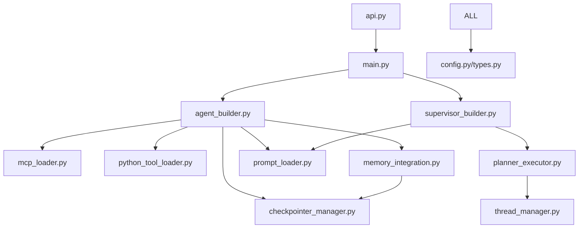

# Per-Module Documentation - JK Agents Framework

*Generated on: 2025-09-29*

## Overview

This document provides detailed API reference documentation for each core module in the jk-agents-framework. Each module description includes purpose, key classes/functions, usage examples, and integration points.

---

## 🔧 Core Configuration Modules

### `app/config.py` - Configuration Management

**Purpose**: Defines Pydantic models for type-safe configuration management across the framework.

#### Key Classes

##### `MCPServerConfig`
```python
class MCPServerConfig(BaseModel):
    description: Optional[str] = ""
    transport: str  # "stdio" | "streamable_http" | "sse" | "http"
    command: Optional[str] = None
    args: Optional[List[str]] = None
    url: Optional[str] = None
    env: Optional[Dict[str, str]] = None
    headers: Optional[Dict[str, str]] = None
```

**Validation Rules**:
- `stdio` transport requires `command`
- HTTP-like transports require `url`
- Validates transport types against allowed values

**Usage Example**:
```yaml
mcp_servers:
  python_runner:
    transport: "stdio"
    command: "deno"
    args: ["run", "-N", "jsr:@pydantic/mcp-run-python"]
```

##### `AgentConfig`
```python
class AgentConfig(BaseModel):
    name: str
    description: Optional[str] = ""
    model: Optional[str] = None
    prompt: Optional[str] = None
    prompt_file: Optional[str] = None
    agent_type: str = "react"  # "react" | "normal"
    mcp_servers: Dict[str, MCPServerConfig] = Field(default_factory=dict)
    http_tools: Dict[str, Dict] = Field(default_factory=dict)
    python_tools: Dict[str, PythonFunctionToolConfig] = Field(default_factory=dict)
    parallel_tool_calls_enabled: Optional[bool] = None
```

**Validation Rules**:
- Requires either `prompt` or `prompt_file`
- Agent type must be "react" or "normal"
- Model-level parallel tool calls override app-level setting

##### `AppConfig`
```python
class AppConfig(BaseModel):
    models: Dict[str, str] = Field(default_factory=lambda: {"default": "openai:gpt-4o-mini"})
    business_context: Optional[str] = ""
    supervisor: Optional[SupervisorConfig] = None
    agents: List[AgentConfig] = Field(default_factory=list)
    temperature: Optional[float] = 0.2
    # ... memory and persistence settings
```

#### Integration Points
- Used by `main.py` for configuration loading
- Validated by `agent_builder.py` during agent construction
- Extended by memory and logging configurations

---

### `app/types.py` - Type Exports

**Purpose**: Backward compatibility module that re-exports configuration types.

**Contents**: Re-exports all classes from `app.config` for legacy imports.

**Usage**: Import configuration types without direct config module dependency.

---

## 🏗️ Core Framework Modules

### `app/main.py` - Application Bootstrap

**Purpose**: Central module for loading configuration and building the agent ecosystem.

#### Key Functions

##### `load_app_config(cfg_path: Path | None = None) -> AppConfig`
```python
def load_app_config(cfg_path: Path | None = None) -> AppConfig:
    """Load YAML configuration into validated AppConfig object"""
```

**Features**:
- Automatic `.env` loading from repo root
- Model format normalization
- Provider prefix handling (Azure OpenAI auto-detection)
- Environment variable overrides
- Prompt file expansion (`file:` prefix)

**Provider Logic**:
- Detects Azure OpenAI environment variables
- Handles OpenAI-compatible base URLs (LM Studio)
- Auto-converts `openai:` to `azure_openai:` when appropriate

##### `build_agents_map(app_cfg: AppConfig, user_input: str = "", config_path: Optional[str] = None)`
```python
async def build_agents_map(app_cfg, user_input, config_path):
    """Build dictionary of agent instances from configuration"""
```

**Process**:
1. Process business context templates
2. Create agent instances via `build_react_agent`
3. Track MCP client connections
4. Return agents map and client references

##### `process_business_context_template(business_context: str, placeholder_context: Optional[Dict[str, Any]] = None) -> str`
```python
def process_business_context_template(business_context, placeholder_context):
    """Render business context with placeholder substitution"""
```

#### Integration Points
- Used by `api.py` for application startup
- Integrates with `agent_builder.py` for agent construction
- Coordinates with placeholder system for template rendering

---

### `app/agent_builder.py` - Agent Construction

**Purpose**: Core agent building logic with multi-provider model support and tool integration.

#### Key Functions

##### `create_model_instance(model_id: str, default_temperature: float = 0.2, app_config: Optional[Dict[str, Any]] = None) -> Any`
```python
def create_model_instance(model_id, default_temperature, app_config):
    """Create model instance with provider-specific handling"""
```

**Model Format Support**:
- `google:gemini-2.0-flash-exp` → Google Gemini
- `azure_openai:gpt-4o` → Azure OpenAI  
- `openai:gpt-4o` → OpenAI API or LM Studio
- `anthropic:claude-sonnet-4` → Anthropic Claude
- LiteLLM format: `openai/gpt-4o`, `gemini/gemini-1.5-pro`

**Temperature Parsing**:
- Format: `provider:model:temperature` 
- Example: `google:gemini-2.0-flash-exp:0.5`

**Provider Selection Logic**:
1. Enhanced LiteLLM wrapper (priority)
2. Legacy LiteLLM provider
3. Provider-specific implementations
4. Model string passthrough for LangGraph

##### `build_react_agent(agent_cfg, app_config, processed_business_context, checkpointer=None, ...)`
```python
async def build_react_agent(agent_cfg, app_config, processed_business_context):
    """Build complete React agent with tools and memory"""
```

**Construction Process**:
1. **Model Creation**: Multi-provider model instance
2. **Tool Loading**: MCP servers, HTTP tools, Python functions
3. **Tool Optimization**: Provider-specific filtering (Gemini schema)
4. **Prompt Rendering**: Template processing with placeholders
5. **Agent Assembly**: LangGraph React agent with memory
6. **Enhancement**: Logging wrappers and monitoring

**Tool Integration**:
- **MCP Tools**: Via `load_mcp_tools()` from `mcp_loader.py`
- **HTTP Tools**: Via `build_http_tools()` for REST APIs
- **Python Tools**: Via `load_python_function_tools()` from module imports

**Memory Integration**:
- Global checkpointer for conversation persistence
- Thread-based memory isolation
- Performance logging and monitoring

#### Provider-Specific Optimizations

##### Google Gemini
- Schema filtering for tool compatibility
- Multimodal capabilities support
- Vision model handling

##### Azure OpenAI
- Custom authentication handling
- Deployment-specific model mapping
- Enterprise security features

##### Enhanced LiteLLM
- Multi-provider abstraction
- Automatic fallback mechanisms
- Cost optimization features

#### Integration Points
- Called by `main.py` for agent construction
- Uses `mcp_loader.py` for tool integration
- Integrates with memory system via `checkpointer_manager.py`
- Applies optimizations from `gemini_schema_filter.py`

---

### `app/supervisor_builder.py` - Supervisor Construction

**Purpose**: Builds the central planning agent that orchestrates task decomposition and execution.

#### Key Functions

##### `build_supervisor_compiled(supervisor_cfg, agents_cfg, default_model, business_context="", ...)`
```python
def build_supervisor_compiled(supervisor_cfg, agents_cfg, default_model, **kwargs):
    """Build supervisor agent with planning capabilities"""
```

**Construction Features**:
1. **Agent Listing**: Formats available agents for planning context
2. **Prompt Loading**: File-based or direct prompt configuration  
3. **Enhanced Placeholders**: Integration with placeholder system
4. **Conversation Metadata**: Dynamic context injection for memory-aware planning
5. **Fallback Rendering**: Multiple template rendering strategies
6. **Model Integration**: Multi-provider model support

**Planning Context Enhancement**:
- Available agent descriptions
- Business context integration
- Original user question context
- Conversation metadata (word count, turn count, etc.)

**Template Rendering Process**:
1. **Enhanced Rendering**: Uses `PlaceholderContext` with custom placeholders
2. **Legacy Fallback**: Jinja2 template rendering
3. **Simple Replacement**: Direct string substitution as last resort

**Conversation Metadata Integration**:
```python
# Metadata structure
{
    "word_count": int,
    "turn_count": int, 
    "message_count": int,
    "has_structured_data": bool,
    "summarization_recommended": bool,
    "memory_size_bytes": int
}
```

#### Integration Points
- Uses `agent_builder.create_model_instance` for model creation
- Integrates with `placeholder_system` for advanced templating
- Coordinates with `simple_conversation_memory_fixed` for metadata
- Utilizes global checkpointer for memory persistence

---

### `app/planner_executor.py` - Plan Execution Engine

**Purpose**: Orchestrates the execution of supervisor-generated plans with dependency management and verification.

#### Key Classes

##### `PlanStep`
```python
class PlanStep(BaseModel):
    id: str
    agent: str  
    task: str
    depends_on: Optional[List[str]] = Field(default_factory=list)
    verify: Optional[str] = None
    timeout_seconds: Optional[int] = None
    retry: Optional[int] = 0
```

##### `Plan`
```python
class Plan(BaseModel):
    goal: Optional[str] = None
    plan: List[PlanStep]
```

#### Key Functions

##### `parse_plan_text(text: str) -> Optional[Plan]`
```python
def parse_plan_text(text: str) -> Optional[Plan]:
    """Extract and validate JSON plan from supervisor response"""
```

**Process**:
1. Extract JSON block using `utils.extract_json_block`
2. Parse JSON and validate against `Plan` schema
3. Return validated plan or None on failure

##### `topo_sort_steps(steps: List[PlanStep]) -> List[PlanStep]`
```python
def topo_sort_steps(steps: List[PlanStep]) -> List[PlanStep]:
    """Topologically sort steps by dependencies"""
```

**Algorithm**: 
- Validates all dependencies exist
- Uses Kahn's algorithm for topological sorting
- Detects circular dependencies
- Returns execution-ready order

##### `execute_plan(supervisor, agents_map, plan, thread_id, ...)`
```python
async def execute_plan(supervisor, agents_map, plan, thread_id):
    """Execute plan with dependency resolution and verification"""
```

**Execution Features**:
1. **Dependency Resolution**: Topological sorting ensures proper order
2. **Thread Isolation**: Each step gets unique conversation thread
3. **Progress Tracking**: Real-time execution monitoring
4. **Verification System**: Optional LLM-based step verification  
5. **Error Handling**: Retry logic and graceful failure recovery
6. **Memory Context**: Conversation continuity across steps

#### Verification System

##### `llm_verify(check_prompt: str, model: str)`
```python
async def llm_verify(check_prompt: str, model: str):
    """LLM-based verification of step completion"""
```

**Features**:
- Multi-provider model support
- Content moderation handling
- Fallback prompt strategies
- Graceful error recovery

#### Safety Features

##### `safe_langgraph_execution()`
```python
@asynccontextmanager
async def safe_langgraph_execution():
    """Safe execution context for LangGraph operations"""
```

**Protection**:
- TaskGroup exception handling
- Error aggregation and reporting
- Controlled exception propagation

#### Integration Points
- Coordinates with `thread_manager.py` for thread isolation
- Uses `supervisor_builder` output for plan generation
- Integrates with `agent_builder` agents for execution
- Utilizes multi-provider model system for verification

---

## 🛠️ Tool Integration Modules

### `app/mcp_loader.py` - Model Context Protocol Integration

**Purpose**: Manages MCP server connections and tool loading with timeout protection and retry logic.

#### Key Classes

##### `TimeoutTool`
```python
class TimeoutTool(BaseTool):
    def __init__(self, inner: BaseTool, timeout: float = 15.0, retries: int = 0):
        """Wrapper for tools with timeout and retry protection"""
```

**Features**:
- **Timeout Protection**: Configurable execution timeouts
- **Retry Logic**: Automatic retry with exponential backoff
- **Schema Preservation**: Maintains original tool schemas
- **Structured Arguments**: Handles both dict and string inputs
- **Empty Value Filtering**: Removes empty arrays and strings
- **Error Categorization**: Intelligent error classification and reporting

**Input Processing**:
```python
# Handles multiple input formats:
# 1. Structured kwargs: {"param1": "value1", "param2": "value2"}
# 2. Single argument: "query string"  
# 3. Empty schema: {} (empty dict for parameterless tools)
# 4. JSON string: '{"param": "value"}' (auto-parsed)
```

**Error Categories**:
- Parameter conflicts
- Authentication issues  
- Permission problems
- Connectivity issues
- Generic errors

#### Key Functions

##### `load_mcp_tools(servers_cfg, tool_timeout=15.0, tool_retries=0)`
```python
async def load_mcp_tools(servers_cfg, tool_timeout, tool_retries):
    """Load tools from MCP server configurations"""
```

**Process**:
1. **Server Creation**: Initialize MCP servers based on transport
2. **Tool Loading**: Retrieve available tools from servers
3. **Tool Wrapping**: Apply timeout and retry protection
4. **Error Handling**: Graceful failure with partial loading

**Transport Support**:
- **stdio**: Command-line MCP servers (most common)
- **http/sse**: Web-based MCP servers
- **streamable_http**: Streaming HTTP servers

##### `build_http_tools(http_tools_cfg)`
```python
def build_http_tools(http_tools_cfg):
    """Build simple HTTP tools for direct API calls"""
```

**Features**:
- Direct REST API integration
- Custom headers and authentication
- Template variable substitution
- Method support (GET, POST, PUT, DELETE)

#### MCP Server Management

**Connection Lifecycle**:
1. **Initialization**: Create transport-specific connections
2. **Tool Discovery**: Query available tools and schemas
3. **Wrapper Application**: Apply timeout and retry protection
4. **Error Recovery**: Handle connection failures gracefully
5. **Cleanup**: Proper resource cleanup on shutdown

**Configuration Example**:
```yaml
mcp_servers:
  python_runner:
    description: "Python code execution"
    transport: "stdio"
    command: "deno"
    args: ["run", "-N", "jsr:@pydantic/mcp-run-python"]
  
  api_service:
    description: "External API integration"
    transport: "http"
    url: "https://api.example.com/mcp"
    headers:
      Authorization: "Bearer {{api_key}}"
```

#### Integration Points
- Used by `agent_builder.py` for tool loading
- Integrates with `MultiServerMCPClient` from langchain-mcp-adapters
- Coordinates with configuration system for server definitions
- Provides tools to LangGraph React agents

---

### `app/python_tool_loader.py` - Python Function Tool Integration

**Purpose**: Loads Python functions as LangChain tools from configured modules.

#### Key Functions

##### `load_python_function_tools(python_tools_config: Dict[str, Any]) -> List[BaseTool]`
```python
def load_python_function_tools(python_tools_config):
    """Load Python function tools from module configurations"""
```

**Configuration Support**:
```python
python_tools:
  business_tools:
    module_path: "tools.python_function_tools"
    tool_names: ["calculate_percentage", "format_currency"]
    description: "Business calculation tools"
  
  data_tools:
    module_path: "tools.data_analysis"
    function_name: "process_csv"  # Single function
```

**Loading Strategies**:
1. **Specific Tools**: Load named tools from `tool_names` list
2. **Single Function**: Load one function via `function_name`
3. **All Tools**: Load all available tools from module

**Module Integration Methods**:
1. **`load_tools_from_config(tool_names)`**: Preferred method
2. **`TOOL_REGISTRY`**: Dictionary of available tools
3. **Direct Attributes**: Tool functions as module attributes
4. **`get_all_function_tools()`**: Load all tools method

#### Validation System

##### `validate_python_tools(tools: List[BaseTool]) -> List[BaseTool]`
```python
def validate_python_tools(tools):
    """Validate loaded tools conform to LangChain BaseTool interface"""
```

**Validation Checks**:
- **Name Attribute**: Tool must have `name` property
- **Execution Method**: Must have `run` or `_run` method
- **Description**: Must have `description` for LLM context

#### Error Handling
- **Import Failures**: Graceful handling of missing modules
- **Missing Tools**: Warnings for tools not found in modules
- **Invalid Tools**: Validation failures with detailed logging
- **Partial Loading**: Continues loading other tools on individual failures

#### Integration Points
- Called by `agent_builder.py` during tool loading phase
- Works with custom tool modules in `tools/` directory
- Integrates with LangChain tool system
- Supports Pydantic configuration models

---

## 📁 Utility Modules

### `app/prompt_loader.py` - Prompt Management

**Purpose**: Handles loading of prompts from files with proper error handling and encoding support.

#### Key Functions

##### `load_prompt_content(prompt=None, prompt_file=None, config_dir=None) -> str`
```python
def load_prompt_content(prompt, prompt_file, config_dir):
    """Load prompt from direct text or file with validation"""
```

**Features**:
- **Dual Source Support**: Direct text or file-based prompts
- **Priority Logic**: `prompt_file` takes precedence if both provided
- **Encoding Handling**: UTF-8 with Windows compatibility
- **Path Resolution**: Relative paths resolved against config directory
- **Error Handling**: Comprehensive validation and error reporting

**Configuration Examples**:
```yaml
# Direct prompt
agents:
  - name: "agent1"
    prompt: "You are a helpful assistant..."

# File-based prompt  
agents:
  - name: "agent2"
    prompt_file: "prompts/specialist_agent.txt"
```

##### `get_config_directory(config_path: Optional[Path] = None) -> Path`
```python
def get_config_directory(config_path):
    """Resolve configuration directory for relative path resolution"""
```

**Resolution Logic**:
1. Use parent of provided config path
2. Default to `config/` directory relative to framework root

#### Error Handling
- **FileNotFoundError**: Missing prompt files
- **UnicodeDecodeError**: Encoding issues with detailed messages
- **ValueError**: Configuration validation failures
- **Path Resolution**: Clear error messages for path issues

#### Integration Points
- Used by `supervisor_builder.py` and `agent_builder.py`
- Integrates with configuration system for file resolution
- Supports template rendering pipeline

---

### `app/thread_manager.py` - Thread Management

**Purpose**: Manages conversation thread IDs for memory isolation and context tracking.

#### Key Functions

##### `generate_unique_thread_id() -> str`
```python
def generate_unique_thread_id():
    """Generate UUID-based thread ID"""
    return f"thread-{uuid.uuid4()}"
```

##### `generate_timestamped_thread_id() -> str`  
```python
def generate_timestamped_thread_id():
    """Generate timestamped thread ID for debugging"""
    return f"thread-{timestamp}-{short_uuid}"
```

##### `validate_thread_id(thread_id: str) -> bool`
```python
def validate_thread_id(thread_id):
    """Validate thread ID format and safety"""
```

**Validation Rules**:
- Alphanumeric characters, hyphens, underscores, dots
- Length between 1-200 characters
- No special characters that could cause issues

##### `get_or_create_thread_id(provided_thread_id: Optional[str] = None) -> str`
```python  
def get_or_create_thread_id(provided_thread_id):
    """Get validated thread ID or create new one"""
```

**Logic**:
1. Validate provided thread ID if given
2. Generate new thread ID if validation fails
3. Log thread ID creation and validation results

#### Thread Hierarchies

##### `create_supervisor_thread_id(base_thread_id: str) -> str`
```python
def create_supervisor_thread_id(base_thread_id):
    """Create supervisor-specific thread ID"""
    return f"{base_thread_id}-supervisor"
```

##### `create_step_thread_id(base_thread_id: str, step_id: str) -> str`
```python
def create_step_thread_id(base_thread_id, step_id):
    """Create step-specific thread ID for plan execution"""
    return f"{base_thread_id}-step-{step_id}"
```

#### Integration Points
- Used by `planner_executor.py` for step isolation
- Integrates with memory system for conversation tracking
- Provides thread context for all agent interactions

---

## 🧠 Memory System Modules

### `app/memory_integration.py` - Memory Coordination

**Purpose**: Provides high-level interface for conversation memory management.

#### Key Functions

##### `initialize_conversation_memory(app_cfg: AppConfig) -> bool`
```python
async def initialize_conversation_memory(app_cfg):
    """Initialize conversation memory system from configuration"""
```

##### `enhance_system_message_with_memory(system_message: str, thread_id: str, prepend: bool = True) -> str`
```python
def enhance_system_message_with_memory(system_message, thread_id, prepend):
    """Inject conversation context into system messages"""
```

##### `store_conversation_memory(thread_id: str, messages: List[Dict[str, Any]]) -> bool`
```python
async def store_conversation_memory(thread_id, messages):
    """Store conversation messages for future retrieval"""
```

**In-Memory Storage**: 
- Thread-based conversation storage
- Message history tracking
- Context building and retrieval

#### Integration Points
- Used by API layer for memory-aware responses
- Coordinates with checkpointer system
- Provides context for supervisor planning

---

### `app/checkpointer_manager.py` - Memory Persistence  

**Purpose**: Manages global checkpointer for conversation persistence and memory statistics.

#### Key Functions

##### `get_global_checkpointer()`
```python  
def get_global_checkpointer():
    """Get or create global memory checkpointer instance"""
```

##### `get_memory_stats()`
```python
def get_memory_stats():
    """Retrieve memory usage statistics"""
```

##### `clear_thread_memory(thread_id: str)`
```python
def clear_thread_memory(thread_id):
    """Clear memory for specific conversation thread"""
```

#### Integration Points
- Provides checkpointer to all agents and supervisors
- Coordinates with LangGraph for memory persistence
- Integrates with monitoring and statistics systems

---

## 🔧 Enhancement and Utility Modules

### `app/enhanced_litellm_wrapper.py` - Multi-Provider LLM Support

**Purpose**: Enhanced wrapper for LiteLLM with multimodal support and provider optimizations.

**Key Features**:
- Multi-provider abstraction (OpenAI, Azure, Anthropic, Google)
- Multimodal capabilities (text, images, documents)
- Automatic fallback mechanisms
- Cost optimization features
- Tool compatibility management

### `app/gemini_schema_filter.py` - Google Gemini Optimization

**Purpose**: Tool schema filtering and optimization for Google Gemini models.

**Key Features**:
- Schema compatibility filtering
- Tool definition optimization
- Gemini-specific parameter handling
- Performance improvements for Gemini interactions

### `app/placeholder_system/` - Template Enhancement

**Purpose**: Advanced placeholder replacement system for dynamic prompt generation.

#### Key Components
- **`context.py`**: Placeholder context management
- **`providers.py`**: Data providers for dynamic values
- **`registry.py`**: Placeholder registration and resolution
- **`exceptions.py`**: Custom exception handling

### `app/memory/` - Advanced Memory System

**Purpose**: Comprehensive memory management with multiple backends and optimizations.

#### Key Components
- **`structures.py`**: High-performance data structures with memory optimization
- **`chromadb_*.py`**: ChromaDB integration for vector storage
- **`transaction_logger.py`**: Memory operation logging and debugging
- **`enhanced_tool_node.py`**: Tool execution with memory awareness

---

## 🔗 Integration Flow

### Application Startup
1. **Configuration Loading** (`main.py`)
2. **Agent Building** (`agent_builder.py`) 
3. **Tool Integration** (`mcp_loader.py`, `python_tool_loader.py`)
4. **Memory Initialization** (`checkpointer_manager.py`)
5. **API Server Start** (`api.py`)

### Request Processing  
1. **Thread Management** (`thread_manager.py`)
2. **Supervisor Planning** (`supervisor_builder.py`)
3. **Plan Execution** (`planner_executor.py`)
4. **Tool Execution** (MCP/Python tools via `TimeoutTool`)
5. **Memory Persistence** (`memory_integration.py`)

### Memory Flow
1. **Context Enhancement** (`memory_integration.py`)
2. **Conversation Storage** (`checkpointer_manager.py`)
3. **Metadata Generation** (conversation metadata system)
4. **Performance Optimization** (`app/memory/structures.py`)

---

## 📊 Module Dependencies



This documentation provides comprehensive coverage of all core modules in the jk-agents-framework, their APIs, integration points, and usage patterns for developers working with the framework.