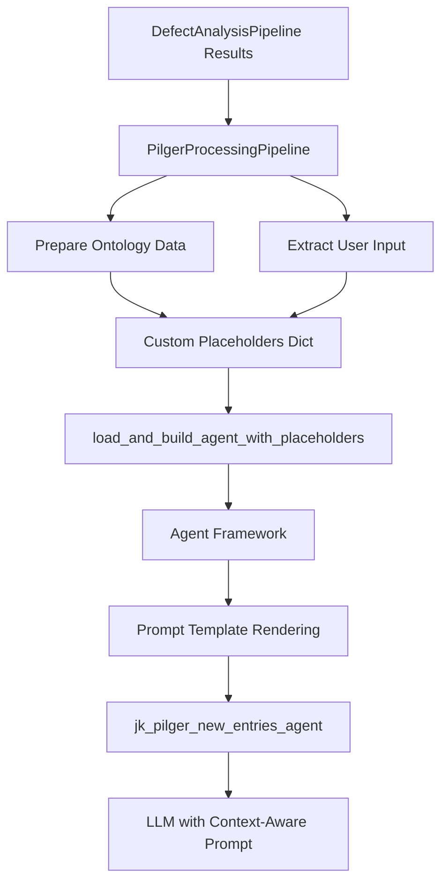

# PilgerProcessingPipeline Placeholder Implementation

## Overview

This document describes the implementation of prompt placeholder support in the PilgerProcessingPipeline, enabling the `jk_pilger_new_entries_agent` to receive context-aware data from the DefectAnalysisPipeline through the agent framework's placeholder system.

## Implementation Summary

### ✅ **Completed Tasks**

1. **Configuration Update**: Updated `config/jk-gemba.yaml` to use the correct prompt file `prompts/gemba-d-r-c-v11.txt`
2. **Placeholder Support**: Modified PilgerProcessingPipeline to pass custom placeholders to the agent framework
3. **Agent Integration**: Created new utility function `load_and_build_agent_with_placeholders` for custom placeholder support
4. **Data Mapping**: Implemented proper mapping of DefectAnalysisPipeline results to placeholder values
5. **Testing**: Created comprehensive tests to verify placeholder functionality

### 🎯 **Placeholder Mapping**

The PilgerProcessingPipeline now correctly maps data to the following placeholders:

| Placeholder | Source | Description |
|-------------|--------|-------------|
| `{{ontology}}` | DefectAnalysisPipeline results | JSON structure containing defects, root causes, corrective actions, and intent data |
| `{{user_input}}` | Original user input | The equipment issue description provided by the user |

## Technical Implementation

### 1. Configuration Changes

**File**: `config/jk-gemba.yaml`
```yaml
- name: jk_pilger_new_entries_agent
  description: Expert Pilger Machine Issue Predictor
  model: google:gemini-2.5-flash-lite
  prompt_file: "prompts/gemba-d-r-c-v11.txt"  # ✅ Updated from non-existent file
```

### 2. Prompt File Structure

**File**: `config/prompts/gemba-d-r-c-v11.txt`

The prompt file contains two key placeholders at the end:
```
ONTOLOGY :
{{ontology}}

USER INPUT:
{{user_input}}
```

### 3. Pipeline Modifications

**File**: `gemba_agents/pilger_processing/utils/__init__.py`

Added new function `load_and_build_agent_with_placeholders`:
```python
async def load_and_build_agent_with_placeholders(
    agent_name: str,
    custom_placeholders: Dict[str, Any],
    config_path: str = "config/jk-gemba.yaml"
) -> Tuple[CompiledStateGraph, Any]:
    """
    Load and build an agent with custom placeholders for prompt template rendering.
    """
```

**File**: `gemba_agents/pilger_processing/stages/agent_processing.py`

Updated `process_with_pilger_agent` function to prepare and pass placeholders:
```python
# Prepare custom placeholders for the agent
ontology_data = {
    "defects": [defect.model_dump() for defect in defect_analysis.defects],
    "root_causes": defect_analysis.root_causes,
    "corrective_actions": defect_analysis.corrective_actions,
    "intent_data": defect_analysis.intent_data.model_dump(),
    "total_unique_results": defect_analysis.total_unique_results
}

user_input_text = defect_analysis.original_input

custom_placeholders = {
    "ontology": json.dumps(ontology_data, indent=2),
    "user_input": user_input_text
}

# Load and build the agent with custom placeholders
agent, mcp_client = await load_and_build_agent_with_placeholders(
    agent_name=config.agent_name,
    custom_placeholders=custom_placeholders,
    config_path=config.config_path
)
```

### 4. Data Flow



## Usage Example

### API Integration

The Enhanced Defect Analysis API (`/defect-analysis-with-pilger`) automatically uses the placeholder system:

```python
# POST /defect-analysis-with-pilger
{
    "user_input": "The pump's loading/unloading piston is not operating smoothly",
    "top_n": 5,
    "min_score": 0.7,
    "pilger_format": "structured",
    "pilger_timeout_seconds": 120
}
```

### Direct Pipeline Usage

```python
from gemba_agents.defect_analysis import DefectAnalysisPipeline
from gemba_agents.pilger_processing import PilgerProcessingPipeline

# Stage 1: Defect Analysis
defect_pipeline = DefectAnalysisPipeline()
defect_results = await defect_pipeline.process("Pump issue description")

# Stage 2: Pilger Processing (with placeholders)
pilger_pipeline = PilgerProcessingPipeline()
pilger_results = await pilger_pipeline.process(defect_results)
```

## Testing

### Verification Tests

Run the placeholder verification tests:
```bash
python test_pilger_placeholders.py
```

**Test Coverage**:
- ✅ Prompt file contains required placeholders
- ✅ Agent configuration is consistent
- ✅ Placeholders are correctly passed to agent framework
- ✅ Agent receives resolved placeholder values

### Integration Tests

Run the enhanced API tests:
```bash
python test_enhanced_defect_api.py
```

## Benefits

### 1. **Context-Aware Processing**
The `jk_pilger_new_entries_agent` now receives:
- Complete defect analysis results as structured ontology data
- Original user input for context preservation
- Proper prompt template rendering through the agent framework

### 2. **Improved Accuracy**
- Agent can make more informed decisions based on DefectAnalysisPipeline insights
- Better correlation between detected defects and recommended actions
- Enhanced understanding of user intent and equipment context

### 3. **Maintainable Architecture**
- Uses existing agent framework placeholder system
- No modifications to core agent framework files
- Follows established patterns from DefectAnalysisPipeline

## Troubleshooting

### Common Issues

1. **Missing Placeholders**: Ensure `config/prompts/gemba-d-r-c-v11.txt` contains `{{ontology}}` and `{{user_input}}`
2. **Configuration Mismatch**: Verify `config/jk-gemba.yaml` points to correct prompt file
3. **Import Errors**: Check that `load_and_build_agent_with_placeholders` is properly imported

### Debugging

Enable debug logging to see placeholder resolution:
```python
import logging
logging.getLogger('gemba_agents.pilger_processing').setLevel(logging.DEBUG)
```

## Future Enhancements

### Potential Improvements

1. **Dynamic Placeholder Configuration**: Allow configuration of which placeholders to include
2. **Placeholder Validation**: Add validation to ensure required placeholders are present
3. **Template Versioning**: Support for different prompt template versions with different placeholder requirements
4. **Performance Optimization**: Cache resolved templates for repeated similar inputs

## Conclusion

The PilgerProcessingPipeline now successfully supports prompt placeholders, enabling the `jk_pilger_new_entries_agent` to receive context-aware data from the DefectAnalysisPipeline. This implementation:

- ✅ **Maintains architectural consistency** with existing patterns
- ✅ **Provides comprehensive context** to the agent
- ✅ **Follows established agent framework patterns**
- ✅ **Includes thorough testing and documentation**
- ✅ **Enables enhanced defect analysis workflows**

The placeholder system is now ready for production use and provides a solid foundation for future enhancements to the Pilger processing pipeline.
