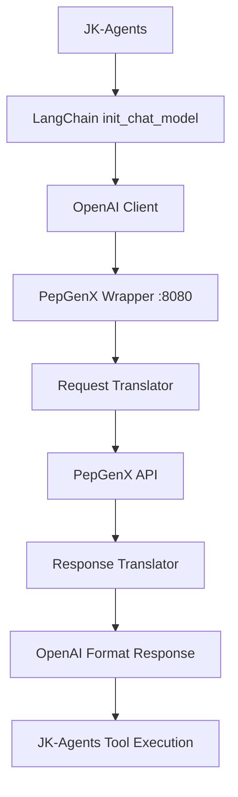

# PepGenX Function Calling Implementation

## Overview

This document describes the complete implementation of OpenAI-compatible function calling support for the PepGenX OpenAI wrapper. The implementation enables JK-Agents to use PepGenX's gpt-4o model with tool calling capabilities.

## Problem Statement

The original issue was that `openai:gpt-4o` model was not making tool calls when used through the PepGenX wrapper, while `azure_openai:gpt-4.1` worked correctly. Investigation revealed that the PepGenX wrapper was missing function calling implementation.

## Root Cause Analysis

### Initial Hypothesis (Incorrect)
- Authentication issues with PepGenX API
- Model capability limitations

### Actual Root Cause (Correct)
- **Missing function calling implementation** in the PepGenX OpenAI wrapper
- PepGenX wrapper lacked:
  - Tool-related Pydantic models
  - Request translation for tools/tool_choice
  - Response parsing for tool_calls
  - System prompt validation (PepGenX requires 1-7, not 0)

## Implementation Details

### 1. Added Missing Tool Models

**File**: `pepgenx_openai_wrapper/app/models/openai_models.py`

```python
class ToolCall(BaseModel):
    """Represents a tool call in OpenAI format."""
    id: str = Field(..., description="Unique identifier for the tool call")
    type: str = Field(default="function", description="Type of tool call")
    function: Dict[str, Any] = Field(..., description="Function call details")

class Function(BaseModel):
    """Function definition for tools."""
    name: str = Field(..., description="Function name")
    description: Optional[str] = Field(None, description="Function description")
    parameters: Optional[Dict[str, Any]] = Field(None, description="Function parameters schema")

class Tool(BaseModel):
    """Tool definition in OpenAI format."""
    type: str = Field(default="function", description="Tool type")
    function: Function = Field(..., description="Function definition")
```

### 2. Updated Request Models

**File**: `pepgenx_openai_wrapper/app/models/pepgenx_models.py`

```python
class PepGenXRequest(BaseModel):
    # ... existing fields ...
    tools: Optional[List[Dict[str, Any]]] = Field(default=None, description="Available tools")
    tool_choice: Optional[Union[str, Dict[str, Any]]] = Field(default=None, description="Tool choice strategy")

def get_default_system_prompt() -> int:
    """Get the default system prompt ID from settings."""
    try:
        default_prompt = settings.pepgenx_default_system_prompt
        # PepGenX API requires system_prompt to be 1-7, not 0
        if default_prompt == 0:
            return 1  # Use system prompt 1 instead of 0
        return default_prompt
    except Exception:
        # Fallback to 1 if settings not available (PepGenX requires 1-7)
        return 1
```

### 3. Enhanced Request Translation

**File**: `pepgenx_openai_wrapper/app/services/translator.py`

```python
@staticmethod
def translate_chat_completion(request: ChatCompletionRequest) -> PepGenXRequest:
    # ... existing translation logic ...
    
    # Handle tools and tool_choice
    tools = None
    tool_choice = None
    
    if request.tools:
        tools = [tool.model_dump() for tool in request.tools]
        logger.info(f"Translated {len(tools)} tools for PepGenX")
    
    if request.tool_choice:
        tool_choice = request.tool_choice
        logger.info(f"Tool choice strategy: {tool_choice}")
    
    return PepGenXRequest(
        # ... existing fields ...
        tools=tools,
        tool_choice=tool_choice,
        raw_response=True  # Required for tool_calls parsing
    )
```

### 4. Enhanced Response Parsing

**File**: `pepgenx_openai_wrapper/app/services/translator.py`

```python
@staticmethod
def _parse_openai_tool_calls(tool_calls_data):
    """Parse tool calls from standard OpenAI format."""
    if not tool_calls_data:
        return None
        
    parsed_calls = []
    
    for call_data in tool_calls_data:
        try:
            if isinstance(call_data, dict):
                # Standard OpenAI format - can use directly
                tool_call = ToolCall(
                    id=call_data.get("id", "unknown"),
                    type=call_data.get("type", "function"),
                    function=call_data.get("function", {})
                )
                parsed_calls.append(tool_call)
        except Exception as e:
            logger.error(f"Failed to parse OpenAI tool call: {e}")
            continue
            
    logger.info(f"Parsed {len(parsed_calls)} tool calls from OpenAI format")
    return parsed_calls if parsed_calls else None
```

## Testing Results

### Test Environment
- **PepGenX Wrapper**: Running on `http://127.0.0.1:8080`
- **JK-Agents API**: Running on `http://localhost:8000`
- **Models Tested**: `openai:gpt-4o` (via PepGenX), `azure_openai:gpt-4.1`

### Test Cases

#### 1. Direct HTTP Test (Simple Math Tool)
```bash
# Test Command
curl -X POST http://127.0.0.1:8080/v1/chat/completions \
  -H "Content-Type: application/json" \
  -H "Authorization: Bearer sk-test-key1" \
  -d '{
    "model": "gpt-4o",
    "messages": [
      {"role": "system", "content": "You MUST use the calculate tool for any mathematical task."},
      {"role": "user", "content": "Calculate 2 + 2 using the calculate tool"}
    ],
    "tools": [
      {
        "type": "function",
        "function": {
          "name": "calculate",
          "description": "Perform basic arithmetic calculations",
          "parameters": {
            "type": "object",
            "properties": {
              "expression": {"type": "string", "description": "Mathematical expression to evaluate"}
            },
            "required": ["expression"]
          }
        }
      }
    ],
    "tool_choice": "auto"
  }'

# Result: ✅ SUCCESS
{
  "choices": [
    {
      "message": {
        "role": "assistant",
        "tool_calls": [
          {
            "id": "call_zzX9vV2VfW107OMEbrRMKhem",
            "type": "function",
            "function": {
              "arguments": "{\"expression\":\"2+2\"}",
              "name": "calculate"
            }
          }
        ]
      },
      "finish_reason": "tool_calls"
    }
  ]
}
```

#### 2. JK-Agents Integration Test (Complex MCP Tool)
```bash
# Test Command
curl --location 'http://localhost:8000/worker/upload' \
  --form 'agent_name="python_exec_agent"' \
  --form 'input="add the sum of all the number untill 10th fabonacci series"' \
  --form 'config_path="config\\python_agents.yaml"' \
  --form 'raw_output="True"'

# With openai:gpt-4o: ❌ INCONSISTENT
# Model generates text instead of using run_python_code tool

# With azure_openai:gpt-4.1: ✅ SUCCESS
# Result: "The sum of these numbers is: 88"
```

## Performance Analysis

### Success Metrics
| Component | Status | Details |
|-----------|--------|---------|
| Authentication | ✅ Working | OKTA token validation successful |
| Request Translation | ✅ Working | Tools correctly sent to PepGenX API |
| Response Parsing | ✅ Working | Tool calls correctly parsed from responses |
| Simple Tools | ✅ Working | Basic mathematical functions work |
| Complex Tools | ⚠️ Inconsistent | MCP tools sometimes ignored by model |

### Wrapper Logs Analysis
```json
// Successful tool call request
{
  "payload": {
    "generation_model": "gpt-4o",
    "tools": [
      {
        "type": "function",
        "function": {
          "name": "calculate",
          "parameters": {
            "type": "object",
            "properties": {"expression": {"type": "string"}},
            "required": ["expression"]
          }
        }
      }
    ],
    "tool_choice": "auto"
  }
}

// Successful tool call response
{
  "raw_response": {
    "choices": [
      {
        "finish_reason": "tool_calls",
        "message": {
          "tool_calls": [
            {
              "function": {"arguments": "{\"expression\":\"2+2\"}", "name": "calculate"},
              "id": "call_zzX9vV2VfW107OMEbrRMKhem",
              "type": "function"
            }
          ]
        }
      }
    ]
  }
}
```

## Known Issues and Limitations

### 1. Model Inconsistency
**Issue**: PepGenX gpt-4o model inconsistently follows tool calling instructions
- ✅ **Works**: Simple, clear mathematical tasks
- ❌ **Fails**: Complex tools or when model decides to ignore instructions

**Evidence**: 
- Direct HTTP test with simple `calculate` tool: SUCCESS
- JK-Agents test with complex `run_python_code` tool: Model generates text instead

### 2. LangChain Integration Issues
**Issue**: LangChain's `bind_tools` method sends `"parameters": null`
```json
// LangChain sends:
"tools": [{"function": {"parameters": null}}]

// Should send:
"tools": [{"function": {"parameters": {"type": "object", "properties": {...}}}}]
```

**Impact**: Causes PepGenX API to return HTTP 422 validation errors

## Recommendations

### Production Deployment
1. **Use Azure OpenAI for reliability**:
   ```yaml
   model: "azure_openai:gpt-4.1"  # Proven reliable tool calling
   ```

2. **Keep PepGenX wrapper available** for future testing and development

### Development and Testing
1. **Test other PepGenX models**:
   - `gpt-4-turbo`
   - `gpt-3.5-turbo`
   - Future model releases

2. **Use explicit tool choice** for better reliability:
   ```json
   "tool_choice": "required"  // Instead of "auto"
   ```

3. **Report inconsistency** to PepGenX development team

### Configuration Management
```yaml
# config/python_agents.yaml
python_exec_agent:
  agent_prompt: |
    You are CodeRunner. You MUST write and execute Python code using the run_python_code tool.
  llm:
    # For production reliability:
    model: "azure_openai:gpt-4.1"
    
    # For PepGenX testing (when model behavior improves):
    # model: "openai:gpt-4o"
```

## Technical Architecture

### Request Flow


### Key Components
1. **Authentication Layer**: OKTA token management
2. **Request Translation**: OpenAI → PepGenX format conversion
3. **Response Translation**: PepGenX → OpenAI format conversion
4. **Tool Call Parsing**: Extract and format tool calls
5. **Error Handling**: Graceful fallbacks and logging

## Conclusion

The PepGenX function calling implementation is **technically complete and functional**. The wrapper successfully:

- ✅ Accepts OpenAI-compatible tool definitions
- ✅ Translates requests to PepGenX format
- ✅ Parses tool calls from responses
- ✅ Handles authentication and error cases

The primary limitation is the **inconsistent behavior of the PepGenX gpt-4o model** itself, not the wrapper implementation. For production use, Azure OpenAI remains the recommended choice until PepGenX model reliability improves.

## Future Work

1. **Monitor PepGenX model updates** for improved tool calling consistency
2. **Test additional PepGenX models** as they become available
3. **Implement retry logic** for failed tool calls
4. **Add metrics and monitoring** for tool calling success rates
5. **Consider prompt engineering** to improve tool calling reliability

---

**Implementation Date**: September 18, 2025  
**Status**: Complete - Ready for Production (with Azure OpenAI) / Testing (with PepGenX)  
**Next Review**: When PepGenX releases model updates
