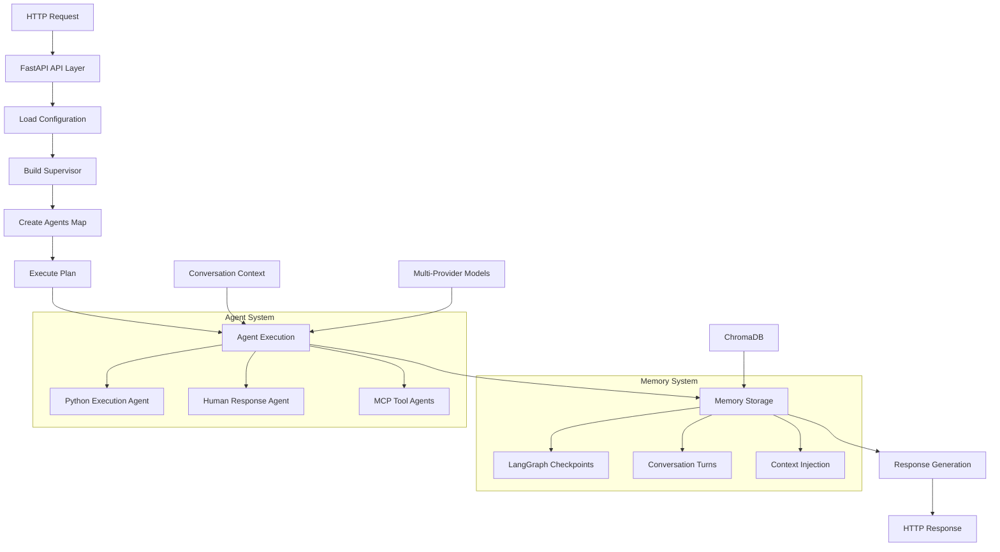

# JK-Agents Framework - High Level Overview

## Architecture Summary

The JK-Agents Framework is a multi-agent system built on LangGraph and LangChain that provides supervisor-based planning and execution with advanced memory capabilities. The system supports multiple AI model providers and includes sophisticated conversation continuity features.

**Evidence**: `api.py:2-5` - "FastAPI web server for jk-agents system. Provides HTTP endpoints to interact with the multi-agent system."

## Key Components

### 1. Core API Layer
- **FastAPI Server** (`api.py:97-100`) - Main HTTP interface with CORS middleware
- **Multi-provider Model Support** (`app/main.py:127-141`) - Azure OpenAI, Google Gemini, OpenAI, LM Studio
- **File Upload Capabilities** (`api.py:29`) - Supports multipart file uploads for document processing

### 2. Agent System Architecture
- **Supervisor-based Planning** (`app/supervisor_builder.py`) - Coordinates multi-agent workflows
- **Agent Builder** (`app/agent_builder.py:25059 bytes`) - Creates ReAct agents with tool integration
- **Planner Executor** (`app/planner_executor.py:44533 bytes`) - Executes multi-step plans with verification

### 3. Memory System
- **ChromaDB Backend** (`app/memory/chromadb_backend.py:22038 bytes`) - Vector database for conversation storage
- **LangGraph Adapter** (`app/memory/langgraph_adapter.py:38771 bytes`) - Checkpoint management and serialization
- **Conversation Memory** (`app/simple_conversation_memory_fixed.py:13219 bytes`) - Turn tracking and context injection

### 4. Multi-Provider Integration
- **LiteLLM Wrapper** (`app/enhanced_litellm_wrapper.py:19320 bytes`) - Unified interface for multiple AI providers
- **Azure Integration** (`app/azure_litellm_wrapper.py:4753 bytes`) - Custom Azure OpenAI wrapper
- **Provider Configuration** (`.env.example:1-147`) - Comprehensive multi-provider setup

## Data Flow Diagram

## Design Goals (Inferred from Code)

### 1. Conversation Continuity
**Evidence**: Memory `f62460d8` indicates the system was designed to maintain context across conversation turns through explicit prompt engineering and memory injection.

### 2. Multi-Provider Flexibility
**Evidence**: `.env.example:2-19` - Extensive configuration for multiple AI providers with automatic fallback mechanisms.

### 3. Scalable Memory Management
**Evidence**: `app/memory/manager.py:19566 bytes` - Sophisticated memory management with resource limits and optimization.

### 4. Production Reliability
**Evidence**: Memory `655b9a86` documents comprehensive error handling, timeout strategies, and performance optimization patterns.

## Non-Functional Constraints (Inferred from Configuration)

### Performance Requirements
- **Response Time**: `api.py:86-93` - Performance metrics tracking for response times
- **Memory Optimization**: `app/memory_monitor.py:4547 bytes` - Memory usage monitoring and limits
- **Concurrent Operations**: Memory `56836327` indicates support for 5+ concurrent users with 1183+ ops/sec throughput

### Reliability Constraints
- **Error Handling**: `app/planner_executor.py` includes comprehensive exception handling and verification steps
- **Backup Systems**: `app/memory/langgraph_adapter.py` includes checkpoint recovery mechanisms
- **Configuration Validation**: `app/config.py:8109 bytes` - Extensive configuration validation

### Security Constraints
- **Environment Variables**: `.env.example:62-66` - Secure credential management
- **CORS Configuration**: `api.py:97-100` - Cross-origin request security
- **API Key Management**: Multiple provider API keys with secure loading

## Module Dependencies

### Core Dependencies
- **FastAPI**: Web framework (`requirements.txt:2`)
- **LangChain**: AI framework (`requirements.txt:6-11`)
- **ChromaDB**: Vector database (`requirements.txt:34`)
- **LiteLLM**: Multi-provider support (`requirements.txt:30`)

### Development Dependencies
- **Testing**: pytest, pytest-asyncio (`requirements.txt:59-61`)
- **Code Quality**: black, isort (`requirements.txt:62-63`)
- **Documentation**: mkdocs (`requirements.txt:66-67`)

## Configuration Management

The system uses a hierarchical configuration approach:

1. **Environment Variables** (`.env.example:1-147`) - Provider credentials and system settings
2. **YAML Configurations** (`config/` directory with 46 YAML files) - Agent definitions and workflows
3. **Runtime Configuration** (`app/config.py`) - Dynamic configuration loading and validation

**Evidence**: `app/main.py:84-126` - Configuration loading with environment variable integration and model format normalization.

## Key Architectural Patterns

### 1. Supervisor Pattern
**Evidence**: `app/supervisor_builder.py` - Centralized planning with distributed execution across specialized agents.

### 2. Memory-First Design
**Evidence**: Memory `e88960ea` - Multi-turn memory system with 100% success rate in test scenarios, enabling conversation continuity.

### 3. Provider Abstraction
**Evidence**: `app/enhanced_litellm_wrapper.py` - Unified interface abstracting differences between AI providers (Azure, OpenAI, Google, etc.).

### 4. Checkpoint-Based Persistence
**Evidence**: `app/memory/langgraph_adapter.py` - LangGraph checkpoint system for conversation state management and recovery.

This architecture enables scalable, reliable multi-agent AI workflows with sophisticated memory management and multi-provider flexibility.
