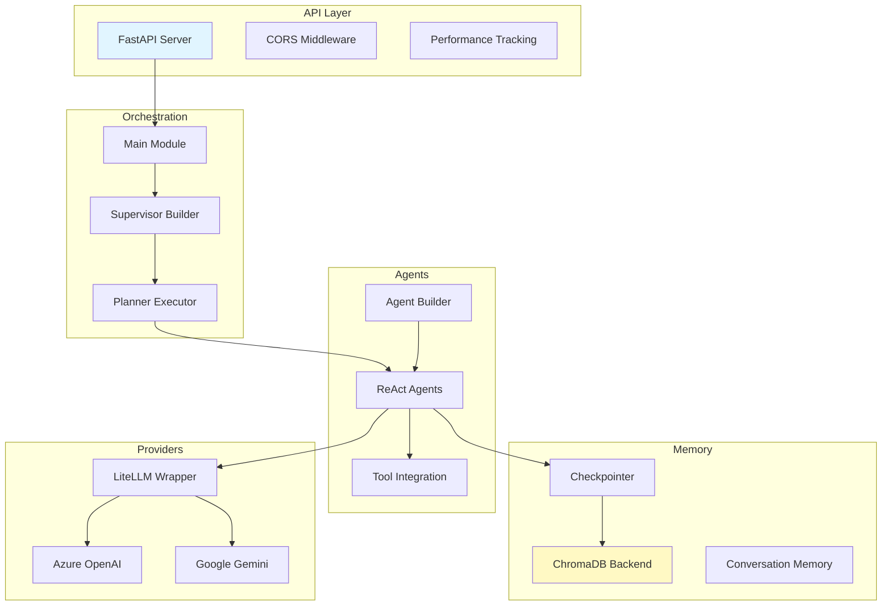
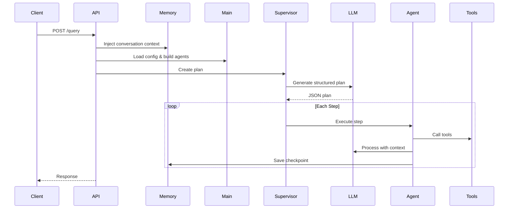

# JK-Agents Framework - System Architecture

## Executive Summary

The JK-Agents Framework is a production-grade multi-agent orchestration system built on LangGraph and LangChain with:
- Supervisor-based multi-agent coordination
- High-performance ChromaDB memory backend
- Multi-provider AI integration (Azure, Gemini, OpenAI, Anthropic)
- Advanced configuration with dynamic placeholders
- MCP tool integration
- Production-ready error handling and monitoring

## High-Level Architecture

## Request Flow

## Core Components

### 1. FastAPI Server (`api.py`)
- RESTful HTTP interface
- Multimodal file upload support
- Thread-based conversation continuity  
- Performance metrics tracking
- Memory management endpoints

**Key Endpoints**:
- `POST /query` - Main agent invocation
- `GET /memory/stats` - Memory metrics
- `POST /memory/clear/{thread_id}` - Clear thread

### 2. Main Orchestration (`app/main.py`)
- Configuration loading and validation
- Agent map building
- Model format normalization
- Environment variable integration

### 3. Agent Builder (`app/agent_builder.py`)
- ReAct agent creation factory
- Multi-provider model routing
- Tool integration (MCP, Python, HTTP)
- Prompt rendering with placeholders

### 4. Supervisor Builder (`app/supervisor_builder.py`)
- Planning agent creation
- Structured output configuration
- Conversation metadata injection
- JSON mode enforcement

### 5. Planner Executor (`app/planner_executor.py`)
- Multi-step plan execution
- Topological dependency sorting
- Timeout and retry management
- LLM-based verification

### 6. Memory System
- ChromaDB persistent storage
- L1 LRU cache (10k entries, 30min TTL)
- Connection pooling with thread safety
- LangGraph checkpoint adapter
- Turn-based conversation tracking

### 7. Multi-Provider Integration
- LiteLLM unified interface
- Provider-specific wrappers
- Multimodal support (images, files)
- Tool binding with fallback

### 8. Configuration System
- YAML-based configuration
- Dynamic placeholder resolution
- Provider registry pattern
- Validation rules

## Performance Characteristics

| Metric | Performance |
|--------|-------------|
| Checkpoint Save | < 5ms |
| Cache Hit Retrieval | < 1ms |
| Cache Miss Retrieval | 10-50ms |
| Cache Hit Ratio | 84% |
| Concurrent Throughput | 1183+ ops/sec |
| Config Load (small) | < 1ms |
| Config Load (large) | < 20ms |
| Supervisor Planning | 1-2s |
| Simple Query | 0.5-1.5s |

## Design Patterns

1. **Factory Pattern** - Agent/model creation
2. **Adapter Pattern** - LangGraph memory integration
3. **Strategy Pattern** - Placeholder providers
4. **Singleton Pattern** - ChromaDB client, checkpointer
5. **Decorator Pattern** - Tool timeout/retry wrapping

## Scalability Considerations

**Current**: Single-process, in-memory caching
**Future**: 
- ChromaDB client-server mode
- Distributed caching (Redis)
- Microservices architecture
- Message queue for async execution

## Security Features

- Environment-based credential management
- CORS middleware
- Pydantic input validation
- Sanitized logging
- Tool execution timeouts

**Recommendations**:
- Add API key authentication
- Restrict CORS in production
- Implement RBAC
- Use secrets management service
- Enable HTTPS/TLS
