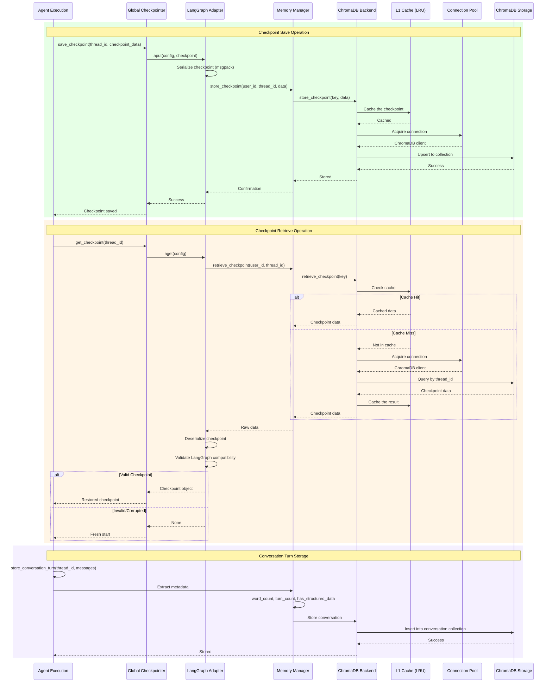
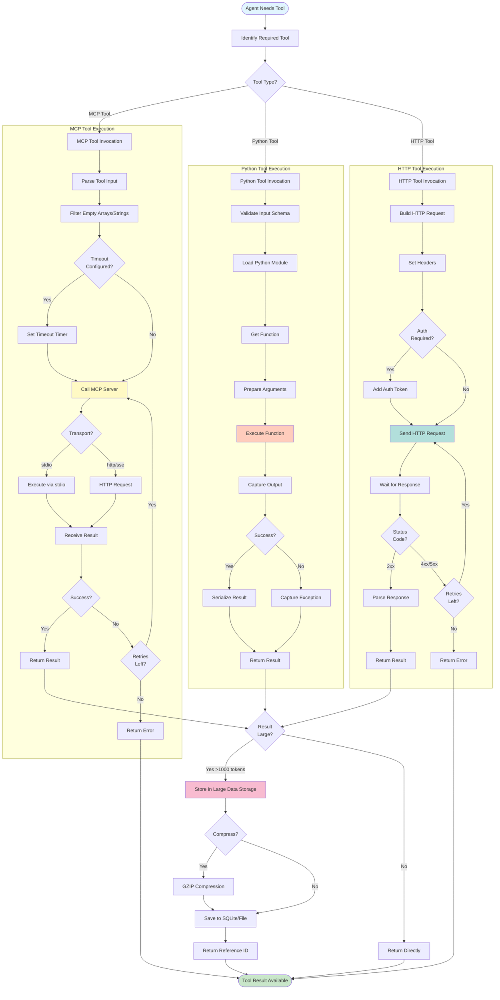

# JK-Agents Framework - Detailed Flow Diagrams

## Complete Request Processing Flow

```mermaid
sequenceDiagram
    participant Client
    participant API as FastAPI Server
    participant FileStore as File Storage
    participant Config as Config Loader
    participant Memory as Memory System
    participant Builder as Agent Builder
    participant Supervisor
    participant Planner as Planner Executor
    participant Agent as Worker Agent
    participant Tools as MCP/Python Tools
    participant LLM as AI Provider
    participant ChromaDB
    
    Client->>API: POST /query {query, config_name, thread_id, files}
    
    rect rgb(230, 245, 255)
        Note over API,FileStore: File Upload Processing
        alt Files Present
            API->>FileStore: store_file(filename, content, mime_type, thread_id)
            alt Is Image
                FileStore->>FileStore: compress_image()
                FileStore->>FileStore: Optimize quality
            end
            FileStore-->>API: reference_ids[]
            API->>API: Inject file references into query
        end
    end
    
    rect rgb(255, 245, 230)
        Note over API,Config: Configuration Loading
        API->>Config: load_app_config(config_path)
        Config->>Config: Parse YAML
        Config->>Config: Normalize model formats (google: → gemini/)
        Config->>Config: Resolve environment variables
        Config->>Config: Validate schema
        Config-->>API: AppConfig
    end
    
    rect rgb(245, 255, 230)
        Note over API,Memory: Memory Context Injection
        alt Conversation Memory Enabled
            API->>Memory: inject_conversation_context(thread_id, query)
            Memory->>ChromaDB: Retrieve conversation history
            ChromaDB-->>Memory: Past turns
            Memory->>Memory: Format context
            Memory-->>API: Enhanced query with context
        end
    end
    
    rect rgb(255, 230, 245)
        Note over API,Builder: Agent Building
        API->>Builder: build_agents_map(app_cfg, user_input)
        loop For each agent in config
            Builder->>Builder: Parse agent config
            Builder->>Builder: create_model_instance(model_id)
            
            alt LiteLLM Model
                Builder->>LLM: Create EnhancedLiteLLMChat
            else Azure Model
                Builder->>LLM: Create AzureLiteLLMChat
            else Legacy
                Builder->>LLM: Create native LangChain model
            end
            
            alt MCP Tools Configured
                Builder->>Tools: load_mcp_tools(mcp_servers)
                Tools->>Tools: Connect to MCP servers
                Tools-->>Builder: MCP tool instances
            end
            
            alt Python Tools Configured
                Builder->>Tools: load_python_function_tools()
                Tools-->>Builder: Python tool instances
            end
            
            Builder->>Builder: Render prompt with placeholders
            Builder->>Builder: create_react_agent(model, tools, prompt)
            Builder-->>API: agent_instance
        end
        Builder-->>API: agents_map, mcp_clients
    end
    
    rect rgb(230, 255, 245)
        Note over API,Supervisor: Supervisor Creation
        API->>Supervisor: build_supervisor_compiled(config)
        Supervisor->>Memory: get_conversation_context_metadata(thread_id)
        Memory-->>Supervisor: Metadata (word_count, turns, etc.)
        Supervisor->>Supervisor: Render supervisor prompt
        Supervisor->>LLM: Create supervisor model
        Supervisor->>Supervisor: Enable JSON mode
        Supervisor-->>API: Supervisor graph
    end
    
    rect rgb(255, 240, 230)
        Note over API,Planner: Plan Execution
        API->>Planner: execute_plan(supervisor, agents_map, query, thread_id)
        
        Planner->>Supervisor: Invoke with query
        Supervisor->>LLM: Generate execution plan (JSON)
        LLM-->>Supervisor: Structured plan
        Supervisor-->>Planner: Plan with steps
        
        Planner->>Planner: Parse plan JSON
        Planner->>Planner: Validate plan schema
        Planner->>Planner: Topological sort steps
        
        loop For each step in execution order
            Planner->>Planner: Check dependencies satisfied
            Planner->>Planner: Create step_thread_id
            
            Planner->>Agent: Invoke agent(task, thread_id=step_thread_id)
            
            Agent->>Memory: Retrieve checkpoint (if exists)
            Memory->>ChromaDB: Query by thread_id
            alt Cache Hit
                ChromaDB-->>Memory: Cached checkpoint
            else Cache Miss
                ChromaDB->>ChromaDB: Query persistent storage
                ChromaDB-->>Memory: Checkpoint data
            end
            
            Agent->>Tools: Execute required tools
            alt Tool Success
                Tools-->>Agent: Tool results
            else Tool Failure
                Tools-->>Agent: Error
                opt Retry Enabled
                    Agent->>Tools: Retry tool execution
                end
            end
            
            Agent->>LLM: Process with context + tool results
            LLM-->>Agent: Agent response
            
            Agent->>Memory: Save checkpoint
            Memory->>ChromaDB: Store checkpoint
            ChromaDB->>ChromaDB: Update L1 cache
            ChromaDB->>ChromaDB: Persist to storage
            
            Agent-->>Planner: Step result
            
            opt Verification Enabled
                Planner->>LLM: Verify step result
                LLM-->>Planner: Verification outcome
                alt Verification Failed
                    Planner->>Planner: Mark step as failed
                end
            end
            
            Planner->>Planner: Update execution state
        end
        
        Planner-->>API: Final execution result
    end
    
    rect rgb(240, 240, 255)
        Note over API,Memory: Conversation Persistence
        API->>Memory: store_conversation_turn(thread_id, messages)
        Memory->>Memory: Extract turn metadata
        Memory->>ChromaDB: Persist conversation
        ChromaDB-->>Memory: Success
        Memory-->>API: Confirmation
    end
    
    API->>API: Update performance metrics
    API->>API: Track thread context
    API-->>Client: JSON response {result, thread_id, metrics}
```



## Agent Building Flow

```mermaid
flowchart TD
    Start([Start Agent Building]) --> LoadConfig[Load Agent Config]
    LoadConfig --> ParseModel{Parse Model ID}
    
    ParseModel -->|google:gemini-*| ConvertGoogle[Convert to gemini/* format]
    ParseModel -->|gemini/*| UseLiteLLM[Use EnhancedLiteLLMChat]
    ParseModel -->|azure/*| UseAzure[Use AzureLiteLLMChat]
    ParseModel -->|openai/*| UseLiteLLM
    ParseModel -->|anthropic/*| UseLiteLLM
    ParseModel -->|Legacy| UseLegacy[Use Native LangChain]
    
    ConvertGoogle --> UseLiteLLM
    UseAzure --> ModelCreated[Model Instance Created]
    UseLiteLLM --> ModelCreated
    UseLegacy --> ModelCreated
    
    ModelCreated --> LoadTools[Load Tools]
    
    LoadTools --> CheckMCP{MCP Servers<br/>Configured?}
    CheckMCP -->|Yes| LoadMCP[Load MCP Tools]
    CheckMCP -->|No| CheckPython
    LoadMCP --> WrapMCP[Wrap with Timeout/Retry]
    WrapMCP --> CheckPython
    
    CheckPython{Python Tools<br/>Configured?}
    CheckPython -->|Yes| LoadPython[Load Python Function Tools]
    CheckPython -->|No| CheckHTTP
    LoadPython --> ValidatePython[Validate Tool Signatures]
    ValidatePython --> CheckHTTP
    
    CheckHTTP{HTTP Tools<br/>Configured?}
    CheckHTTP -->|Yes| LoadHTTP[Build HTTP Tool Wrappers]
    CheckHTTP -->|No| CombineTools
    LoadHTTP --> CombineTools[Combine All Tools]
    
    CombineTools --> CheckGemini{Is Gemini<br/>Model?}
    CheckGemini -->|Yes| FilterSchema[Apply Gemini Schema Filtering]
    CheckGemini -->|No| RenderPrompt
    FilterSchema --> RenderPrompt[Render Prompt with Placeholders]
    
    RenderPrompt --> LoadPrompt{Prompt Source?}
    LoadPrompt -->|Direct| UseDirectPrompt[Use Direct Prompt Text]
    LoadPrompt -->|File| LoadPromptFile[Load from File]
    
    UseDirectPrompt --> ResolvePlaceholders
    LoadPromptFile --> ResolvePlaceholders[Resolve Placeholders]
    
    ResolvePlaceholders --> BuildContext[Build Placeholder Context]
    BuildContext --> InjectValues[Inject: agent_name, business_context, etc.]
    InjectValues --> RenderJinja[Render with Jinja2]
    
    RenderJinja --> CreateAgent[Create ReAct Agent]
    CreateAgent --> BindTools[Bind Tools to Model]
    BindTools --> AttachCheckpointer[Attach Global Checkpointer]
    AttachCheckpointer --> ConfigureParallel{Parallel Tool<br/>Calls?}
    
    ConfigureParallel -->|Enabled| EnableParallel[Enable Parallel Execution]
    ConfigureParallel -->|Disabled/Gemini| DisableParallel[Disable Parallel Execution]
    ConfigureParallel -->|Auto| AutoDetect[Auto-detect Based on Provider]
    
    EnableParallel --> CompileGraph
    DisableParallel --> CompileGraph
    AutoDetect --> CompileGraph[Compile LangGraph]
    
    CompileGraph --> End([Return Agent + MCP Client])
    
    style Start fill:#e1f5ff
    style End fill:#c8e6c9
    style LoadMCP fill:#fff9c4
    style FilterSchema fill:#ffccbc
    style CreateAgent fill:#b2dfdb
```



## Memory Checkpoint Flow



## Tool Execution Flow



## Configuration Loading & Validation

```mermaid
flowchart TD
    Start([Load Config Request]) --> FindFile{Config File<br/>Exists?}
    FindFile -->|No| Error1[Throw FileNotFoundError]
    FindFile -->|Yes| ReadYAML[Read YAML File]
    
    ReadYAML --> ParseYAML[Parse with yaml.safe_load]
    ParseYAML --> ExtractSections[Extract Sections]
    
    ExtractSections --> ProcessModels[Process models section]
    ProcessModels --> CheckTemp{Temperature<br/>in models?}
    CheckTemp -->|Yes| MoveTemp[Move to root level]
    CheckTemp -->|No| CoerceValues
    MoveTemp --> CoerceValues[Coerce to strings]
    
    CoerceValues --> NormalizeModels{Model Format<br/>Utility Available?}
    NormalizeModels -->|Yes| ApplyNormalization[normalize_model_config]
    NormalizeModels -->|No| CheckAzure
    
    ApplyNormalization --> ConvertFormats[Convert google: → gemini/]
    ConvertFormats --> CheckAzure
    
    CheckAzure{Azure OpenAI<br/>Configured?}
    CheckAzure -->|Yes| CheckBaseURL{Custom<br/>Base URL?}
    CheckAzure -->|No| LoadPrompts
    CheckBaseURL -->|LM Studio| KeepOpenAI[Keep openai: prefix]
    CheckBaseURL -->|Azure| UseAzure[Use azure: prefix]
    
    KeepOpenAI --> LoadPrompts
    UseAzure --> LoadPrompts[Process file: references]
    
    LoadPrompts --> ExpandPrompts{Prompt starts<br/>with file:?}
    ExpandPrompts -->|Yes| LoadPromptFile[Load from config/prompts/]
    ExpandPrompts -->|No| KeepPrompt[Keep inline prompt]
    LoadPromptFile --> CheckFileExists{File<br/>Exists?}
    CheckFileExists -->|Yes| ReadPrompt[Read prompt content]
    CheckFileExists -->|No| WarnMissing[Log warning]
    ReadPrompt --> MergePrompt
    KeepPrompt --> MergePrompt
    WarnMissing --> MergePrompt[Merge into config]
    
    MergePrompt --> CheckEnvOverrides{Env Var<br/>Overrides?}
    CheckEnvOverrides -->|Yes| ApplyOverrides[Apply environment values]
    CheckEnvOverrides -->|No| CreateAppConfig
    ApplyOverrides --> CreateAppConfig[Create AppConfig object]
    
    CreateAppConfig --> ValidatePydantic[Pydantic Validation]
    ValidatePydantic --> CheckValid{Valid?}
    CheckValid -->|Yes| ValidateAgents[Validate Agent Configs]
    CheckValid -->|No| CaptureError[Log validation errors]
    
    CaptureError --> ReturnDefault[Return Default AppConfig]
    
    ValidateAgents --> CheckAgentPrompts{Each agent has<br/>prompt or prompt_file?}
    CheckAgentPrompts -->|No| Error2[Raise ValidationError]
    CheckAgentPrompts -->|Yes| ValidateAgentType
    
    ValidateAgentType{agent_type in<br/>['react', 'normal']?}
    ValidateAgentType -->|No| Error3[Raise ValidationError]
    ValidateAgentType -->|Yes| ValidateSupervisor
    
    ValidateSupervisor{Supervisor has<br/>prompt or prompt_file?}
    ValidateSupervisor -->|No| Error4[Raise ValidationError]
    ValidateSupervisor -->|Yes| ValidateMCP
    
    ValidateMCP[Validate MCP Server Configs]
    ValidateMCP --> CheckTransport{Valid<br/>transport?}
    CheckTransport -->|stdio & no command| Error5[Raise ValidationError]
    CheckTransport -->|http & no url| Error6[Raise ValidationError]
    CheckTransport -->|Valid| Success[Configuration Valid]
    
    Success --> CacheConfig{Preload<br/>Enabled?}
    CacheConfig -->|Yes| StoreCache[Store in preload cache]
    CacheConfig -->|No| ReturnConfig
    StoreCache --> ReturnConfig([Return AppConfig])
    ReturnDefault --> End([Return Config])
    ReturnConfig --> End
    
    Error1 --> End
    Error2 --> End
    Error3 --> End
    Error4 --> End
    Error5 --> End
    Error6 --> End
    
    style Start fill:#e1f5ff
    style End fill:#c8e6c9
    style Success fill:#a5d6a7
    style Error1 fill:#ef5350
    style Error2 fill:#ef5350
    style Error3 fill:#ef5350
    style Error4 fill:#ef5350
    style Error5 fill:#ef5350
    style Error6 fill:#ef5350
```

## Placeholder Resolution

```mermaid
flowchart TD
    Start([Template with Placeholders]) --> ParseTemplate[Parse Template Text]
    ParseTemplate --> ExtractPlaceholders[Extract {{placeholder}} references]
    ExtractPlaceholders --> BuildContext[Create PlaceholderContext]
    
    BuildContext --> InitRegistry[Initialize Registry]
    InitRegistry --> RegisterProviders[Register Providers]
    
    RegisterProviders --> AddAgent[AgentPlaceholderProvider]
    AddAgent --> AddBusiness[BusinessPlaceholderProvider]
    AddBusiness --> AddSystem[SystemPlaceholderProvider]
    AddSystem --> AddUser[UserPlaceholderProvider]
    AddUser --> AddDynamic[DynamicPlaceholderProvider]
    
    AddDynamic --> AddCustom{Custom<br/>Placeholders?}
    AddCustom -->|Yes| InjectCustom[Add to UserProvider]
    AddCustom -->|No| LoopPlaceholders
    InjectCustom --> LoopPlaceholders
    
    LoopPlaceholders{For each placeholder}
    LoopPlaceholders --> QueryRegistry[Query Registry]
    
    QueryRegistry --> TryProviders[Try Each Provider in Order]
    TryProviders --> Provider1{AgentProvider<br/>can resolve?}
    Provider1 -->|Yes| ResolveValue1[Resolve from agent context]
    Provider1 -->|No| Provider2
    ResolveValue1 --> ApplyValidation
    
    Provider2{BusinessProvider<br/>can resolve?}
    Provider2 -->|Yes| ResolveValue2[Resolve from business context]
    Provider2 -->|No| Provider3
    ResolveValue2 --> ApplyValidation
    
    Provider3{SystemProvider<br/>can resolve?}
    Provider3 -->|Yes| ResolveValue3[Resolve from system info]
    Provider3 -->|No| Provider4
    ResolveValue3 --> ApplyValidation
    
    Provider4{UserProvider<br/>can resolve?}
    Provider4 -->|Yes| ResolveValue4[Resolve from custom placeholders]
    Provider4 -->|No| Provider5
    ResolveValue4 --> ApplyValidation
    
    Provider5{DynamicProvider<br/>can resolve?}
    Provider5 -->|Yes| ResolveValue5[Resolve from dynamic source]
    Provider5 -->|No| CheckRequired
    ResolveValue5 --> ApplyValidation
    
    CheckRequired{Placeholder<br/>Required?}
    CheckRequired -->|Yes| ThrowError[Throw PlaceholderNotFoundError]
    CheckRequired -->|No| SkipPlaceholder[Skip, use empty string]
    SkipPlaceholder --> MorePlaceholders
    
    ApplyValidation{Validation<br/>Rule Exists?}
    ApplyValidation -->|Yes| RunValidation[Execute validation function]
    ApplyValidation -->|No| AddToContext
    
    RunValidation --> ValidationPass{Valid?}
    ValidationPass -->|Yes| AddToContext[Add to context dict]
    ValidationPass -->|No| ThrowValidationError[Throw PlaceholderValidationError]
    
    AddToContext --> MorePlaceholders{More<br/>Placeholders?}
    MorePlaceholders -->|Yes| LoopPlaceholders
    MorePlaceholders -->|No| BuildFinalContext
    
    BuildFinalContext[Build Final Context Dict]
    BuildFinalContext --> RenderWithJinja[Render Template with Jinja2]
    RenderWithJinja --> End([Rendered Text])
    
    ThrowError --> End
    ThrowValidationError --> End
    
    style Start fill:#e1f5ff
    style End fill:#c8e6c9
    style ResolveValue1 fill:#a5d6a7
    style ResolveValue2 fill:#a5d6a7
    style ResolveValue3 fill:#a5d6a7
    style ResolveValue4 fill:#a5d6a7
    style ResolveValue5 fill:#a5d6a7
    style ThrowError fill:#ef5350
    style ThrowValidationError fill:#ef5350
```

These diagrams provide complete visual documentation of all critical flows in the JK-Agents Framework.
