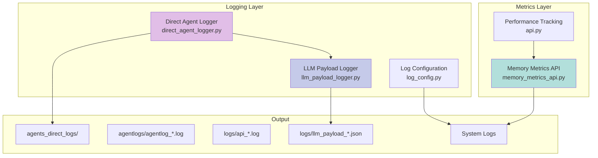

# Module: Logging & Observability System

## Overview

The Logging & Observability system provides comprehensive tracking, monitoring, and debugging capabilities for the JK-Agents Framework.

**Location**: `app/direct_agent_logger.py`, `app/llm_payload_logger.py`, `app/log_config.py`, `app/memory_metrics_api.py`

## Architecture



## Core Components

### 1. Direct Agent Logger (`direct_agent_logger.py`)

**Purpose**: Comprehensive logging for direct agent execution with detailed request/response tracking.

**Key Features**:
```python
class DirectAgentLogger:
    """Logger for direct agent execution with request/response tracking."""
    
    def __init__(self, agent_name: str, user_input: str, business_context: str = ""):
        self.agent_name = agent_name
        self.user_input = user_input
        self.start_time = datetime.now()
        
        # Initialize LLM payload logger
        self.llm_payload_logger = LLMPayloadLogger(agent_name)
        
        # Create timestamped log file in agents_direct_logs/
        self._initialize_log_file()
    
    def log_agent_invocation(self, config: Dict[str, Any]):
        """Log agent invocation with configuration."""
        
    def log_agent_response(self, response: Any, duration: float):
        """Log agent response with execution time."""
    
    def log_tool_execution(self, tool_name: str, input_data: Any, output: Any):
        """Log tool execution details."""
    
    def log_error(self, error: Exception, context: Dict[str, Any]):
        """Log errors with full context."""
```

**Log File Structure**:
```
# Supervisor/Planner Execution Logs
agentlogs/
  agentlog_20251016081827.log  # Timestamped execution logs

# Direct Agent Execution Logs
agents_direct_logs/
  direct_agentlog_20250113_152430.log

# API Server Logs (✅ Oct 2024 - NEW)
logs/
  api_20251016.log  # Daily API logs

Format:
==========================================
DIRECT AGENT EXECUTION LOG
==========================================
Agent: python_exec_agent
Start Time: 2025-01-13 15:24:30
User Input: Calculate statistics for dataset
Business Context: Data analysis project
------------------------------------------

[15:24:30] Agent Invocation
Config: {agent_type: "react", model: "gemini/..."}

[15:24:31] Tool Execution: python_executor
Input: {...}
Output: {...}
Duration: 1.2s

[15:24:32] Agent Response
Result: {...}
Total Duration: 2.5s
------------------------------------------
```

**Usage**:
```python
# In agent execution
logger = DirectAgentLogger(
    agent_name="python_exec_agent",
    user_input="Calculate mean and median",
    business_context="Data analytics"
)

logger.log_agent_invocation(agent_config)
result = await agent.invoke(input)
logger.log_agent_response(result, duration)
```

### 2. LLM Payload Logger (`llm_payload_logger.py`)

**Purpose**: Capture complete LLM interaction payloads for debugging and analysis.

**Key Features**:
```python
class LLMPayloadLogger:
    """Logger for capturing complete LLM request/response payloads."""
    
    def __init__(self, agent_name: str, log_dir: str = "logs"):
        self.log_file = Path(log_dir) / f"llm_payload_{agent_name}_{timestamp}.json"
        self._initialize_log_file()
    
    def log_llm_interaction(
        self,
        interaction_type: str,
        messages: List[Any],
        tools: Optional[List[Dict]] = None,
        model_params: Optional[Dict] = None,
        response: Optional[Any] = None,
        usage: Optional[Dict] = None,
        error: Optional[str] = None
    ):
        """Log complete LLM interaction with all details."""
```

**Log Format** (JSON):
```json
{
  "log_type": "llm_payload_log",
  "agent_name": "python_exec_agent",
  "created_at": "2025-01-13T15:24:30Z",
  "entries": [
    {
      "timestamp": "2025-01-13T15:24:31Z",
      "interaction_type": "invoke",
      "request": {
        "messages": [
          {
            "role": "system",
            "content": "You are a Python execution agent..."
          },
          {
            "role": "user",
            "content": "Calculate mean and median"
          }
        ],
        "tools": [
          {
            "name": "python_executor",
            "description": "Execute Python code",
            "parameters": {...}
          }
        ],
        "model_params": {
          "model": "gemini/gemini-2.0-flash-exp",
          "temperature": 0.2,
          "max_tokens": null
        }
      },
      "response": {
        "content": "I'll calculate the statistics...",
        "tool_calls": [
          {
            "tool": "python_executor",
            "input": {...},
            "output": {...}
          }
        ],
        "usage": {
          "prompt_tokens": 1234,
          "completion_tokens": 567,
          "total_tokens": 1801
        },
        "error": null
      }
    }
  ]
}
```

**Value**: Complete audit trail for:
- Debugging LLM behavior
- Token usage analysis
- Cost optimization
- Prompt engineering
- Compliance and auditing

### 3. LoggingModelWrapper

**Purpose**: Wrap LLM models to automatically log interactions.

```python
class LoggingModelWrapper:
    """Wraps LLM model to automatically log all interactions."""
    
    def __init__(self, inner_model: BaseChatModel, logger: LLMPayloadLogger):
        self.inner_model = inner_model
        self.logger = logger
    
    def invoke(self, messages: List[BaseMessage], **kwargs):
        """Invoke model and log interaction."""
        start_time = time.time()
        
        try:
            response = self.inner_model.invoke(messages, **kwargs)
            duration = time.time() - start_time
            
            # Extract usage info
            usage = self._extract_usage(response)
            
            # Log successful interaction
            self.logger.log_llm_interaction(
                interaction_type="invoke",
                messages=messages,
                tools=kwargs.get("tools"),
                model_params=self._get_model_params(),
                response=response,
                usage=usage
            )
            
            return response
            
        except Exception as e:
            duration = time.time() - start_time
            
            # Log failed interaction
            self.logger.log_llm_interaction(
                interaction_type="invoke",
                messages=messages,
                tools=kwargs.get("tools"),
                model_params=self._get_model_params(),
                error=str(e)
            )
            
            raise
```

### 4. Memory Metrics API (`memory_metrics_api.py`)

**Purpose**: REST API endpoints for real-time memory system monitoring.

**Endpoints**:

#### GET /memory/health
```python
@memory_metrics_router.get("/health")
async def memory_health_check():
    """Check memory system health status."""
    return {
        "timestamp": "2025-01-13T15:30:00Z",
        "memory_system": {
            "healthy": true,
            "chromadb_connected": true,
            "cache_operational": true
        },
        "available_features": [
            "zero_copy_structures",
            "string_interning",
            "memory_pooling",
            "performance_monitoring"
        ]
    }
```

#### GET /memory/stats
```python
@memory_metrics_router.get("/stats")
async def get_memory_optimization_stats():
    """Get current memory optimization statistics."""
    return {
        "timestamp": "2025-01-13T15:30:00Z",
        "memory_optimization": {
            "interned_strings": 1234,
            "memory_saved_bytes": 52428800,  # 50MB
            "string_deduplication_ratio": 0.42
        },
        "system_stats": {
            "total_operations": 50000,
            "cache_hits": 42000,
            "cache_misses": 8000,
            "hit_rate": 0.84
        }
    }
```

#### GET /memory/performance
```python
@memory_metrics_router.get("/performance")
async def get_performance_metrics():
    """Get comprehensive performance metrics."""
    return {
        "timestamp": "2025-01-13T15:30:00Z",
        "checkpoint_operations": {
            "total_saves": 25000,
            "total_retrievals": 50000,
            "avg_save_time_ms": 2.3,
            "avg_retrieve_time_ms": 0.8,
            "p95_save_time_ms": 5.2,
            "p95_retrieve_time_ms": 1.5
        },
        "cache_performance": {
            "l1_cache_size": 10000,
            "l1_hit_rate": 0.84,
            "memory_usage_mb": 48
        },
        "throughput": {
            "operations_per_second": 1183,
            "concurrent_users": 5
        }
    }
```

#### GET /memory/history
```python
@memory_metrics_router.get("/history")
async def get_metrics_history(
    hours: int = 1,
    metric_type: Optional[str] = None
):
    """Get historical metrics data."""
    # Returns time-series data for dashboards
```

### 5. Performance Tracking (in api.py)

**Purpose**: Track API request performance and thread context usage.

```python
_performance_metrics = {
    "total_requests": 0,
    "successful_requests": 0,
    "failed_requests": 0,
    "thread_contexts": {},  # thread_id -> metrics
    "response_times": [],
    "memory_operations": []
}

@asynccontextmanager
async def track_performance(operation_name: str, thread_id: Optional[str] = None):
    """Context manager for tracking operation performance."""
    start_time = time.time()
    request_id = str(uuid.uuid4())[:8]
    
    try:
        yield request_id
        elapsed = time.time() - start_time
        
        # Update metrics
        async with _metrics_lock:
            _performance_metrics["successful_requests"] += 1
            _performance_metrics["response_times"].append({
                "operation": operation_name,
                "duration": elapsed,
                "timestamp": datetime.now(timezone.utc).isoformat(),
                "thread_id": thread_id,
                "request_id": request_id
            })
            
            # Track thread context usage
            if thread_id:
                if thread_id not in _performance_metrics["thread_contexts"]:
                    _performance_metrics["thread_contexts"][thread_id] = {
                        "turns": 1,
                        "first_seen": datetime.now(timezone.utc).isoformat(),
                        "last_seen": datetime.now(timezone.utc).isoformat()
                    }
                else:
                    _performance_metrics["thread_contexts"][thread_id]["turns"] += 1
                    _performance_metrics["thread_contexts"][thread_id]["last_seen"] = datetime.now(timezone.utc).isoformat()
                    
    except Exception as e:
        # Update failure metrics
        async with _metrics_lock:
            _performance_metrics["failed_requests"] += 1
        raise
```

## Log Configuration (`log_config.py`)

**Purpose**: Centralized logging configuration for the entire framework.

```python
def setup_logging(
    log_level: str = "INFO",
    log_file: Optional[str] = None,
    enable_json_logging: bool = False
):
    """
    Configure logging for the application.
    
    Args:
        log_level: Logging level (DEBUG, INFO, WARNING, ERROR)
        log_file: Optional file path for log output
        enable_json_logging: Enable JSON structured logging
    """
    # Configure root logger
    logging.basicConfig(
        level=getattr(logging, log_level.upper()),
        format="[%(asctime)s] [%(levelname)s] %(name)s: %(message)s",
        datefmt="%Y-%m-%d %H:%M:%S",
        handlers=_get_handlers(log_file, enable_json_logging)
    )
    
    # Set specific log levels for noisy libraries
    logging.getLogger("httpx").setLevel(logging.WARNING)
    logging.getLogger("httpcore").setLevel(logging.WARNING)
    logging.getLogger("chromadb").setLevel(logging.INFO)
```

## Best Practices

### 1. Structured Logging
```python
# Good: Structured with context
log.info(
    "checkpoint_saved",
    extra={
        "thread_id": thread_id,
        "checkpoint_size": len(data),
        "duration_ms": elapsed_ms,
        "cache_hit": False
    }
)

# Bad: Unstructured string
log.info(f"Saved checkpoint for {thread_id}, size {len(data)}")
```

### 2. Log Levels
- **DEBUG**: Detailed diagnostic information
- **INFO**: General informational messages
- **WARNING**: Warning messages for recoverable issues
- **ERROR**: Error messages for failures
- **CRITICAL**: Critical failures requiring immediate attention

### 3. Sensitive Data
```python
# Mask sensitive information
def mask_sensitive_data(data: Dict) -> Dict:
    """Mask API keys, passwords, tokens."""
    masked = data.copy()
    for key in ["api_key", "password", "token", "secret"]:
        if key in masked:
            masked[key] = "***REDACTED***"
    return masked

logger.info("Config loaded", extra=mask_sensitive_data(config))
```

### 4. Correlation IDs
```python
# Track requests across components
def log_with_correlation(correlation_id: str, message: str, **kwargs):
    """Log with correlation ID for request tracing."""
    log.info(
        message,
        extra={"correlation_id": correlation_id, **kwargs}
    )
```

## Performance Impact

### Logging Overhead
- **Direct logging**: ~0.1ms per log statement
- **JSON serialization**: ~0.5ms for complex objects
- **File I/O**: ~1-5ms depending on disk speed

### Optimization Strategies
1. **Async logging**: Offload I/O to background thread
2. **Batching**: Write multiple log entries at once
3. **Sampling**: Log only a percentage of operations
4. **Conditional logging**: Skip verbose logs in production

```python
# Conditional debug logging
if log.isEnabledFor(logging.DEBUG):
    log.debug(f"Complex calculation: {expensive_operation()}")
```

## Integration with Monitoring Tools

### Prometheus Integration
```python
from prometheus_client import Counter, Histogram, Gauge

# Metrics
llm_calls_total = Counter(
    'jk_agents_llm_calls_total',
    'Total LLM API calls',
    ['agent_name', 'model', 'status']
)

llm_duration_seconds = Histogram(
    'jk_agents_llm_duration_seconds',
    'LLM call duration',
    ['agent_name', 'model']
)

# In LLMPayloadLogger
def log_llm_interaction(self, ...):
    with llm_duration_seconds.labels(
        agent_name=self.agent_name,
        model=model_params.get("model")
    ).time():
        # Execute LLM call
        ...
    
    llm_calls_total.labels(
        agent_name=self.agent_name,
        model=model_params.get("model"),
        status="success" if not error else "error"
    ).inc()
```

### Grafana Dashboards
- LLM call rates and latencies
- Cache hit ratios over time
- Memory usage trends
- Error rates by component

### ELK Stack (Elasticsearch, Logstash, Kibana)
```python
# JSON structured logging for ELK
import json_logging

json_logging.init_fastapi(enable_json=True)
json_logging.init_request_instrument(app)

# Logs are automatically formatted as JSON
# and can be ingested by Logstash
```

## Improvement Recommendations

### 1. Add Distributed Tracing
**Current**: Basic correlation IDs
**Recommended**: OpenTelemetry integration

```python
from opentelemetry import trace
from opentelemetry.exporter.jaeger import JaegerExporter
from opentelemetry.sdk.trace import TracerProvider
from opentelemetry.sdk.trace.export import BatchSpanProcessor

# Setup tracing
provider = TracerProvider()
provider.add_span_processor(
    BatchSpanProcessor(JaegerExporter())
)
trace.set_tracer_provider(provider)

tracer = trace.get_tracer(__name__)

# In agent execution
with tracer.start_as_current_span("agent_execution") as span:
    span.set_attribute("agent.name", agent_name)
    span.set_attribute("model", model_name)
    
    with tracer.start_as_current_span("llm_call"):
        result = await model.invoke(messages)
    
    span.set_attribute("result.length", len(result))
```

### 2. Add Log Aggregation
**Current**: File-based logs
**Recommended**: Centralized log aggregation

```python
# Send logs to aggregation service
import logstash_async

handler = logstash_async.AsynchronousLogstashHandler(
    host='logstash.internal',
    port=5959,
    database_path='logstash.db'
)
logger.addHandler(handler)
```

### 3. Add Real-Time Alerts
**Current**: Passive monitoring
**Recommended**: Active alerting

```python
# Alert on error rate threshold
class AlertingHandler(logging.Handler):
    def __init__(self, alert_service):
        super().__init__()
        self.alert_service = alert_service
        self.error_count = 0
        self.last_alert = None
    
    def emit(self, record):
        if record.levelno >= logging.ERROR:
            self.error_count += 1
            
            # Alert if >10 errors in 5 minutes
            if self.error_count > 10:
                if not self.last_alert or \
                   (time.time() - self.last_alert) > 300:
                    self.alert_service.send_alert(
                        f"High error rate: {self.error_count} errors"
                    )
                    self.last_alert = time.time()
                    self.error_count = 0
```

### 4. Add Log Retention Policies
**Current**: Logs accumulate indefinitely
**Recommended**: Automated cleanup

```python
# Rotate and archive old logs
from logging.handlers import TimedRotatingFileHandler

handler = TimedRotatingFileHandler(
    filename='logs/jk_agents.log',
    when='midnight',
    interval=1,
    backupCount=30,  # Keep 30 days
    encoding='utf-8'
)
```

### 5. Add Sampling for High-Volume Logs
**Current**: Log everything
**Recommended**: Smart sampling

```python
class SamplingHandler(logging.Handler):
    def __init__(self, inner_handler, sample_rate=0.1):
        super().__init__()
        self.inner_handler = inner_handler
        self.sample_rate = sample_rate
    
    def emit(self, record):
        # Always log errors
        if record.levelno >= logging.ERROR:
            self.inner_handler.emit(record)
        # Sample other levels
        elif random.random() < self.sample_rate:
            self.inner_handler.emit(record)
```

## Security Considerations

### 1. PII/Sensitive Data
- Never log passwords, API keys, tokens
- Mask user data in logs
- Comply with GDPR/privacy regulations

### 2. Log Access Control
- Restrict log file permissions (600)
- Use log aggregation with RBAC
- Audit log access

### 3. Log Tampering Prevention
- Use append-only log files
- Implement log signing/verification
- Store logs in immutable storage

## Conclusion

The Logging & Observability system provides comprehensive visibility into the JK-Agents Framework's operation. With structured logging, performance metrics, and LLM payload tracking, it enables effective debugging, optimization, and monitoring.

**Key Strengths**:
- Comprehensive LLM interaction logging
- Performance metrics API
- Structured logging support
- Correlation ID tracking

**Recommended Enhancements**:
- Add OpenTelemetry distributed tracing
- Implement centralized log aggregation
- Add real-time alerting
- Implement log sampling for production
- Add automated log retention
