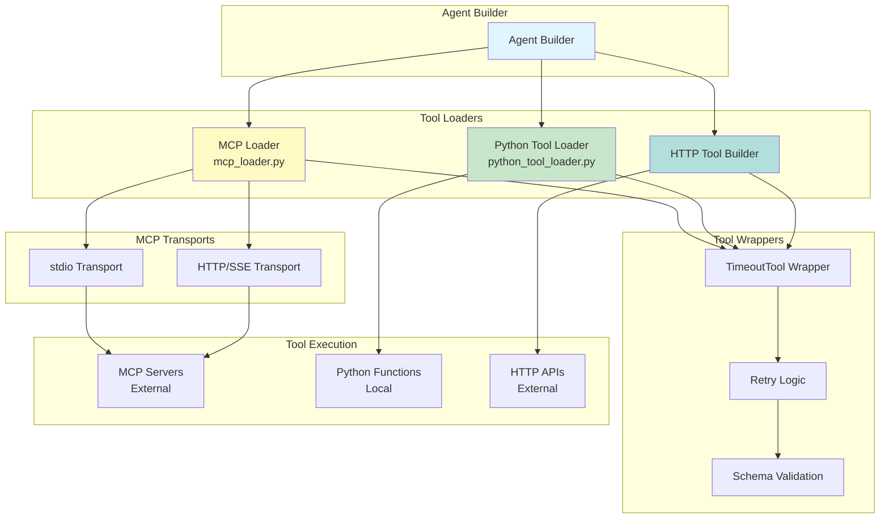

# Module: MCP & Tool Integration - Comprehensive Documentation

## Overview

The MCP & Tool Integration system provides extensible tool loading for agents with support for:
- **MCP (Model Context Protocol)** servers (stdio, HTTP, SSE)
- **Python function tools** (dynamic module loading)
- **HTTP tools** (RESTful API wrappers)
- **Timeout and retry wrapping**
- **Schema validation and filtering**

**Location**: `app/mcp_loader.py`, `app/python_tool_loader.py`, `tools/`

## Architecture



## MCP Loader (`mcp_loader.py`)

### Purpose
Load and manage MCP (Model Context Protocol) servers, wrapping tools with timeout and retry logic.

### Key Components

#### 1. TimeoutTool Wrapper

```python
class TimeoutTool(BaseTool):
    """
    Wraps any LangChain tool with timeout and retry capabilities.
    Preserves tool schema and metadata for proper integration.
    """
    name: str = "timeout_wrapper"
    description: str = ""
    
    def __init__(self, inner: BaseTool, timeout: float = 15.0, retries: int = 0, **kwargs):
        tool_name = getattr(inner, "name", "unnamed_tool")
        tool_desc = getattr(inner, "description", "")
        
        super().__init__(name=tool_name, description=tool_desc, **kwargs)
        
        self._inner = inner
        self._timeout = float(timeout)
        self._retries = int(retries)
        
        # Propagate schema for structured inputs
        self.args_schema = getattr(inner, "args_schema", None)
        self.return_direct = bool(getattr(inner, "return_direct", False))
```

**Key Features**:
- Preserves tool name, description, and schema
- Configurable timeout (default: 15s)
- Retry logic for transient failures
- Input payload filtering (removes empty arrays/strings)

#### 2. MCP Tool Loading

```python
async def load_mcp_tools(
    mcp_servers_cfg: Dict[str, MCPServerConfig],
    timeout_per_tool: float = 15.0,
    retries: int = 0
) -> Tuple[List[BaseTool], Optional[MultiServerMCPClient]]:
    """
    Load tools from multiple MCP servers.
    
    Args:
        mcp_servers_cfg: Server configurations by name
        timeout_per_tool: Timeout for each tool invocation
        retries: Number of retry attempts
    
    Returns:
        (tools_list, mcp_client)
    """
    if not mcp_servers_cfg:
        return [], None
    
    client = MultiServerMCPClient()
    
    # Connect to each server
    for server_name, cfg in mcp_servers_cfg.items():
        try:
            if cfg.transport == "stdio":
                # Local command execution
                await client.connect_stdio(
                    server_name,
                    cfg.command,
                    cfg.args or [],
                    cfg.env or {}
                )
                log.info(f"Connected to MCP server '{server_name}' via stdio")
                
            elif cfg.transport in ["http", "sse", "streamable_http"]:
                # Remote HTTP server
                await client.connect_sse(
                    server_name,
                    cfg.url,
                    cfg.headers or {}
                )
                log.info(f"Connected to MCP server '{server_name}' via {cfg.transport}")
                
        except Exception as e:
            log.error(f"Failed to connect to MCP server '{server_name}': {e}")
            continue
    
    # List all available tools
    try:
        raw_tools = await client.list_tools()
        log.info(f"Loaded {len(raw_tools)} tools from MCP servers")
    except Exception as e:
        log.error(f"Failed to list MCP tools: {e}")
        return [], None
    
    # Wrap with timeout/retry
    wrapped_tools = [
        TimeoutTool(tool, timeout=timeout_per_tool, retries=retries)
        for tool in raw_tools
    ]
    
    return wrapped_tools, client
```

#### 3. Payload Filtering

```python
def _filter_payload(self, payload: Any) -> Any:
    """
    Filter payload to prevent MCP API issues.
    Removes:
    - Empty arrays []
    - Empty strings ""
    """
    if not isinstance(payload, dict):
        return payload
    
    filtered = {}
    for key, value in payload.items():
        # Skip empty arrays
        if isinstance(value, list) and len(value) == 0:
            continue
        # Skip empty strings
        if isinstance(value, str) and value == "":
            continue
        filtered[key] = value
    
    return filtered
```

### MCP Server Configuration

```yaml
agents:
  - name: "data_agent"
    mcp_servers:
      filesystem:
        description: "File system operations"
        transport: "stdio"
        command: "npx"
        args: ["-y", "@modelcontextprotocol/server-filesystem", "./data"]
        env:
          NODE_ENV: "production"
      
      weather:
        description: "Weather information"
        transport: "http"
        url: "http://localhost:8080/mcp"
        headers:
          Authorization: "Bearer ${WEATHER_API_KEY}"
      
      database:
        description: "Database queries"
        transport: "sse"
        url: "http://db-server.internal/mcp/stream"
```

### MCP Transport Details

#### stdio Transport
- **Use Case**: Local command execution (Node.js, Python scripts)
- **Example**: `npx -y @modelcontextprotocol/server-filesystem`
- **Communication**: stdin/stdout pipes
- **Limitations**: Single process, no remote access

#### HTTP/SSE Transport
- **Use Case**: Remote MCP servers
- **Communication**: HTTP requests with Server-Sent Events
- **Benefits**: Distributed, scalable, firewall-friendly
- **Limitations**: Network latency

## Python Tool Loader (`python_tool_loader.py`)

### Purpose
Dynamically load Python functions as LangChain tools with validation and documentation.

### Key Components

#### 1. Python Function Tool Loading

```python
def load_python_function_tools(
    python_tools_cfg: Dict[str, PythonFunctionToolConfig]
) -> List[BaseTool]:
    """
    Load Python functions as LangChain tools.
    
    Args:
        python_tools_cfg: Configuration mapping tool names to module/function specs
    
    Returns:
        List of wrapped Python function tools
    """
    tools = []
    
    for tool_name, cfg in python_tools_cfg.items():
        try:
            # Import module dynamically
            module = importlib.import_module(cfg.module_path)
            
            if cfg.function_name:
                # Load specific function
                func = getattr(module, cfg.function_name)
                tool = create_tool_from_function(func, tool_name, cfg.description)
                tools.append(tool)
            
            elif cfg.tool_names:
                # Load specified functions
                for func_name in cfg.tool_names:
                    func = getattr(module, func_name)
                    tool = create_tool_from_function(func, func_name)
                    tools.append(tool)
            
            else:
                # Load all functions with @tool decorator
                tools_in_module = [
                    obj for name, obj in inspect.getmembers(module)
                    if hasattr(obj, "_langchain_tool")
                ]
                tools.extend(tools_in_module)
            
            log.info(f"Loaded {len(tools)} tools from {cfg.module_path}")
            
        except Exception as e:
            log.error(f"Failed to load Python tools from {cfg.module_path}: {e}")
            continue
    
    return tools
```

#### 2. Tool Validation

```python
def validate_python_tools(tools: List[BaseTool]) -> List[BaseTool]:
    """
    Validate Python tools for proper schema and signatures.
    
    Checks:
    - Function has proper type hints
    - Args schema is defined
    - Description is provided
    - Function is callable
    """
    validated = []
    
    for tool in tools:
        try:
            # Check callable
            if not callable(tool.func if hasattr(tool, 'func') else tool):
                log.warning(f"Tool {tool.name} is not callable, skipping")
                continue
            
            # Check description
            if not tool.description or tool.description.strip() == "":
                log.warning(f"Tool {tool.name} missing description")
            
            # Check args schema
            if hasattr(tool, 'args_schema') and tool.args_schema:
                # Validate schema is a Pydantic model
                from pydantic import BaseModel
                if not issubclass(tool.args_schema, BaseModel):
                    log.warning(f"Tool {tool.name} args_schema is not a Pydantic model")
            
            validated.append(tool)
            
        except Exception as e:
            log.error(f"Validation failed for tool {tool.name}: {e}")
            continue
    
    return validated
```

#### 3. Tool Creation from Function

```python
def create_tool_from_function(
    func: Callable,
    name: Optional[str] = None,
    description: Optional[str] = None
) -> BaseTool:
    """
    Create LangChain tool from Python function with automatic schema inference.
    """
    from langchain.tools import StructuredTool
    from pydantic import create_model
    import inspect
    
    # Extract function metadata
    func_name = name or func.__name__
    func_desc = description or func.__doc__ or f"Tool: {func_name}"
    
    # Get function signature
    sig = inspect.signature(func)
    
    # Build Pydantic model for args schema
    fields = {}
    for param_name, param in sig.parameters.items():
        param_type = param.annotation if param.annotation != inspect.Parameter.empty else str
        param_default = param.default if param.default != inspect.Parameter.empty else ...
        
        fields[param_name] = (param_type, param_default)
    
    ArgsSchema = create_model(f"{func_name}Args", **fields)
    
    # Create structured tool
    tool = StructuredTool.from_function(
        func=func,
        name=func_name,
        description=func_desc,
        args_schema=ArgsSchema
    )
    
    return tool
```

### Python Tool Configuration

```yaml
agents:
  - name: "analysis_agent"
    python_tools:
      data_tools:
        module_path: "tools.python_function_tools"
        tool_names:
          - "analyze_data"
          - "generate_report"
          - "validate_json"
        description: "Data analysis and validation tools"
      
      custom_math:
        module_path: "custom.math_tools"
        function_name: "advanced_calculator"
        description: "Advanced mathematical operations"
```

### Example Python Tool

```python
# tools/python_function_tools.py

from typing import List, Dict, Any
from langchain.tools import tool
from pydantic import BaseModel, Field

class AnalyzeDataInput(BaseModel):
    data: List[Dict[str, Any]] = Field(description="Data to analyze")
    metrics: List[str] = Field(description="Metrics to calculate")

@tool("analyze_data", args_schema=AnalyzeDataInput)
def analyze_data(data: List[Dict[str, Any]], metrics: List[str]) -> Dict[str, Any]:
    """
    Analyze structured data and calculate requested metrics.
    
    Supports metrics: mean, median, sum, count, unique
    """
    results = {}
    
    for metric in metrics:
        if metric == "count":
            results[metric] = len(data)
        elif metric == "mean":
            values = [item.get("value", 0) for item in data]
            results[metric] = sum(values) / len(values) if values else 0
        # ... more metrics
    
    return results
```

## HTTP Tool Builder

### Purpose
Create LangChain tools that wrap RESTful HTTP APIs.

### Implementation

```python
def build_http_tools(
    http_tools_cfg: Dict[str, Dict[str, Any]]
) -> List[BaseTool]:
    """
    Build HTTP tools from configuration.
    
    Config format:
    {
        "tool_name": {
            "url": "https://api.example.com/endpoint",
            "method": "POST",
            "headers": {"Authorization": "Bearer ${API_KEY}"},
            "description": "Tool description",
            "response_path": "$.data.result"  # JSONPath for response extraction
        }
    }
    """
    tools = []
    
    for tool_name, cfg in http_tools_cfg.items():
        try:
            tool = create_http_tool(
                name=tool_name,
                url=cfg["url"],
                method=cfg.get("method", "GET"),
                headers=cfg.get("headers", {}),
                description=cfg.get("description", ""),
                response_path=cfg.get("response_path")
            )
            tools.append(tool)
            log.info(f"Created HTTP tool: {tool_name}")
        except Exception as e:
            log.error(f"Failed to create HTTP tool {tool_name}: {e}")
    
    return tools

def create_http_tool(
    name: str,
    url: str,
    method: str,
    headers: Dict[str, str],
    description: str,
    response_path: Optional[str] = None
) -> BaseTool:
    """Create HTTP tool with request/response handling."""
    from langchain.tools import Tool
    import requests
    from jsonpath_ng import parse
    
    def execute_http_request(**kwargs) -> str:
        # Resolve environment variables in headers
        resolved_headers = {
            k: os.path.expandvars(v) for k, v in headers.items()
        }
        
        # Make request
        if method.upper() == "GET":
            response = requests.get(url, headers=resolved_headers, params=kwargs)
        elif method.upper() == "POST":
            response = requests.post(url, headers=resolved_headers, json=kwargs)
        else:
            raise ValueError(f"Unsupported HTTP method: {method}")
        
        response.raise_for_status()
        
        # Extract response data
        data = response.json()
        
        if response_path:
            # Use JSONPath to extract specific field
            jsonpath_expr = parse(response_path)
            matches = jsonpath_expr.find(data)
            return str(matches[0].value) if matches else str(data)
        
        return str(data)
    
    return Tool(
        name=name,
        func=execute_http_request,
        description=description
    )
```

### HTTP Tool Configuration

```yaml
agents:
  - name: "api_agent"
    http_tools:
      weather_lookup:
        url: "https://api.weather.com/v1/current"
        method: "GET"
        headers:
          Authorization: "Bearer ${WEATHER_API_KEY}"
        description: "Get current weather for a location"
        response_path: "$.weather.description"
      
      database_query:
        url: "http://internal-db.service/query"
        method: "POST"
        headers:
          X-API-Key: "${DB_API_KEY}"
        description: "Execute database query"
        response_path: "$.result.rows"
```

## Tool Examples

### Available Python Tools (in `tools/`)

| Tool | File | Purpose |
|------|------|---------|
| `analyze_memory_logs` | `analyze_memory_logs.py` | Parse and analyze memory system logs |
| `cleanup_memory_logs` | `cleanup_memory_logs.py` | Archive and clean old log files |
| `constraint_lookup_tool` | `constraint_lookup_tool.py` | Look up validation constraints |
| `fast_ocr_tool` | `fast_ocr_tool.py` | Fast OCR for visiting cards |
| `file_retrieval_tools` | `file_retrieval_tools.py` | Retrieve files from storage |
| `fuzzy_matcher_tool` | `fuzzy_matcher_tool.py` | Fuzzy string matching |
| `json_validator_tool` | `json_validator_tool.py` | Validate JSON against schemas |
| `vision_processor_tool` | `vision_processor_tool.py` | Process images with vision models |
| `visiting_card_tools` | `visiting_card_tools.py` | Extract data from business cards |

### Example: Fast OCR Tool

```python
# tools/fast_ocr_tool.py

from langchain.tools import tool
from pydantic import BaseModel, Field

class OCRInput(BaseModel):
    image_data: str = Field(description="Base64-encoded image data")
    filename: str = Field(description="Image filename")

@tool("fast_ocr", args_schema=OCRInput)
async def fast_ocr(image_data: str, filename: str) -> str:
    """
    Extract text from an image using vision model OCR.
    Optimized for business cards and documents.
    """
    from app.enhanced_litellm_wrapper import create_litellm_model
    from langchain_core.messages import HumanMessage
    import base64
    
    # Create vision model
    model = create_litellm_model("gemini/gemini-2.0-flash-exp", temperature=0.1)
    
    # Prepare multimodal message
    content = [
        {"type": "text", "text": "Extract all text from this image."},
        {
            "type": "image_url",
            "image_url": {"url": f"data:image/jpeg;base64,{image_data}"}
        }
    ]
    
    # Process with vision model
    response = await model.ainvoke([HumanMessage(content=content)])
    
    return response.content
```

## Performance Characteristics

### Tool Invocation Latency

| Tool Type | Typical Latency | Notes |
|-----------|-----------------|-------|
| Python Function | < 100ms | Local execution |
| MCP stdio | 200-500ms | Process spawn overhead |
| MCP HTTP | 100-300ms | Network latency |
| HTTP Tool | 200-1000ms | External API dependency |

### Timeout Configuration

```python
# Default timeouts by tool type
TOOL_TIMEOUTS = {
    "python": 30.0,      # Python functions
    "mcp_stdio": 60.0,   # Local MCP servers
    "mcp_http": 30.0,    # Remote MCP servers
    "http": 30.0         # HTTP tools
}
```

## Design Patterns

### 1. Decorator Pattern
- **Usage**: TimeoutTool wraps original tools
- **Benefit**: Adds timeout/retry without modifying tools
- **Trade-off**: Additional indirection

### 2. Factory Pattern
- **Usage**: Tool creation from configuration
- **Benefit**: Consistent tool instantiation
- **Trade-off**: Complexity in factory logic

### 3. Strategy Pattern
- **Usage**: Different tool loaders (MCP, Python, HTTP)
- **Benefit**: Extensible tool sources
- **Trade-off**: Multiple code paths

## Improvement Suggestions

### 1. Extensibility

**Add Plugin System**:
```python
class ToolLoader(ABC):
    @abstractmethod
    def load(self, config: Dict) -> List[BaseTool]:
        """Load tools from source."""
        pass
    
    @abstractmethod
    def validate(self, tool: BaseTool) -> bool:
        """Validate tool is properly configured."""
        pass

class ToolLoaderRegistry:
    def __init__(self):
        self._loaders: Dict[str, ToolLoader] = {}
    
    def register(self, name: str, loader: ToolLoader):
        self._loaders[name] = loader
    
    def load_tools(self, tool_type: str, config: Dict) -> List[BaseTool]:
        loader = self._loaders.get(tool_type)
        if not loader:
            raise ValueError(f"Unknown tool type: {tool_type}")
        return loader.load(config)

# Register loaders
registry = ToolLoaderRegistry()
registry.register("mcp", MCPToolLoader())
registry.register("python", PythonToolLoader())
registry.register("http", HTTPToolLoader())
registry.register("grpc", GRPCToolLoader())  # New loader
```

### 2. Maintainability

**Separate Concerns**:
```
tool_system/
  loaders/
    mcp_loader.py
    python_loader.py
    http_loader.py
  wrappers/
    timeout_wrapper.py
    retry_wrapper.py
    cache_wrapper.py
  validators/
    schema_validator.py
    security_validator.py
  registry.py
```

### 3. Performance

**Tool Result Caching**:
```python
class CachedTool(BaseTool):
    def __init__(self, inner: BaseTool, cache: Cache, ttl: int = 300):
        super().__init__(name=inner.name, description=inner.description)
        self._inner = inner
        self._cache = cache
        self._ttl = ttl
    
    def _run(self, *args, **kwargs):
        # Generate cache key from args
        cache_key = f"{self.name}:{hash((args, tuple(sorted(kwargs.items()))))}"
        
        # Check cache
        cached_result = self._cache.get(cache_key)
        if cached_result:
            return cached_result
        
        # Execute tool
        result = self._inner.run(*args, **kwargs)
        
        # Cache result
        self._cache.set(cache_key, result, ttl=self._ttl)
        
        return result
```

**Parallel Tool Execution**:
```python
async def execute_tools_parallel(tools: List[BaseTool], inputs: List[Dict]) -> List[Any]:
    """Execute multiple tools in parallel."""
    tasks = [
        tool.arun(input_data)
        for tool, input_data in zip(tools, inputs)
    ]
    
    results = await asyncio.gather(*tasks, return_exceptions=True)
    
    return results
```

### 4. Security

**Tool Sandboxing**:
```python
class SandboxedPythonTool(BaseTool):
    """Execute Python tools in restricted environment."""
    
    def _run(self, *args, **kwargs):
        # Create restricted globals
        safe_globals = {
            '__builtins__': {
                'len': len,
                'str': str,
                'int': int,
                # ... safe builtins only
            }
        }
        
        # Execute in sandbox
        try:
            result = self._inner.run(*args, **kwargs)
        except Exception as e:
            log.error(f"Sandboxed execution failed: {e}")
            raise
        
        return result
```

**MCP Server Authentication**:
```yaml
mcp_servers:
  secure_api:
    transport: "http"
    url: "https://api.example.com/mcp"
    headers:
      Authorization: "Bearer ${API_TOKEN}"
      X-Client-Cert: "${CLIENT_CERT_PATH}"
    ssl_verify: true
    ssl_cert: "/path/to/client.crt"
    ssl_key: "/path/to/client.key"
```

### 5. Observability

**Tool Metrics**:
```python
class InstrumentedTool(BaseTool):
    """Tool with metrics tracking."""
    
    def _run(self, *args, **kwargs):
        start_time = time.time()
        
        try:
            result = self._inner.run(*args, **kwargs)
            
            # Record success
            self._metrics.record_success(
                tool_name=self.name,
                duration=time.time() - start_time,
                input_size=len(str(args) + str(kwargs)),
                output_size=len(str(result))
            )
            
            return result
            
        except Exception as e:
            # Record failure
            self._metrics.record_failure(
                tool_name=self.name,
                duration=time.time() - start_time,
                error_type=type(e).__name__
            )
            raise
```

## Testing

### Unit Tests
```python
async def test_mcp_tool_loading():
    """Test loading MCP tools."""
    config = {
        "filesystem": MCPServerConfig(
            transport="stdio",
            command="npx",
            args=["-y", "@modelcontextprotocol/server-filesystem", "./test_data"]
        )
    }
    
    tools, client = await load_mcp_tools(config)
    
    assert len(tools) > 0
    assert all(isinstance(tool, BaseTool) for tool in tools)

def test_python_tool_validation():
    """Test Python tool validation."""
    @tool("test_tool")
    def valid_tool(x: int) -> int:
        """Valid tool with type hints."""
        return x * 2
    
    validated = validate_python_tools([valid_tool])
    assert len(validated) == 1
```

### Integration Tests
```python
async def test_end_to_end_tool_execution():
    """Test complete tool execution flow."""
    # Load tools
    tools, _ = await load_mcp_tools(test_config)
    
    # Wrap with timeout
    wrapped = [TimeoutTool(t, timeout=5.0) for t in tools]
    
    # Execute tool
    result = await wrapped[0].arun({"query": "test"})
    
    assert result is not None
```

## Conclusion

The MCP & Tool Integration system provides a flexible, extensible architecture for connecting agents to external tools. The multi-source support (MCP, Python, HTTP) combined with timeout/retry wrappers creates a robust tool ecosystem.

**Key Strengths**:
- Multi-transport MCP support
- Dynamic Python module loading
- Automatic timeout/retry wrapping
- Schema preservation and validation

**Recommended Improvements**:
- Add plugin system for new tool types
- Implement tool result caching
- Add sandboxing for Python tools
- Enhance observability with metrics
- Support parallel tool execution
