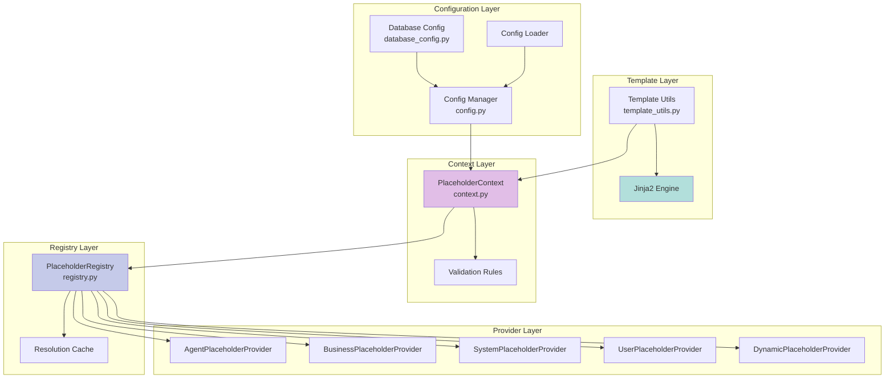

# Module: Placeholder System & Configuration Management

## Overview

The Placeholder System provides dynamic template rendering with extensible placeholder resolution, enabling flexible configuration management and prompt engineering.

**Location**: `app/placeholder_system/`, `app/config.py`, `app/template_utils.py`, `app/database_config.py`

### ⚠️ Critical Understanding

**Placeholders are replaced BEFORE the prompt is sent to the LLM, not in the LLM's output.**

- ✅ **Correct**: Use placeholders in your prompt templates and config files. They will be replaced with actual values before sending to the LLM.
- ❌ **Incorrect**: Instructing the LLM to "use {{timestamp}}" will cause the LLM to literally output "{{timestamp}}" in its response.

**Example**:

```yaml
# ❌ WRONG - LLM will output literal "{{timestamp}}"
business_context: |
  TIMESTAMP: use {{timestamp}} for dates and times

# ✅ CORRECT - Placeholder replaced before LLM sees it
business_context: |
  CURRENT DATETIME: {{timestamp}} (use this for date/time references)
```

After replacement, the LLM sees:

```text
CURRENT DATETIME: 2025-10-14T08:17:42.769027 (use this for date/time references)
```

## Architecture

### Component Structure



## Core Components

### 1. PlaceholderContext (`placeholder_system/context.py`)

**Purpose**: Main interface for building template contexts with placeholder resolution.

**Key Features**:
```python
class PlaceholderContext:
    def __init__(self, registry: Optional[PlaceholderRegistry] = None):
        self._registry = registry or get_default_registry()
        self._custom_placeholders: Dict[str, Any] = {}
        self._validation_rules: Dict[str, Callable] = {}
        self._required_placeholders: Set[str] = set()
    
    def add_custom_placeholder(
        self, 
        name: str, 
        value: Any,
        validation_rule: Optional[Callable] = None,
        required: bool = False
    ):
        """Add custom placeholder with optional validation."""
        self._custom_placeholders[name] = value
        if validation_rule:
            self._validation_rules[name] = validation_rule
        if required:
            self._required_placeholders.add(name)
    
    def build_context(
        self,
        agent_name: Optional[str] = None,
        business_context: Optional[str] = None,
        **additional_context
    ) -> Dict[str, Any]:
        """Build complete context by resolving all placeholders."""
        base_context = {
            "agent_name": agent_name or "",
            "business_context": business_context or "",
            **additional_context
        }
        
        # Resolve all available placeholders
        final_context = {}
        for placeholder_name in self._registry.get_available_placeholders():
            try:
                value = self._registry.resolve_placeholder(
                    placeholder_name, 
                    base_context
                )
                
                # Apply validation
                if placeholder_name in self._validation_rules:
                    if not self._validation_rules[placeholder_name](value):
                        raise PlaceholderValidationError(placeholder_name, value)
                
                final_context[placeholder_name] = value
            except PlaceholderNotFoundError:
                if placeholder_name in self._required_placeholders:
                    raise
        
        return final_context
```

**Usage Example**:
```python
# Create context
context = PlaceholderContext()

# Add custom placeholders
context.add_custom_placeholder(
    "conversation_context_metadata",
    metadata_string,
    required=False
)

# Add validation rule
context.add_validation_rule(
    "agent_name",
    lambda v: v and len(v) > 0
)

# Build context
final_context = context.build_context(
    agent_name="python_exec_agent",
    business_context="Data analysis project",
    original_user_question="Calculate statistics"
)
```

### 2. PlaceholderRegistry (`placeholder_system/registry.py`)

**Purpose**: Manages placeholder providers and resolution chain.

**Provider Chain**:
```python
class PlaceholderRegistry:
    def __init__(self):
        self._providers: List[PlaceholderProvider] = []
        self._cache: Dict[str, Any] = {}
    
    def register_provider(self, provider: PlaceholderProvider):
        """Register a placeholder provider."""
        self._providers.append(provider)
    
    def resolve_placeholder(self, name: str, context: Dict) -> Any:
        """Resolve placeholder through provider chain."""
        # Check cache first
        cache_key = f"{name}:{hash(frozenset(context.items()))}"
        if cache_key in self._cache:
            return self._cache[cache_key]
        
        # Try each provider
        for provider in self._providers:
            if provider.can_provide(name):
                value = provider.resolve(name, context)
                self._cache[cache_key] = value
                return value
        
        raise PlaceholderNotFoundError(name)
```

### 3. Placeholder Providers

#### AgentPlaceholderProvider
```python
class AgentPlaceholderProvider(PlaceholderProvider):
    """Provides agent-specific placeholders."""
    
    SUPPORTED = {
        "agent_name", "agent_description", "agent_model"
    }
    
    def can_provide(self, name: str) -> bool:
        return name in self.SUPPORTED
    
    def resolve(self, name: str, context: Dict) -> Any:
        return context.get(name, "")
```

#### BusinessPlaceholderProvider
```python
class BusinessPlaceholderProvider(PlaceholderProvider):
    """Provides business context placeholders."""
    
    SUPPORTED = {
        "business_context", "businessContext", 
        "original_user_question"
    }
    
    def resolve(self, name: str, context: Dict) -> Any:
        if name in ["business_context", "businessContext"]:
            return context.get("business_context", "")
        return context.get(name, "")
```

#### SystemPlaceholderProvider
```python
class SystemPlaceholderProvider(PlaceholderProvider):
    """Provides system-level placeholders."""
    
    SUPPORTED = {
        # Core datetime placeholders
        "timestamp",      # ISO format: 2025-10-14T08:17:42.769027
        "datetime",       # With timezone
        "datetime_utc",   # UTC timezone
        "date",           # YYYY-MM-DD
        "time",           # HH:MM:SS
        "time_24h",       # 24-hour format
        "time_12h",       # 12-hour with AM/PM
        
        # Formatted date options
        "date_iso",       # ISO format: 2025-10-14
        "date_us",        # US format: 10/14/2025
        "date_eu",        # EU format: 14/10/2025
        "date_long",      # Long: October 14, 2025
        "date_short",     # Short: Oct 14, 2025
        
        # Timestamp variants
        "timestamp_unix", # Unix timestamp (seconds)
        "timestamp_ms",   # Milliseconds since epoch
        
        # Date/time components
        "year",           # 2025
        "month",          # 10
        "month_name",     # October
        "month_short",    # Oct
        "day",            # 14
        "day_name",       # Tuesday
        "day_short",      # Tue
        "week_number",    # ISO week number
        "quarter",        # Quarter (1-4)
        
        # System info
        "platform",       # Darwin/Windows/Linux
        "python_version", # Python version
        "working_directory", # Current directory
        "user_home",      # Home directory
        "hostname",       # System hostname
    }
    
    def resolve(self, name: str, context: Dict) -> Any:
        if name == "timestamp":
            return datetime.now().isoformat()
        elif name == "date":
            return datetime.now().strftime("%Y-%m-%d")
        # ... (see app/placeholder_system/providers.py for full implementation)
```

#### DynamicPlaceholderProvider
```python
class DynamicPlaceholderProvider(PlaceholderProvider):
    """Provides dynamically computed placeholders."""
    
    def can_provide(self, name: str) -> bool:
        return name.startswith("computed_")
    
    def resolve(self, name: str, context: Dict) -> Any:
        if name == "computed_token_count":
            text = context.get("business_context", "")
            return len(text.split())
        return ""
```

### 4. Template Utils (`template_utils.py`)

**Purpose**: Template rendering with Jinja2 integration.

```python
from jinja2 import Environment, BaseLoader, TemplateNotFound

def render_prompt_with_placeholders(
    template: str,
    placeholder_context: Optional[PlaceholderContext] = None,
    **kwargs
) -> str:
    """
    Render template with placeholder resolution.
    
    Args:
        template: Template string with {{placeholder}} syntax
        placeholder_context: PlaceholderContext instance
        **kwargs: Additional context values
    
    Returns:
        Rendered template string
    """
    if placeholder_context is None:
        placeholder_context = PlaceholderContext()
    
    # Build context
    context = placeholder_context.build_context(**kwargs)
    
    # Render with Jinja2
    env = Environment(loader=BaseLoader())
    jinja_template = env.from_string(template)
    
    return jinja_template.render(**context)

def render_prompt(template: str, context: Dict[str, Any]) -> str:
    """Legacy rendering without placeholder system."""
    env = Environment(loader=BaseLoader())
    jinja_template = env.from_string(template)
    return jinja_template.render(**context)
```

**Template Example**:
```jinja2
You are {{agent_name}}, a specialized agent.

Description: {{agent_description}}
Model: {{agent_model}}

Business Context:
{{business_context}}

Original Question: {{original_user_question}}


Conversation Metadata:
{{conversation_context_metadata}}


Available Tools: {{mcpservers}}

Instructions:
1. Analyze the user's question
2. Use appropriate tools
3. Provide clear answers
```

### 5. Configuration Manager (`config.py`)

**Purpose**: YAML configuration loading and validation with Pydantic.

**Data Models**:
```python
class MCPServerConfig(BaseModel):
    description: Optional[str] = ""
    transport: str = Field(..., description="stdio | http | sse")
    command: Optional[str] = None
    args: Optional[List[str]] = None
    url: Optional[str] = None
    env: Optional[Dict[str, str]] = None
    headers: Optional[Dict[str, str]] = None
    
    @field_validator("transport")
    @classmethod
    def check_transport(cls, v):
        if v not in ("stdio", "streamable_http", "sse", "http"):
            raise ValueError("Invalid transport type")
        return v

class AgentConfig(BaseModel):
    name: str
    description: Optional[str] = ""
    model: Optional[str] = None
    prompt: Optional[str] = None
    prompt_file: Optional[str] = None
    agent_type: Optional[str] = Field(default="react")
    mcp_servers: Dict[str, MCPServerConfig] = Field(default_factory=dict)
    http_tools: Dict[str, Dict] = Field(default_factory=dict)
    python_tools: Dict[str, PythonFunctionToolConfig] = Field(default_factory=dict)
    parallel_tool_calls_enabled: Optional[bool] = None
    
    @field_validator("agent_type")
    @classmethod
    def check_agent_type(cls, v):
        if v not in ("react", "normal"):
            raise ValueError("agent_type must be 'react' or 'normal'")
        return v

class ConversationMemoryConfig(BaseModel):
    enabled: bool = Field(default=False)
    database_url: Optional[str] = None
    max_conversations: int = Field(default=5)
    max_context_length: int = Field(default=2000)
    pool_size: int = Field(default=10)

class AppConfig(BaseModel):
    name: Optional[str] = "JK-Agents"
    business_context: Optional[str] = ""
    models: Dict[str, str] = Field(default_factory=dict)
    temperature: float = Field(default=0.2)
    agents: List[AgentConfig] = Field(default_factory=list)
    supervisor: Optional[SupervisorConfig] = None
    conversation_memory: Optional[ConversationMemoryConfig] = None
    memory: Optional[Dict[str, Any]] = None
    litellm: Optional[Dict[str, Any]] = None
```

**Configuration Loading**:
```python
def load_app_config(cfg_path: Path) -> AppConfig:
    """Load and validate configuration from YAML."""
    # Load .env
    load_dotenv()
    
    # Read YAML
    with cfg_path.open("r", encoding="utf-8") as f:
        data = yaml.safe_load(f)
    
    # Normalize model formats (google: → gemini/)
    if HAS_MODEL_FORMAT:
        data = normalize_model_config(data)
    
    # Resolve file: references
    for key, value in data.items():
        if isinstance(value, str) and value.startswith("file:"):
            filename = value[5:].strip()
            data[key] = load_prompt_content(filename)
    
    # Override with environment variables
    for key in data.keys():
        env_key = key.upper()
        if env_key in os.environ:
            data[key] = os.environ[env_key]
    
    # Create and validate AppConfig
    try:
        app_cfg = AppConfig(**data)
        return app_cfg
    except ValidationError as e:
        log.error(f"Configuration validation failed: {e}")
        raise
```

### 6. Database Configuration (`database_config.py`)

**Purpose**: Centralized database path configuration from environment variables.

```python
@dataclass
class DatabasePaths:
    base_path: Path
    large_data_db: Path
    large_data_files: Path
    chromadb: Path
    
    def ensure_directories(self):
        """Create directories if they don't exist."""
        self.base_path.mkdir(parents=True, exist_ok=True)
        self.large_data_files.mkdir(parents=True, exist_ok=True)
        self.chromadb.mkdir(parents=True, exist_ok=True)

class DatabaseConfig:
    """Centralized database configuration manager."""
    
    def __init__(self, is_test_mode: bool = False):
        self.is_test_mode = is_test_mode
        self._load_config()
    
    def _load_config(self):
        """Load paths from environment variables."""
        if self.is_test_mode:
            base_path = os.getenv("TEST_DB_BASE_PATH", "./test_data")
        else:
            base_path = os.getenv("DB_BASE_PATH", "./data")
        
        self.paths = DatabasePaths(
            base_path=Path(base_path),
            large_data_db=Path(os.getenv("LARGE_DATA_DB_PATH", f"{base_path}/large_data_storage.db")),
            large_data_files=Path(os.getenv("LARGE_DATA_FILES_PATH", f"{base_path}/large_files")),
            chromadb=Path(os.getenv("CHROMADB_PATH", f"{base_path}/chromadb"))
        )

# Global instance
def get_database_config(is_test_mode: bool = False) -> DatabaseConfig:
    """Get or create database configuration."""
    global _db_config
    if _db_config is None or _db_config.is_test_mode != is_test_mode:
        _db_config = DatabaseConfig(is_test_mode)
    return _db_config
```

## Configuration Examples

### Complete Agent Configuration

```yaml
name: "Data Analysis System"
business_context: "Enterprise data analytics platform"

models:
  default: "gemini/gemini-2.0-flash-exp"
  supervisor: "gemini/gemini-2.0-flash-exp"

temperature: 0.2

conversation_memory:
  enabled: true
  max_conversations: 10
  max_context_length: 3000

memory:
  backend: "chromadb"
  chromadb:
    path: "./data/chromadb"
    max_connections: 20
    l1_cache_size: 10000

supervisor:
  name: "supervisor"
  prompt_file: "supervisor_prompt.txt"
  model: "gemini/gemini-2.0-flash-exp"

agents:
  - name: "python_exec_agent"
    description: "Executes Python code for data analysis"
    agent_type: "react"
    model: "gemini/gemini-2.0-flash-exp"
    prompt_file: "python_exec_agent_prompt.txt"
    
    mcp_servers:
      filesystem:
        description: "File system operations"
        transport: "stdio"
        command: "npx"
        args: ["-y", "@modelcontextprotocol/server-filesystem", "./data"]
    
    python_tools:
      analysis_tools:
        module_path: "tools.python_function_tools"
        tool_names: ["analyze_data", "generate_report"]
    
    parallel_tool_calls_enabled: false
  
  - name: "human_response_agent"
    description: "Generates natural language responses"
    agent_type: "normal"
    prompt: "You are a helpful assistant. Provide clear, concise answers."
```

### Environment Variables

```bash
# Database Configuration
DB_BASE_PATH=./data
CHROMADB_PATH=./data/chromadb
LARGE_DATA_DB_PATH=./data/large_data_storage.db
LARGE_DATA_FILES_PATH=./data/large_files

# Model Provider Keys
GOOGLE_API_KEY=your_key_here
AZURE_OPENAI_API_KEY=your_key_here
AZURE_OPENAI_ENDPOINT=https://your-endpoint.openai.azure.com/
OPENAI_API_KEY=your_key_here

# Memory Configuration
CONVERSATION_MEMORY_ENABLED=true
MEMORY_L1_CACHE_SIZE=10000

# Large Data Configuration
LARGE_DATA_COMPRESSION_ENABLED=true
LARGE_DATA_MAX_SQLITE_SIZE_MB=50
LARGE_DATA_TOKEN_THRESHOLD=1000
```

## Best Practices

### 1. Placeholder Naming

- Use snake_case: `agent_name`, not `agentName`
- Be descriptive: `original_user_question`, not `question`
- Namespace system placeholders: `system_time`, `system_environment`

### 2. Using Placeholders in Business Context

**❌ WRONG - Causes LLM to output literal placeholder text:**

```yaml
business_context: |
  CRITICAL RULES:
    - TIMESTAMP: use {{timestamp}} for dates and times
```

When the LLM sees: "use {{timestamp}}", it will literally output `{{timestamp}}` in responses.

**✅ CORRECT - Provides actual datetime to LLM:**

```yaml
business_context: |
  CRITICAL RULES:
    - CURRENT DATETIME: {{timestamp}} (use this for date/time references)
```

After replacement, LLM sees: "CURRENT DATETIME: 2025-10-14T08:17:42.769027 (use this for date/time references)"

### 3. Available System Placeholders

All system placeholders are automatically replaced before the prompt reaches the LLM:

**Datetime Placeholders:**

- `{{timestamp}}` → `2025-10-14T08:17:42.769027`
- `{{date}}` → `2025-10-14`
- `{{time}}` → `08:17:42`
- `{{date_us}}` → `10/14/2025`
- `{{date_eu}}` → `14/10/2025`
- `{{date_long}}` → `October 14, 2025`
- `{{year}}` → `2025`
- `{{month}}` → `10`
- `{{day}}` → `14`

**System Info Placeholders:**

- `{{platform}}` → `Darwin` (or `Windows`, `Linux`)
- `{{working_directory}}` → `/path/to/project`
- `{{hostname}}` → `your-machine-name`

**Agent Context Placeholders:**

- `{{agent_name}}` → Agent's name from config
- `{{agent_description}}` → Agent's description
- `{{business_context}}` → Business context from config
- `{{original_user_question}}` → Current user's question

### 4. Configuration Organization
- Keep base configuration minimal
- Use environment-specific overrides
- Store sensitive values in .env
- Validate configurations in CI/CD

### 5. Template Design
- Keep templates readable
- Use comments to explain sections
- Provide sensible defaults with ``
- Test templates with sample data

### 6. Custom Placeholders
- Add validation rules for critical placeholders
- Document placeholder meaning and format
- Use consistent naming across templates

## Performance Considerations

### 1. Placeholder Resolution
- **Cache resolved values** for repeated use
- **Provider order matters**: Put frequently used providers first
- **Lazy evaluation**: Only resolve placeholders actually used in template

### 2. Configuration Loading
- **Preload configurations** at startup
- **Cache parsed YAML** to avoid repeated file I/O
- **Validate once** at load time, not per-request

### 3. Template Rendering
- **Compile templates** once, render multiple times
- **Reuse Jinja2 environment** instead of creating new one
- **Limit template complexity** to avoid performance issues

## Testing

### Unit Tests
```python
def test_placeholder_resolution():
    """Test basic placeholder resolution."""
    context = PlaceholderContext()
    result = context.build_context(
        agent_name="test_agent",
        business_context="test context"
    )
    
    assert result["agent_name"] == "test_agent"
    assert result["business_context"] == "test context"

def test_custom_placeholder_validation():
    """Test validation rules."""
    context = PlaceholderContext()
    
    context.add_custom_placeholder(
        "port",
        "invalid",
        validation_rule=lambda v: str(v).isdigit()
    )
    
    with pytest.raises(PlaceholderValidationError):
        context.build_context()

def test_config_loading():
    """Test configuration loading and validation."""
    config_path = Path("test_config.yaml")
    config = load_app_config(config_path)
    
    assert isinstance(config, AppConfig)
    assert len(config.agents) > 0
    assert config.models.get("default") is not None
```

## Improvement Suggestions

### 1. Computed Placeholders
```python
# Add support for computed placeholders with dependencies
class ComputedPlaceholder:
    def __init__(self, name: str, func: Callable, dependencies: List[str]):
        self.name = name
        self.func = func
        self.dependencies = dependencies
    
    def resolve(self, context: Dict) -> Any:
        # Ensure dependencies are resolved first
        dep_values = {dep: context[dep] for dep in self.dependencies}
        return self.func(**dep_values)

# Usage
registry.register_computed(
    "agent_display_name",
    lambda agent_name, environment: f"[{environment}] {agent_name}",
    dependencies=["agent_name", "environment"]
)
```

### 2. Conditional Placeholders
```python
# Add conditional placeholder resolution
class ConditionalPlaceholderProvider:
    def resolve(self, name: str, context: Dict) -> Any:
        if name == "greeting":
            hour = datetime.now().hour
            if hour < 12:
                return "Good morning"
            elif hour < 18:
                return "Good afternoon"
            else:
                return "Good evening"
```

### 3. Configuration Inheritance
```yaml
# base.yaml
_base:
  models:
    default: "openai/gpt-4o-mini"
  
  temperature: 0.2

# production.yaml (extends base.yaml)
extends: "base.yaml"

models:
  default: "azure/gpt-4o"  # Override
  
environment: "production"
```

### 4. Schema Validation
```python
# Add JSON Schema validation for configurations
import jsonschema

def validate_config_against_schema(config: Dict, schema_path: Path):
    """Validate configuration against JSON schema."""
    with schema_path.open() as f:
        schema = json.load(f)
    
    jsonschema.validate(config, schema)
```

## Conclusion

The Placeholder System and Configuration Management provide a flexible, extensible foundation for template-based configuration. The provider pattern allows easy addition of new placeholder sources, while Pydantic validation ensures configuration correctness.

**Key Strengths**:
- Extensible provider system
- Strong validation with Pydantic
- Environment-based configuration
- Centralized database paths

**Recommended Enhancements**:
- Add computed placeholders with dependencies
- Implement configuration inheritance
- Add JSON Schema validation in CI/CD
- Create configuration UI/validator tool
